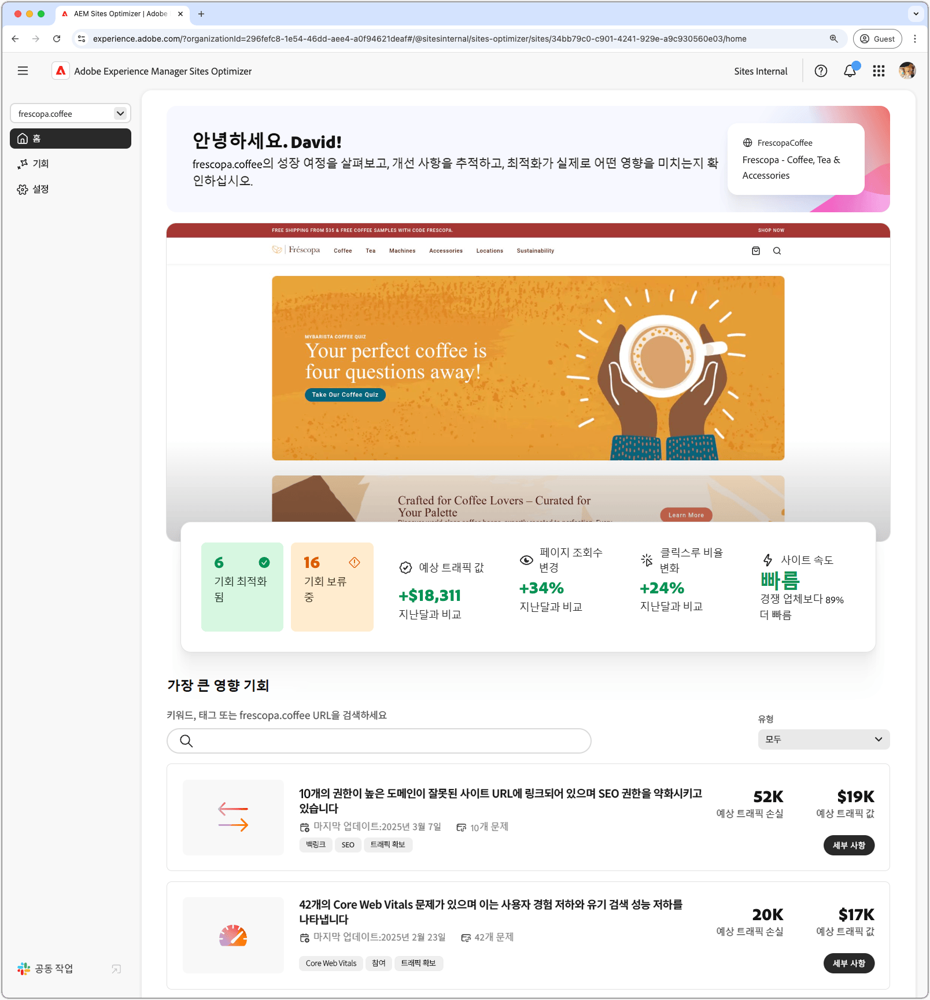
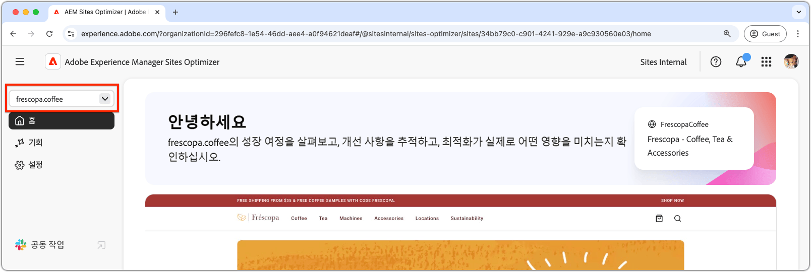
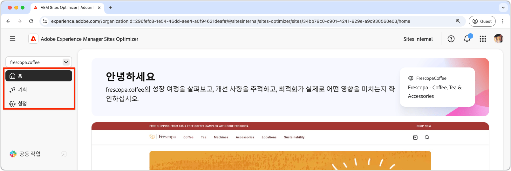
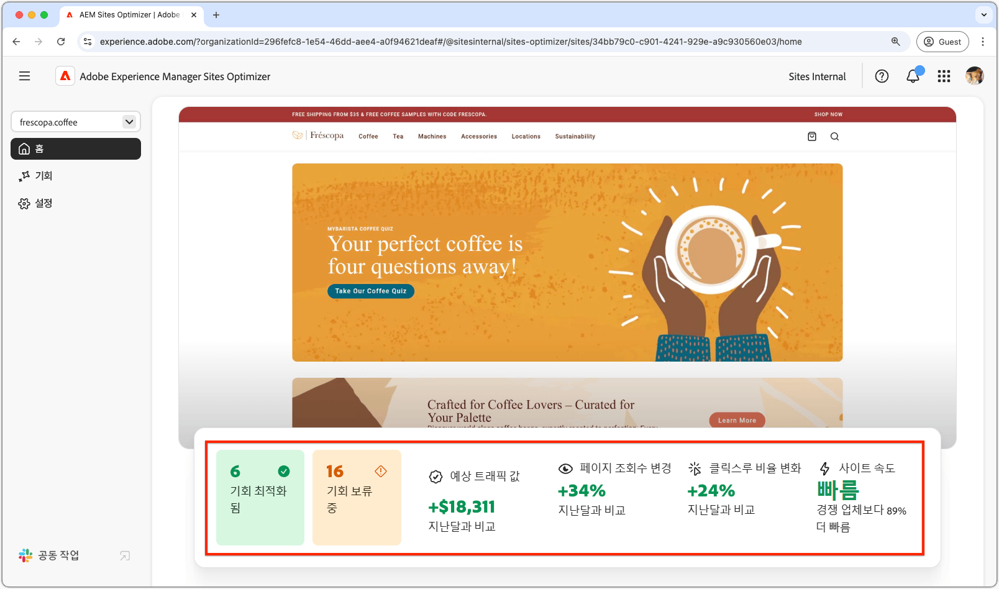
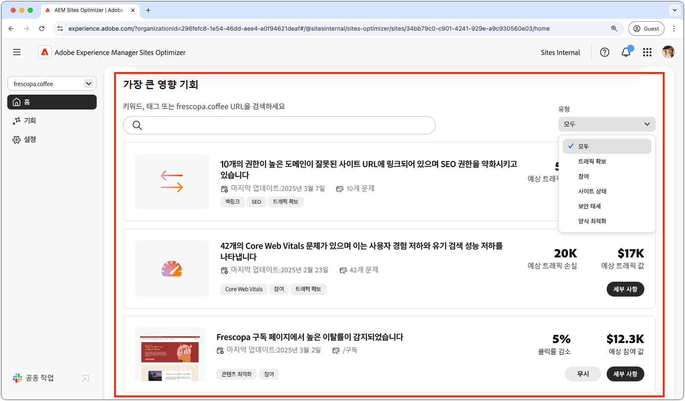
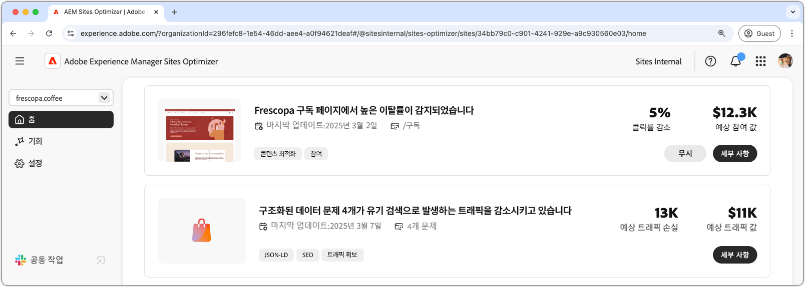

# Sites Optimizer 기본 사항

{align="center"}

Sites Optimizer 대시보드는 사이트의 성능에 대한 높은 수준의 개요와 개선 기회를 제공합니다.

## 도메인 관리자

{align="center"}

도메인 관리자 상황에 맞는 메뉴를 사용하면 도메인별로 평가하고 최적화할 AEM 사이트를 선택할 수 있습니다. Sites Optimizer은 [Cloud Manager](https://experienceleague.adobe.com/en/docs/experience-manager-cloud-service/content/implementing/using-cloud-manager/edge-delivery-sites/add-edge-delivery-site)에 등록된 모든 프로덕션 AEM 사이트 목록을 제공합니다.

## 탐색

{align="center"}

탐색 섹션에서는 다음을 포함하여 Sites Optimizer의 어디에서든 Sites Optimizer의 주요 영역에 빠르고 지속적으로 액세스할 수 있습니다.

* **홈** - 기본 대시보드로서 사이트 성능에 대한 높은 수준의 개요를 제공하고 개선 기회를 제공합니다.
* **기회** - 최적화된 기회와 최적화되지 않은 기회를 포함하여 Sites Optimizer에서 식별한 기회를 보고 관리합니다.
* **설정** - 모니터링 중인 사이트 및 수신하는 알림을 포함하여 Sites Optimizer 설정을 구성합니다.

## 사이트 요약

{align="center"}

사이트 요약 섹션은 사이트의 성능, 시간이 지남에 따라 Sites Optimizer이 사이트를 어떻게 개선했는지 및 개선 기회를 제공합니다. 주요 지표는 다음과 같습니다.

* **최적화된 영업 기회** - 식별된 영업 기회 수(비즈니스 성과를 향상시키기 위해 개선되었습니다.)
* **보류 중인 영업 기회** - 최적화되지 않은 상태로 유지되어 비즈니스 이익을 위한 영역을 나타내는 잠재적 개선 사항의 수입니다.
* **프로젝트 트래픽 값** - 지난 달과 비교하여 웹 사이트 트래픽의 예상 값 변경이 비즈니스 목표에 대한 Site Optimizer의 기여도를 측정하는 데 도움이 됩니다.
* **페이지 보기 수 변경** - 사용자의 관심 사항과 콘텐츠 효과를 반영하여 사이트를 보는 빈도의 백분율 변경입니다.
* **클릭률 변경** - 사용자가 클릭하는 빈도의 백분율 변경으로, 참여 및 전환 가능성이 변화함을 나타냅니다.
* **사이트 속도** - 웹 사이트의 속도와 사용 편이성을 보여 주는 주요 지표로, 사용자 경험과 검색 순위에 영향을 줍니다.

## 영향력이 큰 기회

{align="center"}

높은 영향 기회 섹션에서는 사이트 성능에 미치는 잠재적 영향을 기반으로 하여 보류 중인 가장 중요한 개선 기회를 강조 표시합니다. 이러한 기회는 유형별로 구성되므로 최적화 노력의 우선 순위를 쉽게 지정할 수 있습니다.

기회는 키워드, 태그 또는 URL 또는 [기회 유형](../opportunity-types/overview.md)별로 필터링하여 가장 중요한 개선 영역에 집중할 수 있습니다.

### 영업 기회 세부 정보

{align="center"}

각 영업 기회는 문제에 대한 간략한 설명, 사이트에 미치는 잠재적 영향 및 전체 세부 정보에 대한 링크를 제공합니다. 또한 최적화 되었는지 또는 아직 보류 중인지 여부를 나타내는 상태를 확인할 수도 있습니다.

* **영업 기회 제목** - 이 문제와 사이트 성능에 미치는 잠재적 영향에 대한 간략한 설명입니다.
* **마지막으로 업데이트됨** - Sites Optimizer에서 새 데이터로 영업 기회를 마지막으로 업데이트한 날짜입니다.
* **문제 수** - 사이트에서 식별된 문제의 인스턴스 수입니다.
* **영업 기회 유형** - 해당 영업 기회의 [유형](../opportunity-types/overview.md)은(는) 트래픽 획득, 참여 또는 사이트 상태 등 의 일부입니다.

각 영업 기회에 대한 요약 정보는 유형에 따라 다르며 매출 영향, 트래픽, 사용자 참여 또는 보안 위협에 대한 세부 정보를 포함할 수 있습니다.

영업 기회의 세부 정보를 보려면 **세부 정보** 단추를 클릭하십시오.

Sites Optimizer 대시보드 및 보고서에서 기회를 제외하려면 **무시** 단추를 클릭하십시오.
