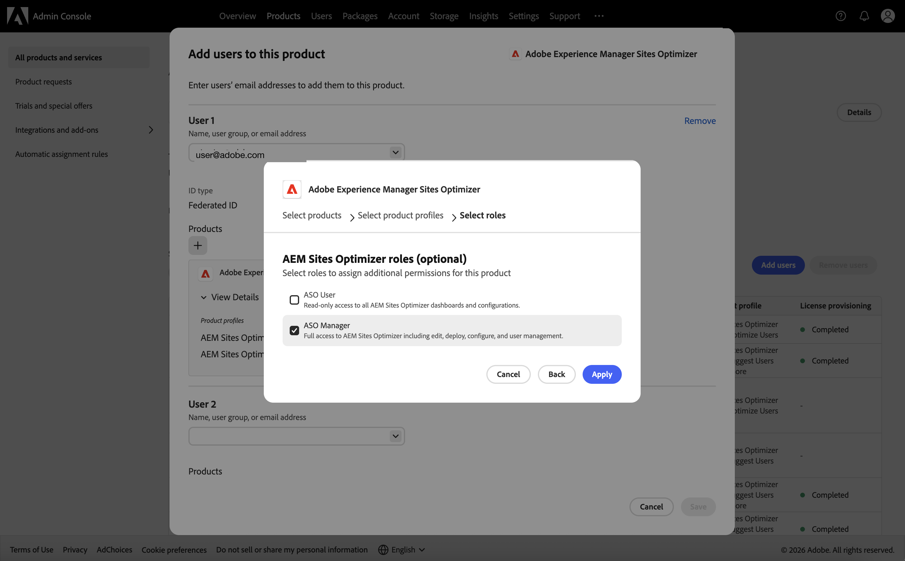

# 사용자 권한 관리

Sites Optimizer에서 사이트에 액세스할 수 있는 사용자와 이를 사용하여 수행할 수 있는 작업을 제어합니다. 액세스 권한은 각 사용자에게 부여하는 독립적인 *기능*(보기, 편집, 배포, 구성 및 사용자 관리)의 작은 집합에서 만들어집니다.

액세스 권한은 **additive**&#x200B;입니다. 개인의 권한은 부여된 모든 것의 합계입니다. 거부가 없기 때문에 지원금은 서로 충돌하거나 취소하지 않습니다. 다른 사용자에게 더 적은 액세스 권한을 부여하려면 권한 부여를 무시하지 말고 제거하십시오.

액세스를 관리하려면 **권한** 탭(왼쪽 탐색 영역에 있는 잠금 아이콘)을 연 다음 관리할 사이트를 선택하십시오.

{align="center"}

## 액세스 권한 부여 방법

사용자가 액세스할 수 있는 방법에는 두 가지가 있으며 함께 작동합니다.

- **조직 전체 액세스** — [Adobe Admin Console](https://adminconsole.adobe.com/)에서 Adobe 조직 관리자가 할당했습니다. 조직의 모든 사이트에 적용됩니다. 모든 곳에서 동일한 액세스를 필요로 하는 사람들을 위해 사용하십시오.
- **사이트 수준 액세스** — **권한** 탭에서 Sites Optimizer 내에 할당됩니다. 단일 사이트에 적용되며 필요한 만큼 광범위하거나 좁을 수 있습니다. Admin Console 액세스가 필요하지 않습니다.

>[!NOTE]
>
>두 개의 레이어가 더해집니다. 한 사이트에서 편집 권한이 부여된 조직 전체 보기 액세스 권한을 가진 사용자는 모든 사이트를 보고 해당 사이트를 편집할 수 있습니다. 한 사람을 단일 사이트로 제한하려면 이들이 조직 전체의 역할도 담당하지 않도록 해야 합니다.

### 조직 전체 역할(Admin Console)

조직 전체 액세스는 [AEM Sites Optimizer](https://adminconsole.adobe.com/)에서 할당된 두 **Adobe Admin Console** 제품 역할 중 하나에서 가져옵니다.

- **ASO 관리자** — **사용자 관리**&#x200B;를 포함하여 모든 사이트에 대한 전체 액세스 권한. 관리자는 모든 사이트에 대해 **권한** 탭을 열고 다른 사용자에게 액세스 권한을 할당할 수 있습니다.
- **ASO 사용자** — 모든 사이트에 대한 보기 전용 액세스 권한. 변경 사항 및 사용자 관리 없음.

역할을 할당하려면 조직의 **시스템 관리자** 또는 AEM Sites Optimizer의 **제품 관리자**&#x200B;여야 합니다.

1. [Adobe Admin Console](https://adminconsole.adobe.com/)에 로그인합니다.
1. **제품**(으)로 이동하여 **AEM Sites Optimizer**&#x200B;을(를) 선택하십시오.
1. **사용자** 탭을 열고 전자 메일로 사용자를 추가합니다(또는 기존 사용자를 선택).
1. **+**(추가) 아이콘을 클릭하여 제품 프로필을 추가한 다음 제품 프로필을 선택합니다.

   {align="center"}

1. **다음**&#x200B;을 클릭합니다.
1. 역할(전체 액세스용 **ASO 관리자** 또는 보기 전용 액세스용 **ASO 사용자**)을 선택한 다음 **적용**&#x200B;을 클릭합니다.

   {align="center"}

   {align="center"}

사용자 추가에 대한 자세한 내용은 [사용자 온보딩](setup/onboard-users.md)을 참조하십시오.

>[!IMPORTANT]
>
>조직 관리자만 조직 전체에 **사용자 관리**&#x200B;를 부여할 수 있습니다. 사이트에 **사용자 관리**&#x200B;가 있는 구성원은 해당 사이트에 대한 액세스 권한을 할당할 수 있지만 조직 전체의 **ASO 관리자**&#x200B;를 만들 수는 없습니다.

## 기능 수준

각 기능은 한 가지 종류의 작업을 제어합니다. 이러한 속성은 독립적입니다. 예를 들어 편집 없이 배포를 허용할 수 있습니다.

| 기능 | 허용 사항 | 허용되지 않는 사항 |
|---|---|---|
| 보기 | 아무 것도 변경하지 않고 사이트의 데이터(기회, 제안, 수정 사항, 보고서 및 구성)를 확인합니다. | 모든 변경 사항 |
| 편집 | 영업 기회와 제안 사항을 만들고 변경합니다(변경 사항). | 변경 사항 게시, 설정 변경 또는 사용자 관리 |
| 배포 | 수정 사항을 사이트에 실시간으로 게시하고 롤백합니다. | 사용자 관리. |
| 구성 | 사이트의 설정 및 연결을 변경합니다. | 수정 사항 게시 또는 사용자 관리 |
| 사용자 관리 | 다른 구성원의 사이트 액세스 권한을 부여하거나 취소합니다. | 개인이 아직 액세스할 수 없는 사이트 관리 |

>[!NOTE]
>
>**보기가 항상 포함됩니다.** 모든 부여에는 자동으로 보기가 포함됩니다. 볼 수 없는 항목을 관리, 구성, 편집 또는 배포할 수 없습니다. 이로 인해 보기는 자체적으로 제거할 수 없습니다. 다른 사람의 액세스 권한을 완전히 제거하려면 모든 기능을 선택 취소하는 대신 해당 구성원을 제거합니다(아래 [구성원 편집 또는 제거](#edit-or-remove-a-member) 참조).

## 영업 기회 유형에 대한 액세스 범위 지정

단일 사이트에서 전체 사이트 대신 **특정 영업 기회 유형**(예: Core Web Vitals 또는 끊어진 내부 링크)에 대한 보기, 편집 및 배포를 허용할 수 있습니다. 이렇게 하면 한 사람이 다른 모든 항목을 보면서 Core Web Vitals을 편집할 수 있습니다.

- **보기**, **편집** 및 **배포**&#x200B;의 범위를 하나 이상의 영업 기회 형식 또는 **모두**&#x200B;개의 영업 기회 형식으로 지정할 수 있습니다.
- **구성** 및 **사용자 관리**&#x200B;은(는) 항상 전체 사이트에 적용됩니다. 영업 기회 유형으로 제한될 수 없습니다.

범위가 지정된 각 부여는 멤버의 고유한 행으로 표시되며 **적용 대상** 열은 영업 기회 유형, **모두** 또는 **사이트 전체**&#x200B;를 표시합니다.

>[!CAUTION]
>
>범위 지정은 *해당* 부여에서 제공하는 권한만 제한합니다. 다른 부여에서 제공하는 액세스 권한은 제거하지 않습니다. 또한 사용자에게 조직 전체 액세스 권한 또는 **모두** 형식의 부여가 있는 경우 더 광범위한 액세스 권한이 적용됩니다. 따라서 특정 영업 기회 유형으로 사용자를 진정으로 제한하려면 더 광범위한 역할 또는 **모두** 유형 부여를 보유하고 있지 않은지 확인하십시오.

## 구성원 추가

1. **권한** 탭(왼쪽 탐색 영역에 있는 잠금 아이콘)을 열고 사이트를 선택합니다.
1. **구성원 추가**&#x200B;를 클릭합니다.
1. 이름 또는 전자 메일로 검색하고 한 명 이상의 사용자를 선택합니다.
1. 액세스가 적용되는 **영업 기회 유형**(또는 **모두**)을 선택한 다음 부여할 기능을 선택하십시오.
1. **추가**&#x200B;를 클릭합니다.

## 멤버 편집 또는 제거

**구성원** 테이블에서:

- 구성원 행에서 **기능 편집**&#x200B;을 클릭하여 수행할 수 있는 작업을 변경합니다. 기존 부여를 편집할 때 해당 영업 기회 유형은 고정된 상태를 유지합니다. 즉, 기능만 변경하고 하나 이상의 기능은 선택된 상태로 유지되어야 합니다.
- **제거**&#x200B;를 클릭하여 해당 구성원의 사이트 액세스를 완전히 취소하세요.

>[!NOTE]
>
>기능 변경과 멤버 제거는 서로 다른 작업입니다. 모든 액세스 권한을 제거하려면 **제거**&#x200B;를 사용하십시오. 권한 부여에 하나 이상의 기능이 유지되어야 하고 보기가 항상 유지되므로 기능을 선택 취소하면 수행할 수 없습니다.

## 권한을 관리할 수 있는 사람

사이트의 **권한** 탭은 다음 위치에서 사용할 수 있습니다.

- 해당 사이트에서 **사용자 관리** 기능을 가진 구성원 및
- 조직 관리자(ASO 관리자).

**사용자 관리**&#x200B;가 없는 구성원은 해당 사이트에 대한 액세스 관리 권한이 없다는 메시지를 볼 수 있습니다.

## 사용자 및 액세스 관리 켜기

사용자 및 액세스 관리는 조직의 설정에 의해 제어됩니다. 이 기능을 사용하기 전에 액세스 권한을 할당할 수 있지만 설정이 설정된 후에만 **강제**&#x200B;됩니다.

아직 활성화되지 않은 경우 **권한** 탭에 계정 팀에 문의하라는 배너가 표시됩니다. Sites Optimizer 계정 팀에 문의하여 이 기능을 켜십시오.

>[!NOTE]
>
>사용자 및 액세스 관리가 켜질 때까지 할당한 권한은 저장되지만 강제 적용되지는 않습니다.

## 적용하기 전에 액세스 설정

액세스를 할당하기 위해 시행이 시작될 때까지 기다리지 않아도 됩니다. 사용자 및 액세스 관리가 **꺼짐**&#x200B;인 경우에도 **ASO 관리자** 역할을 가진 사용자는 **권한** 탭을 열고 다른 사용자에게 사이트 및 기능을 할당할 수 있습니다.

이를 통해 모든 사용자에게 적합한 액세스 권한을 미리 준비할 수 있습니다. 나중에 시행이 켜지면 사용자는 이미 필요한 액세스 권한을 갖게 되므로 예기치 않게 아무도 잠기지 않습니다.

>[!IMPORTANT]
>
>적용이 해제되어 있는 동안에는 **권한** 탭은 **ASO 관리자** 사용자만 사용할 수 있습니다. 먼저 모든 사용자에 대한 액세스 권한을 설정한 다음 적용을 켭니다.

## 자주 묻는 질문

**사이트 수준 구성원이 Admin Console 역할이 필요합니까?**

아니요. 사이트 수준 액세스 권한은 전적으로 Sites Optimizer의 **권한** 탭에서 부여됩니다. Admin Console에서는 조직 전체 역할만 할당됩니다.

**조직 전체 액세스 권한과 사이트 수준 액세스 권한이 모두 있는 사람은 어떻게 됩니까?**

둘 다 적용됩니다. 그들의 효과적인 접근은 그 둘의 결합이다. 어떤 권한도 액세스를 거부할 수 없으므로 권한은 충돌하지 않습니다.

**사용자 관리 구성원이 조직 전체의 관리자를 만들 수 없는 이유는 무엇입니까?**

조직 전체 역할을 만드는 것은 Admin Console 작업입니다. **사용자 관리**&#x200B;가 있는 구성원은 자신의 사이트에서 액세스 권한을 할당할 수 있지만 조직 관리자만 조직 전체 역할을 부여할 수 있습니다.

**사이트에 대한 사용자의 액세스를 취소하려면 어떻게 해야 합니까?**

**권한** 탭에서 권한을 제거하십시오. 이는 편집 기능과 다르며, 편집 기능은 항상 하나 이상의 기능을 남겨야 합니다.

**개인을 특정 영업 기회 유형으로 제한할 수 있습니까?**

예 — **모두** 대신 특정 영업 기회 유형에 대한 보기, 편집 또는 배포 권한을 부여합니다. 액세스는 추가적이므로 이 기능은 개인이 조직 전체 액세스 권한이나 **모두** 유형의 부여를 받지 않는 경우에만 적용됩니다.
