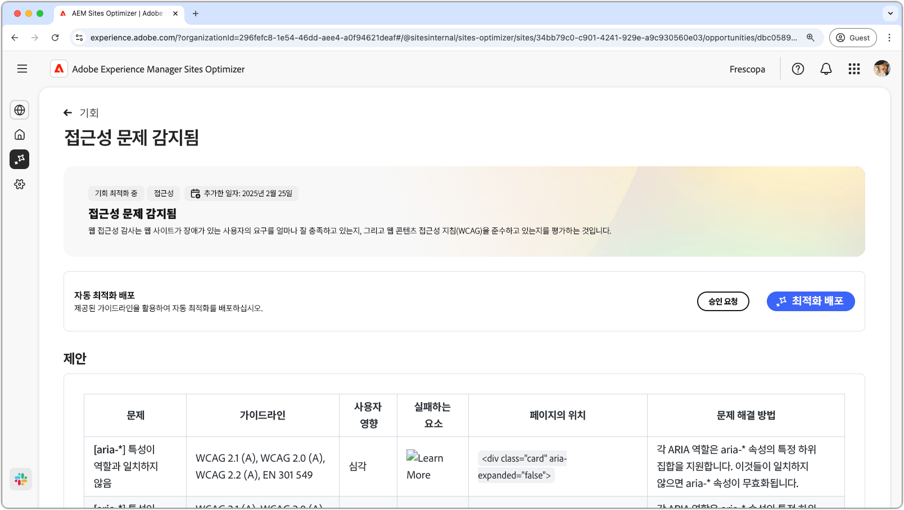
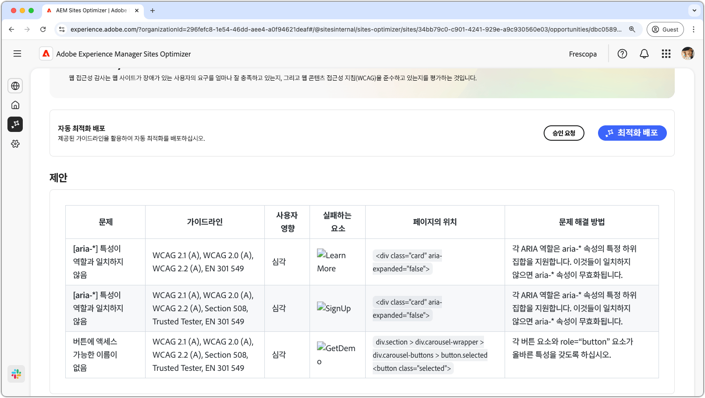

# 접근성 문제 기회

{align="center"}

접근성 문제 기회는 웹 사이트가 장애를 가진 사용자의 필요에 얼마나 잘 부합하는지와 [웹 콘텐츠 접근성 지침(WCAG)](https://www.w3.org/TR/WCAG21/)을 따르는지 여부를 식별합니다. 사이트가 WCAG를 얼마나 잘 준수하는지 평가함으로써 포괄적인 온라인 경험을 만드는 데 도움이 됩니다. 또한 시각, 청각, 인지 및 운동 장애가 있는 개인도 콘텐츠를 탐색하고 상호 작용하며 이점을 누릴 수 있습니다. 이 기능은 윤리적인 이유로 필수적일 뿐만 아니라 법적 요구 사항의 준수를 촉진하고 SEO를 개선하며 고객 만족도를 높여 사용자 경험과 비즈니스 성과를 모두 향상시킬 수 있습니다.

## 자동 식별

{align="center"}

**접근성 문제 기회**&#x200B;는 웹 사이트의 접근성 문제를 식별하며 다음을 포함합니다.

* **문제** – 발견된 특정 접근성 문제입니다.
* **지침** – 이 문제가 위반한 [WCAG 지침 ID](https://www.w3.org/TR/WCAG21/)입니다.
* **사용자 영향** – 장애가 있는 사용자에게 미치는 영향에 대한 평가입니다.
* **실패하는 요소** - 문제의 영향을 받는 웹 페이지의 HTML 요소입니다.
* **페이지에서의 위치** - 문제의 영향을 받는 페이지의 요소에 대한 HTML 스니펫입니다.

## 자동 제안

{align="center"}

자동 제안은 **문제 해결 방법** 필드에 문제를 해결하기 위해 수행해야 할 작업에 대한 구체적인 지침이 포함된 AI 생성 권장 사항을 제공합니다.

## 자동 최적화

[!BADGE Ultimate]{type=Positive tooltip="Ultimate"}

{align="center"}

Sites Optimizer Ultimate에는 발견된 취약점에 대해 자동 최적화를 배포하는 기능이 추가됩니다.

>[!BEGINTABS]

>[!TAB 최적화 배포]

{{auto-optimize-deploy-optimization-slack}}

>[!TAB 승인 요청]

{{auto-optimize-request-approval}}

>[!ENDTABS]
