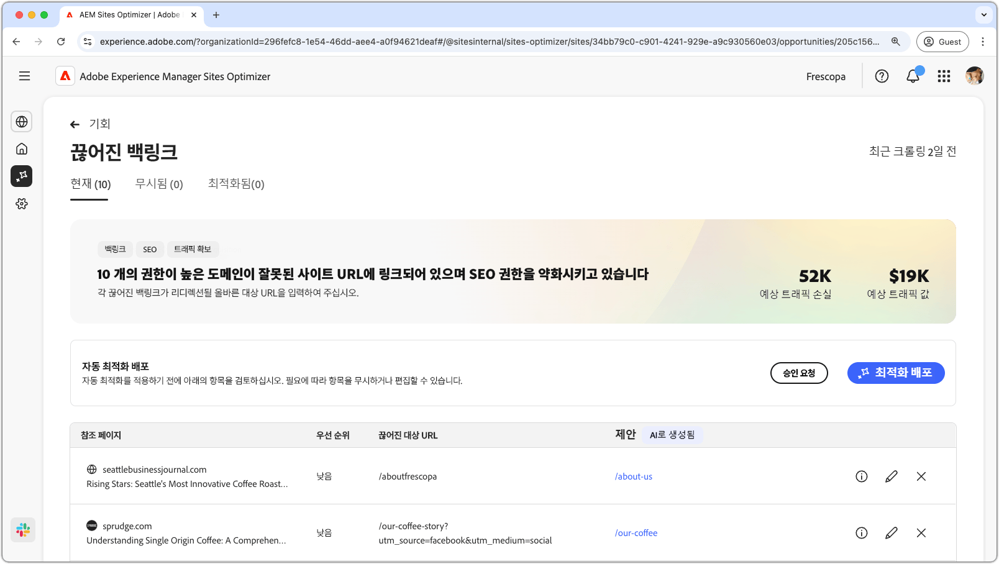
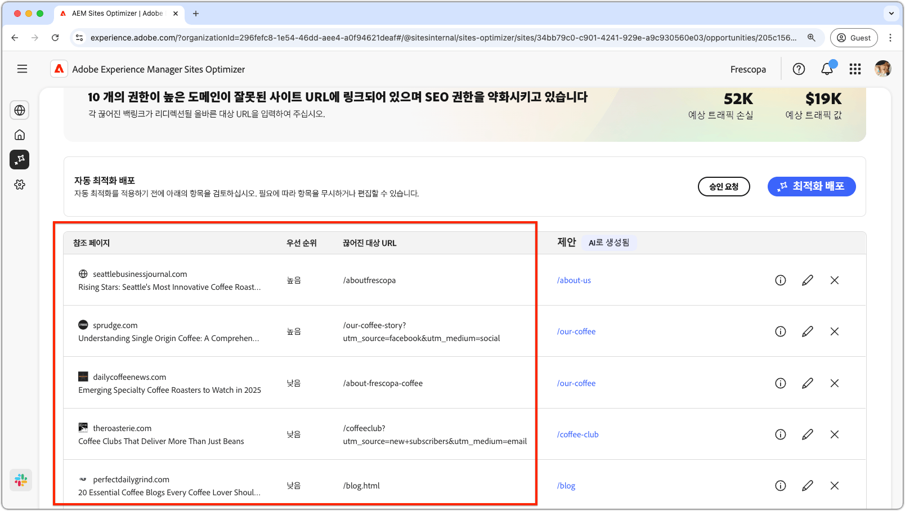
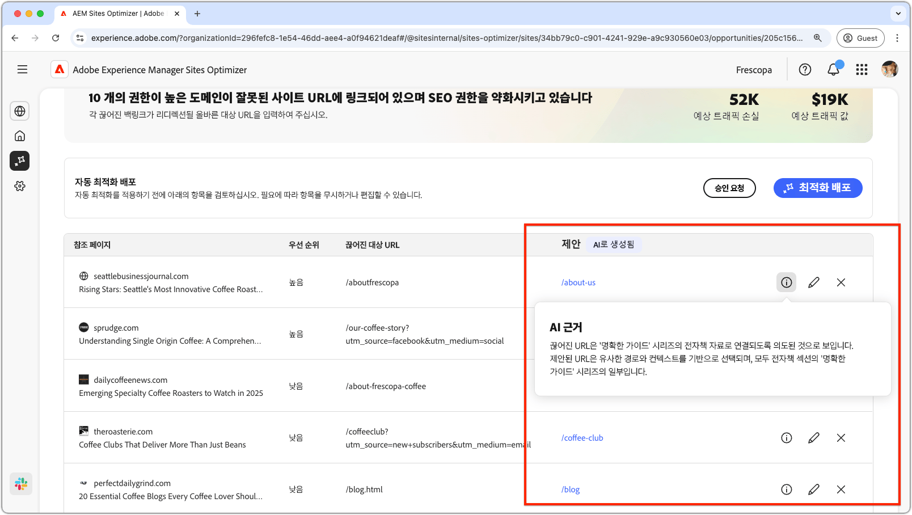
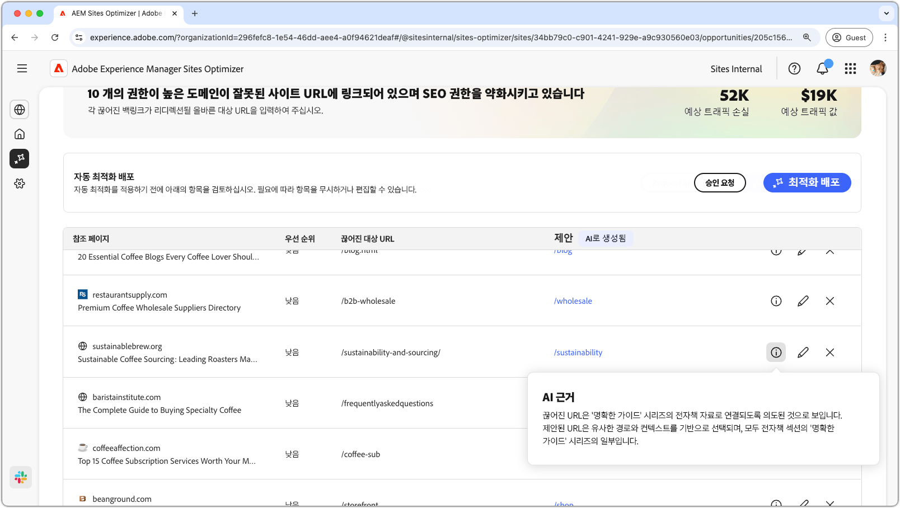
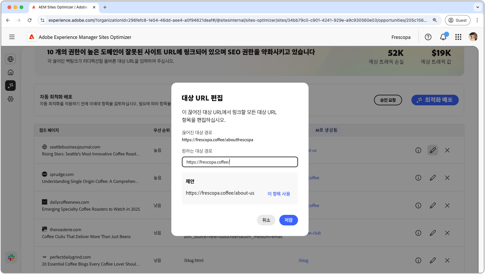
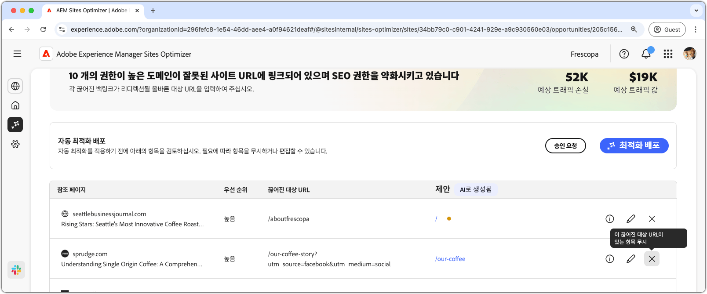

# 끊어진 백링크 기회

<!--{align="center"}-->

>[!VIDEO](https://video.tv.adobe.com/v/3483260/?captions=kor&learn=on&enablevpops)

끊어진 백링크 기회는 사이트에 존재하지 않는(404) 페이지를 가리키는 외부 링크를 식별합니다. 이러한 링크가 있으면 참조 트래픽이 손실되고 검색 엔진이 백링크를 사용하여 관련성과 권한을 평가하기 때문에 SEO 값 또한 줄어듭니다. 이러한 문제는 URL이 변경되거나, 콘텐츠가 제거되거나, 적절한 리디렉션 없이 페이지를 더 이상 사용할 수 없을 때 발생합니다. AEM Sites Optimizer는 끊어진 모든 백링크를 식별하고 구체적인 AI 권장 사항을 제공하며 클릭 한 번으로 배포하여 끊어진 백링크를 수정할 수 있는 기능을 지원합니다. 이 모든 작업은 단일 중앙 집중식 보기에서 이루어집니다.

## 자동 식별

<!--{align="center"}-->

AEM Sites Optimizer는 지속적으로 외부 데이터 소스를 스캔하여 사이트에 존재하지 않는 404페이지를 가리키는 백링크를 감지합니다. Google Search Console, [운영 원격 측정](https://experienceleague.adobe.com/ko/docs/experience-manager-cloud-service/content/sites/operational-telemetry-for-aem-as-a-cloud-service), 서드파티 SEO 플랫폼을 포함하여 여러 소스에서 데이터를 집계합니다. 자동 식별 기회는 끊어진 URL에 연결된 외부 도메인을 식별하고 도메인 권한, 예상 트래픽 및 링크 지분 손실을 포함한 영향을 기준으로 해당 URL의 우선순위를 지정합니다.

이 기회에는 다음 세부 정보를 포함하여 식별된 모든 문제가 나열됩니다.

* **참조 도메인 및 페이지** – 끊어진 링크가 포함된 외부 페이지 또는 도메인입니다.
* **우선순위** – 높음, 보통, 낮음으로 구분되며, SEO 프로세스에 끊어진 링크가 미치는 영향을 나타냅니다.
* **끊어진 대상 URL** – 사이트에서 링크되고 있지만 존재하지 않는 URL입니다.

## 자동 제안

<!--{align="center"}-->

AEM Sites Optimizer는 식별된 각 끊어진 백링크에 대해 트래픽 및 SEO 값을 복원하기에 가장 적합한 대상을 권장하며 다음 항목을 분석하여 백링크의 의도를 파악합니다.

* URL 구조 및 토큰
* 앵커 텍스트
* 참조 페이지의 제목 및 컨텍스트

이 의도를 기존 사이트 콘텐츠와 비교하여 가장 관련성이 높은 대상 페이지를 식별합니다. 각각의 끊어진 URL은 정확하게 일치하는 대체 페이지나 가장 유사하고 관련성이 높은 페이지에 매핑됩니다. 적합한 대상을 결정할 수 없는 경우 수동으로 검토할 수 있도록 문제가 표시됩니다.

>[!BEGINTABS]

>[!TAB AI 이론적 근거]

<!--{align="center"}-->

**정보** 아이콘을 선택하면 제안된 URL에 대한 AI 이론적 근거를 확인할 수 있습니다. 이론적 근거는 AI가 제안된 URL이 끊어진 링크에 가장 적합하다고 판단한 이유를 설명합니다. 이를 통해 AI의 의사 결정 과정을 이해하고 제안을 수락할지 거부할지에 대한 정보에 입각한 결정을 내리는 데 도움이 될 수 있습니다.

>[!TAB 대상 URL 편집]

<!--{align="center"}-->

AI 생성 제안에 동의하지 않는 경우 **편집 아이콘**&#x200B;을 선택하여 제안된 URL을 편집할 수 있습니다. 편집하면 끊어진 링크에 가장 적합하다고 생각되는 URL을 수동으로 입력할 수 있습니다. Sites Optimizer는 사이트에서 끊어진 링크에 적합할 것으로 판단되는 다른 URL도 나열합니다.

>[!TAB 항목 무시]

<!--{align="center"}-->

타기팅된 끊어진 URL이 포함된 항목을 무시하도록 선택할 수 있습니다. 을 선택하면 기회 목록에서 끊어진 백링크가 제거됩니다. 무시된 끊어진 백링크는 기회 페이지 상단의 **무시됨** 탭에서 다시 활성화할 수 있습니다.

>[!ENDTABS]

## 자동 최적화

<!--[!BADGE Ultimate]{type=Positive tooltip="Ultimate"}-->

제안을 검토하고 승인하면 **최적화 배포**&#x200B;를 클릭할 수 있습니다. 그러면 AEM Sites Optimizer가 구현 내에서 리디렉션이 관리되는 방식에 따라 수정 사항을 작성 환경에 적용합니다. 그런 다음, AEM 작성자는 콘텐츠 관리 시스템(CMS)에서 변경 사항을 게시할 수 있습니다.

구성에 따라 수정 사항은 기존 배포 워크플로 내에서 콘텐츠 변경 사항 또는 코드 변경 사항으로 적용됩니다. 최적화 프로세스에는 다음 단계가 포함됩니다.

* **유효성 검사** – 배포하기 전에 변경 사항이 예상대로 작동하고 회귀를 초래하지 않는지 확인합니다.
* **배포** – AEM의 콘텐츠 업데이트 또는 CI/CD 파이프라인을 통한 코드 배포와 같은 기존 프로세스를 통해 변경 사항을 적용합니다.
* **권한 확인** – 사용자에게 변경 사항을 배포할 수 있는 적절한 권한이 있는지 확인합니다. 그렇지 않은 경우 다운로드 가능한 리디렉션 목록 또는 코드 패치와 같은 대체 출력이 제공됩니다.

이 프로세스를 통해 리디렉션이 정확하게 구현되고 릴리스 전에 유효성 검사를 거치며 기존 구성 및 거버넌스 프로세스와 일치하도록 할 수 있습니다.
