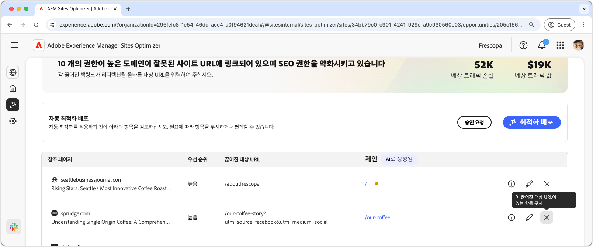

# 끊어진 백링크 기회

{align="center"}

끊어진 백링크 기회는 다른 웹 사이트에서 귀하의 사이트로 연결되는 링크 중 404 오류로 이어지는 링크를 식별합니다. 검색 엔진은 백링크를 사용하여 검색 관련성을 결정하므로, 끊어진 링크는 사이트의 SEO 및 검색 가능성에 부정적인 영향을 미칠 수 있습니다. 이러한 문제는 URL 변경이나 링크된 페이지 제거와 같은 요소로 인해 발생할 수 있습니다.

끊어진 백링크 기회는 페이지 상단에 요약을 표시하며, 여기에는 문제의 개요와 사이트 및 비즈니스에 미치는 영향이 포함됩니다.

* **예상 트래픽 손실** - 끊어진 백링크로 인한 예상 트래픽 손실입니다.
* **예상 트래픽 가치** - 손실된 트래픽의 예상 가치입니다.

## 자동 식별

{align="center"}

끊어진 백링크 기회는 사이트의 모든 끊어진 백링크를 나열하며, 여기에는 다음이 포함됩니다.

* **참조 페이지** - 끊어진 링크가 포함된 웹 사이트 도메인입니다.
* **우선순위** - 높음, 보통, 낮음으로 구분되며, TODO 기반 SEO에 끊어진 링크가 미치는 영향을 나타냅니다.
* **끊어진 대상 URL** - 사이트에서 링크되고 있지만 존재하지 않는 URL입니다.

## 자동 제안

{align="center"}

끊어진 백링크 기회는 또한 끊어진 URL이 웹 사이트의 어느 페이지로 리디렉션되어야 하는지에 대한 AI 생성 제안을 제공합니다. 제안은 끊어진 URL을 구성하는 텍스트와 제안된 페이지의 내용을 기반으로 합니다.

>[!BEGINTABS]

>[!TAB AI 이론적 근거]

{align="center"}

**정보** 아이콘을 선택하면 제안된 URL에 대한 AI 이론적 근거를 확인할 수 있습니다. 이론적 근거는 AI가 제안된 URL이 끊어진 링크에 가장 적합하다고 판단한 이유를 설명합니다. 이를 통해 AI의 의사 결정 과정을 이해하고 제안을 수락할지 거부할지에 대한 정보에 입각한 결정을 내리는 데 도움이 될 수 있습니다.

>[!TAB 대상 URL 편집]

{align="center"}

AI 생성 제안에 동의하지 않는 경우 **편집 아이콘**&#x200B;을 선택하여 제안된 URL을 편집할 수 있습니다. 이렇게 하면 끊어진 링크에 가장 적합하다고 생각되는 URL을 수동으로 입력할 수 있습니다. Sites Optimizer는 사이트에서 끊어진 링크에 적합할 것으로 판단되는 다른 URL도 나열합니다.

>[!TAB 항목 무시]

{align="center"}

끊어진 대상 URL이 포함된 항목을 무시하도록 선택할 수 있습니다. **무시 아이콘**&#x200B;을 선택하면 기회 목록에서 끊어진 백링크가 제거됩니다. 무시된 끊어진 백링크는 기회 페이지 상단의 **무시됨** 탭에서 다시 활성화할 수 있습니다.

>[!ENDTABS]

## 자동 최적화

[!BADGE Ultimate]{type=Positive tooltip="Ultimate"}

{align="center"}

Sites Optimizer Ultimate에는 끊어진 백링크에 대해 자동 최적화를 배포하는 기능이 추가됩니다. **자동 최적화** 버튼을 선택하면 AEM 사이트의 리디렉션 규칙이 **끊어진 대상 URL**&#x200B;을 **제안된 URL**&#x200B;에 매핑하도록 자동 업데이트됩니다. 이렇게 하면 **참조 페이지**&#x200B;의 끊어진 링크를 따르는 웹 사이트 방문자와 검색 봇이 사이트의 올바른 페이지로 리디력션되어 SEO 및 사용자 경험이 향상됩니다.

>[!BEGINTABS]

>[!TAB 최적화 배포]

{align="center"}

**배포 최적화**&#x200B;를 선택하면 AEM 사이트의 리디렉션 규칙이 **끊어진 대상 URL**&#x200B;을 **제안된 URL**&#x200B;에 매핑하도록 업데이트됩니다. 이렇게 하면 **참조 페이지**&#x200B;의 끊어진 링크를 따르는 웹 사이트 방문자와 검색 봇이 사이트의 올바른 페이지로 리디력션되어 SEO 및 사용자 경험이 향상됩니다.

>[!TAB 승인 요청]

{align="center"}

{{auto-optimize-request-approval}}

>[!ENDTABS]
