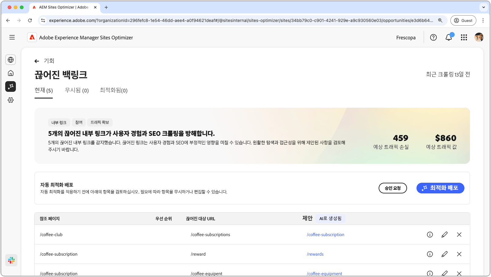

# 끊어진 내부 링크 기회

{align="center"}

끊어진 내부 링크는 검색 엔진이 사이트를 색인화하는 능력에 영향을 미치고, 사용자 경험과 검색 엔진 최적화에 부정적인 영향을 미칩니다. 이 문제를 해결하기 위해 끊어진 내부 링크 기회는 끊어진 URL을 표시하고 유효한 링크 업데이트에 대한 제안을 제공합니다. 이러한 문제를 해결하면 사용자 참여도를 향상시키고 원활한 탐색 및 접근성을 보장할 수 있습니다.

끊어진 내부 링크 기회는 페이지 상단에 요약을 표시하며, 여기에는 문제의 개요와 사이트 및 비즈니스에 미치는 영향이 포함됩니다.

* **예상 트래픽 손실** – 끊어진 내부 링크로 인한 예상 트래픽 손실입니다.
* **예상 트래픽 가치** – 손실된 트래픽의 예상 가치입니다.

## 자동 식별

<!---{align="center"}-->

끊어진 내부 링크 기회는 페이지의 모든 끊어진 내부 링크를 자동으로 식별하여 나열하며, 여기에는 다음 사항이 포함됩니다.

* **참조 페이지** – 끊어진 링크가 포함된 페이지입니다.
* **끊어진 대상 URL** – 끊어진 내부 링크입니다.
* **제안** – 끊어진 링크를 업데이트하는 방법에 대한 AI 생성 제안입니다. 자세한 내용은 자동 제안 섹션을 참조하십시오.

## 자동 제안

<!--{align="center"}-->

끊어진 내부 링크 기회는 끊어진 링크를 업데이트하는 방법에 대한 AI 생성 제안을 제공합니다. 이러한 제안은 타기팅된 끊어진 URL을 기반으로 하며 적합한 대체 URL을 제공합니다. 을 선택하면 제안된 업데이트에 대한 AI 생성 근거가 제공됩니다.

>[!BEGINTABS]

>[!TAB AI 이론적 근거]

<!--[AI rationale of broken internal links](./assets/broken-internal-links/auto-suggest-ai-rationale.png) -->

제안된 URL의 AI 근거를 보려면 을 선택하십시오. 이론적 근거는 AI가 제안된 URL이 끊어진 링크에 가장 적합하다고 판단한 이유를 설명합니다. AI의 의사 결정 과정을 이해하고 제안을 받아들일지 거부할지 정보에 입각한 결정을 내리는 데도 도움이 된다.

>[!TAB 대상 URL 편집]

<!--{align="center"}-->

AI 생성 제안에 동의하지 않는 경우 **편집 아이콘**&#x200B;을 선택하여 제안된 링크 값을 편집할 수 있습니다. 이 기능을 사용하면 원하는 링크를 수동으로 입력할 수 있습니다. 편집 창에는 링크의 **끊어진 대상 경로**, 링크를 수동으로 편집할 수 있는 **원하는 대상 경로** 및 AI 생성 제안이 포함된 필드가 포함됩니다. 편집이 완료되면 **저장**&#x200B;을 클릭하여 끊어진 링크 항목을 업데이트합니다. 시작 필드에 노란색 점이 표시되어 링크가 편집되었음을 나타냅니다.

>[!TAB 항목 무시]

<!--{align="center"}-->

타기팅된 끊어진 URL이 포함된 항목을 무시하도록 선택할 수 있습니다. 을 선택하면 영업 기회 목록에서 항목이 제거됩니다. 무시된 항목은 기회 페이지 상단의 **무시됨** 탭에서 다시 활성화할 수 있습니다.

>[!ENDTABS]

## 자동 최적화

[!BADGE Ultimate]{type=Positive tooltip="Ultimate"}

<!---{align="center"}-->

Sites Optimizer Ultimate에는 기회를 통해 발견된 끊어진 링크에 대해 자동 최적화를 배포하는 기능이 추가됩니다. <!--- TBD-need more in-depth and opportunity specific information here. What does the auto-optimization do?-->

>[!BEGINTABS]

>[!TAB 최적화 배포]

{{auto-optimize-deploy-optimization-slack}}

>[!TAB 승인 요청]

{{auto-optimize-request-approval}}

>[!ENDTABS]

