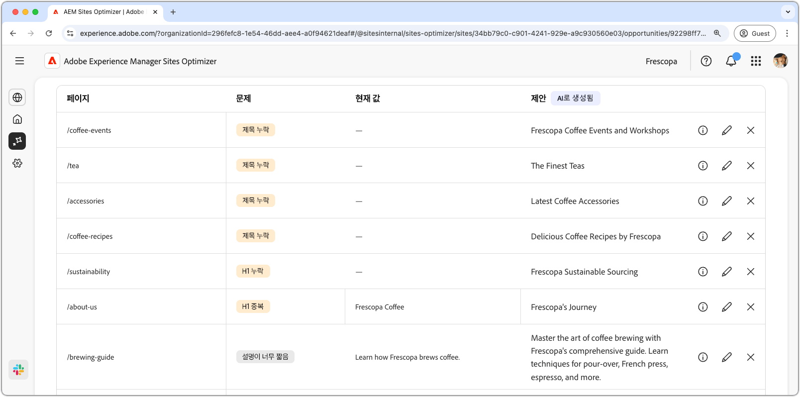

# 메타데이터 기회가 잘못되었거나 누락되었습니다.

{align="center"}

끊어진 내부 링크는 사이트를 색인화하는 검색 엔진의 기능에 영향을 주고 사용자 경험과 검색 엔진 최적화 모두에 부정적인 영향을 줍니다. 이 문제를 해결하는 데 도움이 되도록 끊어진 내부 링크 기회가 끊어진 URL을 알려 주고 유효한 링크 업데이트에 대한 제안을 제공합니다. 이러한 문제를 해결하면 사용자 참여도가 향상되고 원활한 탐색 및 접근성이 보장됩니다.

끊어진 내부 링크 영업 기회는 페이지 맨 위에 문제와 사이트 및 비즈니스에 미치는 영향에 대한 개요를 포함한 요약을 표시합니다.

* **예상되는 트래픽 손실** - 내부 링크가 끊어져 예상되는 트래픽 손실입니다.
* **예상 트래픽 값** - 손실된 트래픽의 예상 값입니다.

## 자동 식별

<!---{align="center"}-->

끊어진 내부 링크 영업 기회는 페이지에 있는 끊어진 모든 내부 링크를 자동으로 식별하고 나열하며 다음을 포함합니다.

* **참조 페이지** - 끊어진 링크가 포함된 페이지입니다.
* **끊어진 대상 URL** - 끊어진 내부 링크입니다.
* **제안** - 끊어진 링크를 업데이트하는 방법에 대한 AI 생성 제안입니다. 자세한 내용은 자동 제안 섹션을 참조하십시오.

## 자동 제안

<!--{align="center"}-->

끊어진 내부 링크 영업 기회는 끊어진 링크를 업데이트하는 방법에 대해 AI가 생성한 제안 사항을 제공합니다. 이러한 제안은 타깃팅된 끊어진 URL을 기반으로 하며 적절한 대체를 제공합니다. **정보 아이콘**&#x200B;을 선택하면 제안된 업데이트에 대한 AI 생성 근거가 제공됩니다.

>[!BEGINTABS]

>[!TAB AI 이유]

<!--[AI rationale of broken internal links](./assets/broken-internal-links/auto-suggest-ai-rationale.png) -->

제안된 URL의 AI 근거를 보려면 **정보** 아이콘을 선택하십시오. 그 근거는 AI가 제안된 URL이 끊어진 링크에 가장 잘 맞는다고 믿는 이유를 설명한다. 이를 통해 AI의 의사 결정 과정을 이해하고 제안을 받아들일지 거부할지 정보에 입각한 결정을 내릴 수 있다.

>[!TAB 대상 URL 편집]

<!--{align="center"}-->

AI가 생성한 제안에 동의하지 않는 경우 **편집 아이콘**&#x200B;을 선택하여 제안된 링크 값을 편집할 수 있습니다. 이렇게 하면 원하는 링크를 수동으로 입력할 수 있습니다. 편집 창에는 링크의 **끊어진 대상 경로**, 링크와 Ai 생성 제안을 사용하여 필드를 수동으로 편집할 수 있는 **원하는 대상 경로**&#x200B;가 포함되어 있습니다. 편집을 마치면 **저장**&#x200B;을 클릭하여 끊어진 링크 항목을 업데이트합니다. 시작 필드에 노란색 점이 표시되어 링크가 편집되었음을 나타냅니다.

>[!TAB 항목 무시]

<!--{align="center"}-->

타깃팅된 끊어진 URL이 있는 항목은 무시하도록 선택할 수 있습니다. **무시 아이콘**&#x200B;을 선택하면 영업 기회 목록에서 항목이 제거됩니다. 기회 페이지 상단의 **무시됨** 탭에서 무시된 항목을 다시 사용할 수 있습니다.

>[!ENDTABS]

## [!BADGE Ultimate] 자동 최적화{type=Positive tooltip="Ultimate"}

<!---{align="center"}-->

Sites Optimizer Ultimate은 해당 영업 기회에 의해 발견된 끊어진 링크에 대한 자동 최적화 배포 기능을 추가합니다. <!--- TBD-need more in-depth and opportunity specific information here. What does the auto-optimization do?-->

>[!BEGINTABS]

>[!TAB 최적화 배포]

{{auto-optimize-deploy-optimization-slack}}

>[!TAB 승인 요청]

{{auto-optimize-request-approval}}

>[!ENDTABS]

