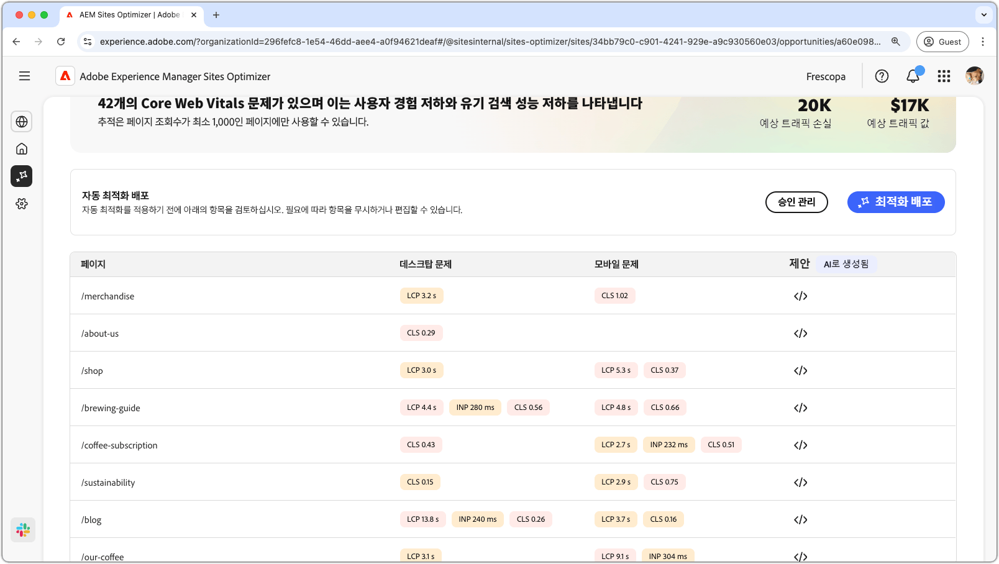
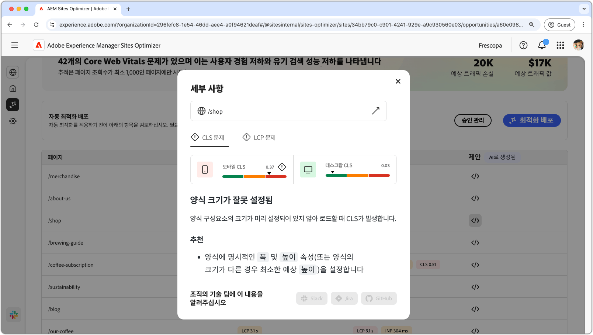
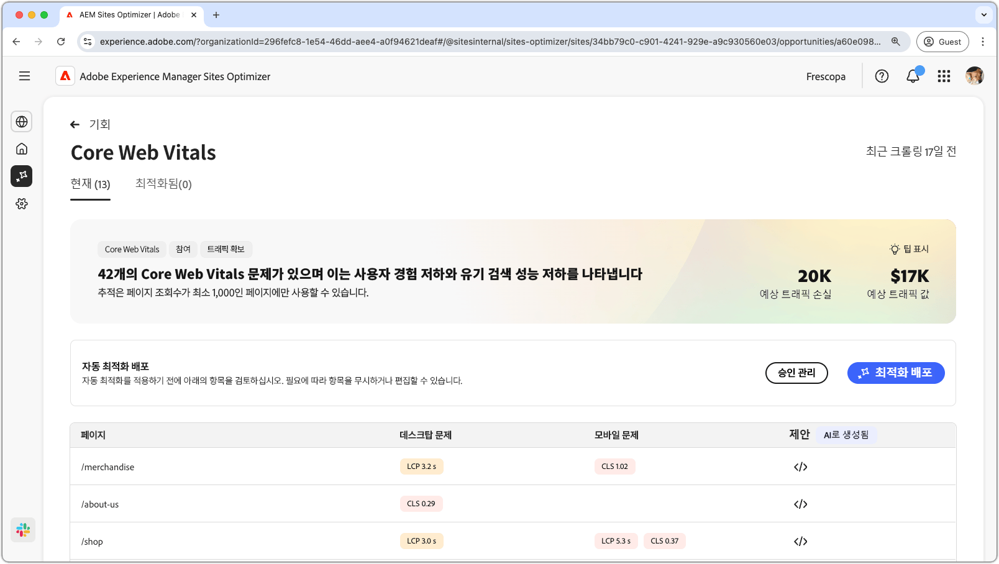

# 핵심 웹 바이탈 기회

{align="center"}

핵심 웹 바이탈 기회는 웹 페이지의 사용자 경험과 유기 검색 성능을 저하시킬 수 있는 문제를 식별합니다. 이러한 문제는 사용자 정의 글꼴, 최적화되지 않은 JavaScript 종속성, 서드파티 스크립트 등 다양한 요인으로 인해 발생합니다. 핵심 웹 바이탈 기회는 이러한 잘못된 요소를 표시하고 웹 페이지 성능을 높일 수 있는 수정 사항을 제안합니다. 페이지 조회수가 최소 1000인 페이지만 분석할 수 있습니다.

우선, 핵심 웹 바이탈 기회는 페이지 상단에 요약을 표시하며, 여기에는 문제의 개요와 사이트 및 비즈니스에 미치는 영향이 포함됩니다.

* **예상 트래픽 손실** – 핵심 웹 바이탈이 성능 임계값 미만인 경우 예상되는 트래픽 손실입니다.
* **예상 트래픽 가치** – 손실된 트래픽의 예상 가치입니다.

## 자동 식별

{align="center"}

페이지 하단에는 현재 진행 중인 모든 문제가 다음과 같이 그룹화되어 나열되어 있습니다.

* **모바일 문제** – 모바일 버전 페이지에 영향을 미치는 문제 목록입니다.
* **데스크탑 문제** – 데스크탑 버전 페이지에 영향을 미치는 문제 목록입니다.

각 문제는 테이블에 표시되며, **페이지** 열은 영향을 받는 페이지 항목을 식별합니다.

또한 이러한 문제는 핵심 웹 바이탈 보고서의 표준 성능 지표에 따라 콘텐츠풀 페인트 **LCP**, 다음 페인트에 대한 상호 작용 **INP** 및 누적 레이아웃 이동 **CLS**&#x200B;로 그룹화됩니다.

## 자동 제안

{align="center"}

핵심 웹 바이탈 기회는 AI 생성 수정 제안을 제공합니다. 제안 버튼을 클릭하면 **LCP**, **INP** 및 **CLS**&#x200B;가 카테고리로 표시된 새 창이 나타납니다. 이들 카테고리 간 전환하면 특정 문제 목록을 볼 수 있습니다.

각 카테고리에는 여러 가지 문제가 포함될 수 있으므로, 전체 문제와 권장 사항 목록을 확인하려면 아래로 스크롤합니다.  또한 각 지표에 대해 모바일과 데스크탑 모두에 대한 두 가지 성능 게이지가 표시됩니다.

## 자동 최적화

[!BADGE Ultimate]{type=Positive tooltip="Ultimate"}

{align="center"}

Sites Optimizer Ultimate에는 핵심 웹 바이탈 기회를 통해 발견된 문제에 대한 자동 최적화를 배포하는 기능이 추가됩니다. <!--- TBD-need more in-depth and opportunity specific information here. What does the auto-optimization do?-->

>[!BEGINTABS]

>[!TAB 최적화 배포]

{{auto-optimize-deploy-optimization-slack}}

>[!TAB 승인 요청]

{{auto-optimize-request-approval}}

>[!ENDTABS]

