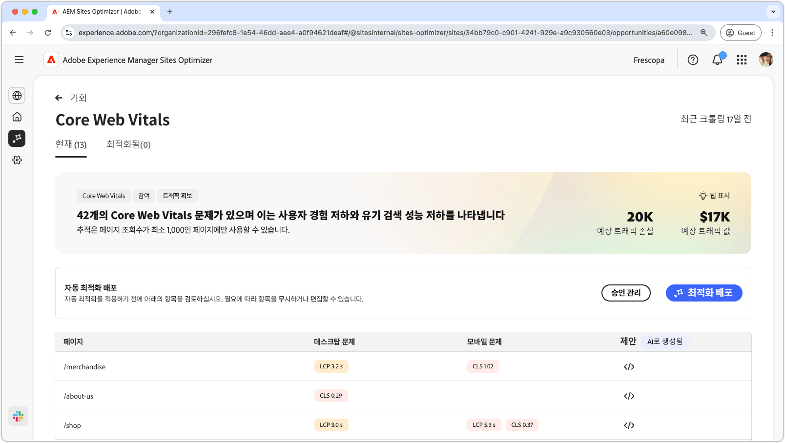
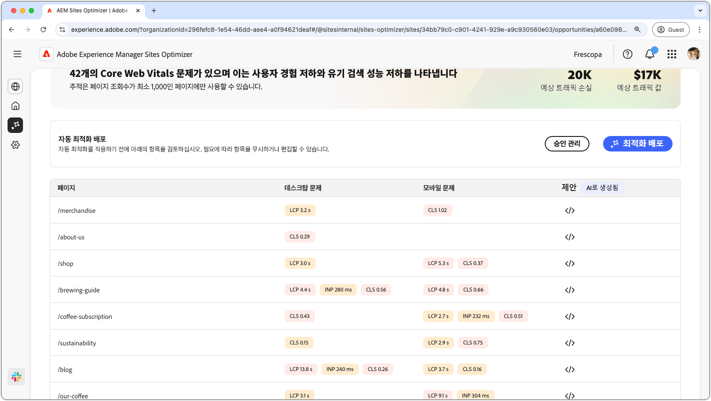
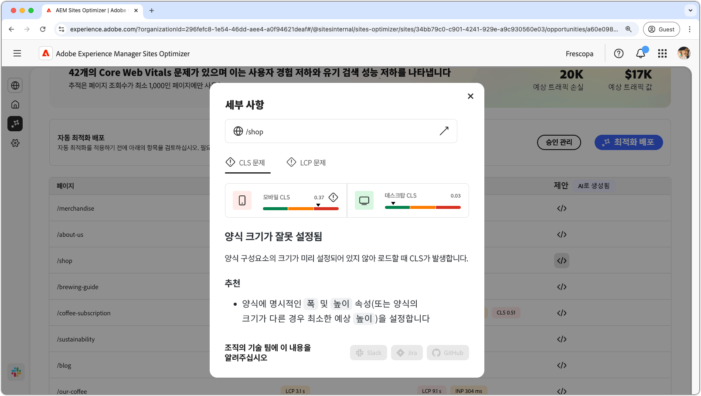

# Core Web Vitals 기회

<!--{align="center"}-->

>[!VIDEO](https://video.tv.adobe.com/v/3483371/?learn=on&enablevpops)

Core Web Vitals 기회는 성능이 저하되어 사용자 경험과 유기 검색 성능에 영향을 미치는 웹 사이트 페이지를 식별합니다. 이러한 문제는 사용자 정의 글꼴, 최적화되지 않은 JavaScript 종속성, 서드파티 스크립트와 같은 요인으로 인해 발생할 수 있습니다. Core Web Vitals는 콘텐츠 로드 속도, 페이지 레이아웃의 안정성, 사용자 상호 작용에 대한 페이지 반응성을 측정합니다.

AEM Sites Optimizer는 이러한 문제의 영향을 받는 페이지를 감지하고 코드 수준에서 구체적인 AI 권장 사항을 제공하며 기존 개발 워크플로를 통해 수정 사항을 적용합니다. 페이지 조회수가 최소 1,000인 페이지만 분석할 수 있습니다.

## 자동 식별

<!--{align="center"}-->

AEM Sites Optimizer는 [운영 원격 측정](https://experienceleague.adobe.com/ko/docs/experience-manager-cloud-service/content/sites/operational-telemetry-for-aem-as-a-cloud-service)을 사용하여 최대 콘텐츠풀 페인트(LCP), 누적 레이아웃 이동(CLS), 다음 페인트에 대한 상호 작용(INP)과 같은 Core Web Vitals 지표에서 회귀를 감지하여 사이트 성능을 지속적으로 모니터링합니다. 실제 사용자 데이터를 사용하여 성능 회귀를 식별하고 사용자 경험에 미치는 영향에 따라 문제의 우선순위를 지정합니다.

AEM Sites Optimizer는 현재 모든 문제 목록을 모바일과 데스크탑별로 자세히 표시합니다. **페이지** 열은 영향을 받는 페이지 항목을 나타내며 문제는 LCP, INP, CLS로 분류됩니다.

## 자동 제안

<!--{align="center"}-->

식별된 각 문제에 대해 AEM Sites Optimizer는 Core Web Vitals 성능을 향상할 수 있도록 규범적인 코드 수준 권장 사항을 생성합니다. 그리고 코드 저장소에 액세스하여 기본 구현을 평가합니다. 그러면 시스템에서 구성 요소, 스크립트, 스타일이 구현되는 방식을 분석하고 성능 문제가 발생한 근본 원인을 식별할 수 있습니다. 이 분석을 기반으로 시스템은 대상이 지정된 권장 사항을 제공하고 성능 향상에 필요한 변경 사항을 지정하는 코드 패치를 생성합니다. 각 권장 사항은 적용하기 전에 검토할 수 있습니다.

제안 버튼을 클릭하면 LCP, INP 및 CLS가 카테고리로 표시된 새 창이 나타납니다. 이들 카테고리 간 전환하면 특정 문제 목록을 볼 수 있습니다. 각 카테고리에는 여러 가지 문제가 포함될 수 있으므로, 전체 문제와 권장 사항 목록을 확인하려면 아래로 스크롤합니다. 또한 각 지표에 대해 모바일과 데스크탑 모두에 대한 두 가지 성능 게이지가 표시됩니다.

## 자동 최적화

<!--[!BADGE Ultimate]{type=Positive tooltip="Ultimate"}-->

권장 사항을 검토하고 승인하면 **최적화 배포**&#x200B;를 클릭할 수 있습니다. AEM Sites Optimizer는 식별된 문제를 기반으로 코드 패치를 생성하여 버전 제어 프로세스를 통해 사용할 수 있도록 합니다. 최적화 프로세스에는 다음 단계가 포함됩니다.

* **문제 생성** – 각 수정 사항에 대해 레이블이 지정된 GitHub 문제를 만들고 가시성을 위해 명확한 설명과 영향을 받는 URL을 포함합니다.
* **가져오기 요청 전달** – 정확한 코드 수정 사항이 있는 연결된 가져오기 요청을 자동으로 열고 검토, 테스트, 병합할 수 있도록 준비합니다.
* **상태 추적** – 각 수정 사항을 완료할 때까지 추적하고 부분적으로 완료했거나 실패한 시도에 플래그를 지정하여 후속 조치를 취할 수 있도록 합니다.

AEM Sites Optimizer는 해당 업데이트를 제공하기 전에 유효성 검사를 수행하여 수정 사항이 기본 문제를 해결하고 회귀를 초래하지 않는지 확인합니다. 모든 업데이트는 표준 개발 관행을 따르며 프로덕션으로 병합되기 전에 검토와 승인을 거쳐야 합니다.

이를 통해 성능 최적화가 정확하게 이루어지고 유효성 검사를 거치며 기존 개발 및 거버넌스 프로세스에 통합됩니다.
