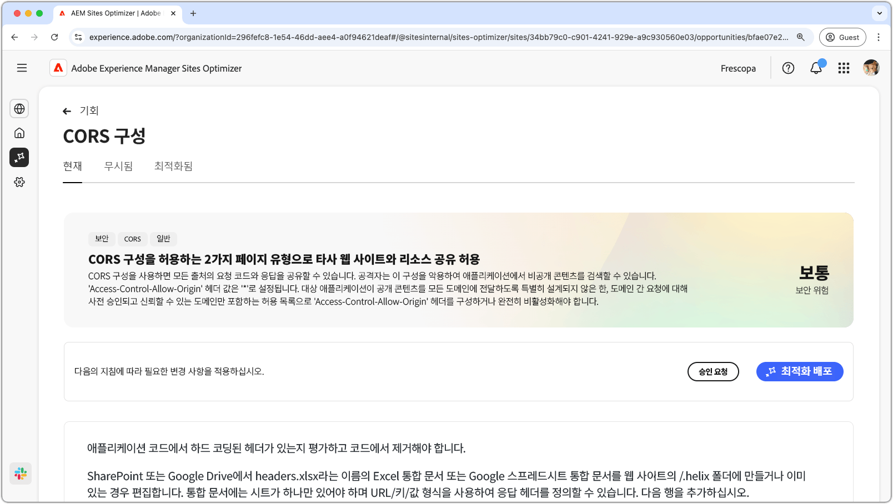
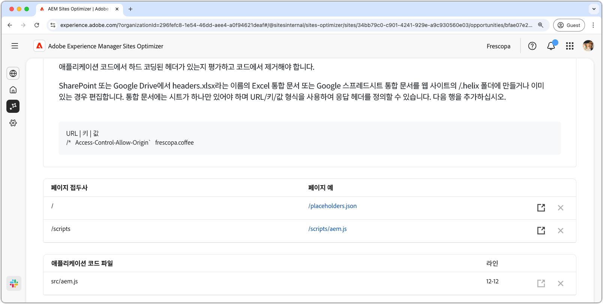

# CORS 구성 기회

{align="center"}

웹 애플리케이션을 무단 데이터 액세스로부터 보호하려면 CORS(원본 간 리소스 공유)를 올바르게 구성하는 것이 필수적입니다. `Access-Control-Allow-Origin` 헤더가 `*`로 설정되어 있는 경우 모든 도메인에서 응답을 요청하고 수신할 수 있으며, 잠재적으로 공격자에게 민감한 정보가 노출될 수 있습니다. 이는 신뢰할 수 있는 도메인의 허용 목록을 제어하여 보안을 강화하거나 필요하지 않은 곳에서 CORS를 비활성화할 기회를 제공합니다. CORS를 안전하게 설정하면 권한이 있는 사용자가 원활하게 액세스할 수 있도록 하는 동시에 비공개 콘텐츠를 보호하는 데 도움이 됩니다.

## 자동 식별

{align="center"}

자동 식별은 웹 사이트의 CORS 구성 오류를 검사하고 무단 액세스에 가능한 URL을 감지합니다. 이러한 URL은 다음 세부 정보와 함께 위쪽 테이블에 나열되어 있습니다.

* **페이지 접두사** - CORS 오류에 취약한 URL 경로 접두사입니다.
* **페이지 예시** - 무단 액세스가 가능한 URL의 예입니다.

## 자동 제안

{align="center"}

자동 제안은 **애플리케이션 코드 파일** 및 해당 **라인**&#x200B;을 제공하여 느슨한 CORS 정책을 설정할 가능성이 있는 부분을 검토하도록 합니다.

## 자동 최적화

[!BADGE Ultimate]{type=Positive tooltip="Ultimate"}

>[!BEGINTABS]

>[!TAB 최적화 배포]

{{auto-optimize-deploy-optimization-slack}}

>[!TAB 승인 요청]

{{auto-optimize-request-approval}}

>[!ENDTABS]
