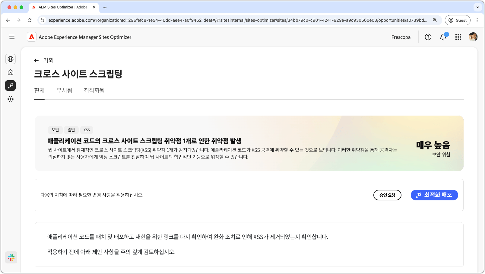
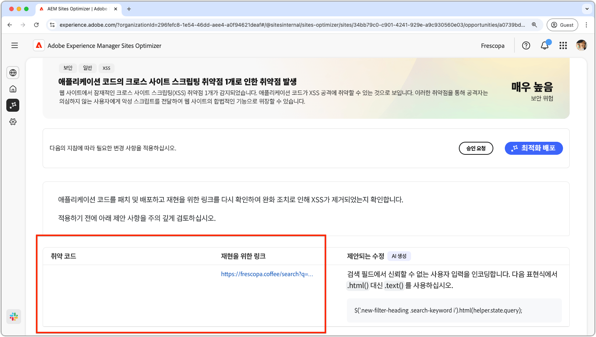
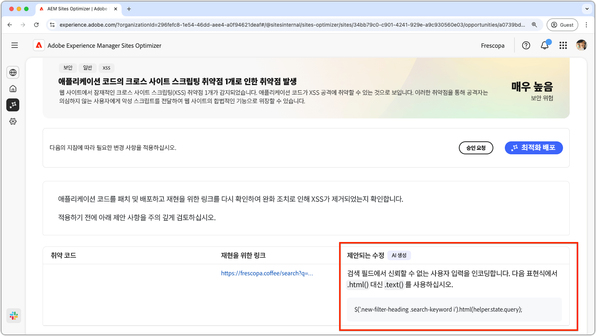

# 크로스 사이트 스크립팅 기회

{align="center"}

크로스 사이트 스크립팅 기회는 공격자가 다른 사용자가 보는 웹 페이지에 악성 스크립트를 삽입하는 데 악용할 수 있는 사이트 코드의 취약점을 식별하고 해결해 줍니다. 이러한 스크립트는 세션 쿠키와 같은 민감한 정보를 훔치거나 사용자의 암호를 변경하는 등 사용자를 대신하여 액션을 수행할 수 있습니다.

## 자동 식별

{align="center"}

* **취약한 코드** - 크로스 사이트 스크립팅 공격에 취약한 코드입니다.
* **재현을 위한 링크** - 취약점이 발견된 페이지에 대한 링크입니다.

## 자동 제안

{align="center"}

* **제안된 수정 사항** - 취약점을 해결하는 방법에 대한 AI 생성 제안입니다.

## 자동 최적화

[!BADGE Ultimate]{type=Positive tooltip="Ultimate"}

>[!BEGINTABS]

>[!TAB 최적화 배포]

{{auto-optimize-deploy-optimization-slack}}

>[!TAB 승인 요청]

{{auto-optimize-request-approval}}

>[!ENDTABS]
