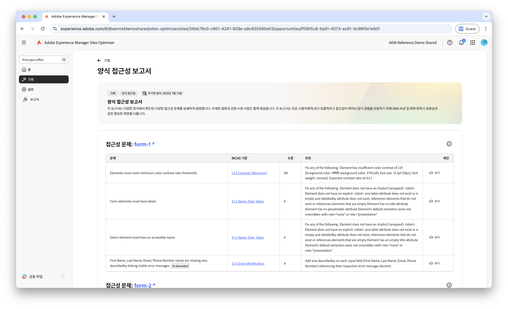
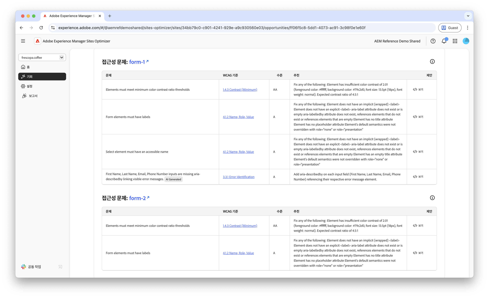
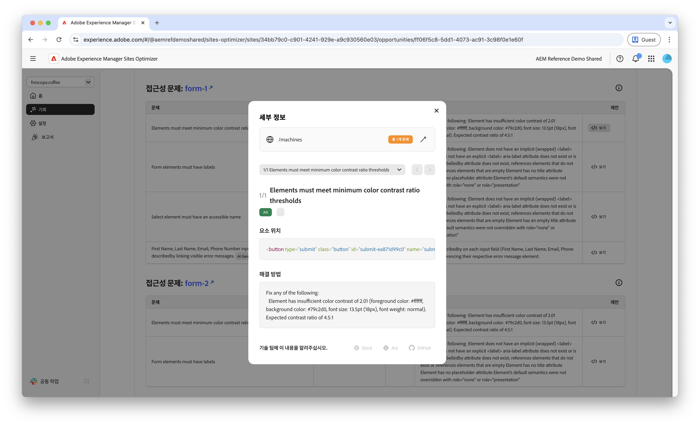
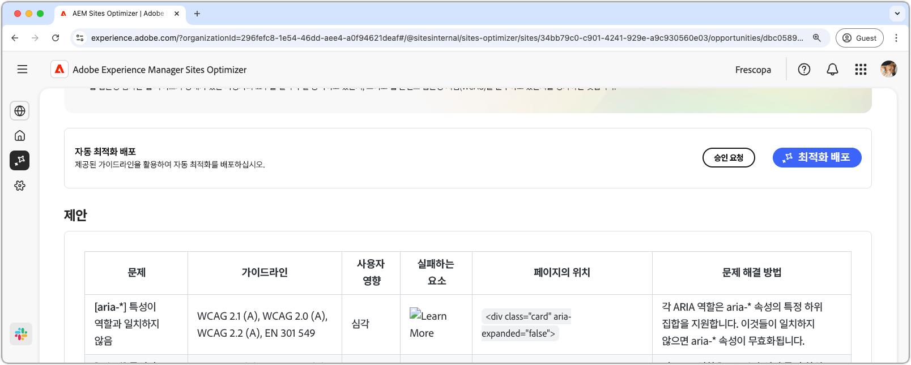

# Forms 접근성 문제 기회

 Forms 최적화 기능은 조기 액세스 프로그램에서 사용할 수 있습니다. 공식 이메일 ID를 사용하여 aem-forms-ea@adobe.com으로 이메일을 보내 얼리 액세스 프로그램에 참여하고 기능에 대한 액세스 권한을 요청할 수 있습니다. 

{align="center"}

양식 접근성 문제 기회는 양식이 장애를 가진 사용자의 필요에 얼마나 잘 부합하는지와 [웹 콘텐츠 접근성 가이드라인(WCAG)](https://www.w3.org/TR/WCAG21/)을 따르는지 여부를 식별합니다. 양식이 WCAG를 얼마나 잘 준수하는지 평가함으로써 포괄적인 양식 경험을 만드는 데 도움이 됩니다. 이렇게 하면 시각, 청각, 인지 및 운동 장애가 있는 개인이 양식을 탐색하고 상호 작용하며 성공적으로 완료할 수 있습니다. 윤리적 이유로 필수적일 뿐만 아니라 법적 요건의 준수를 조장하고 있다. 또한 양식 완료율을 향상시키고, 대상자 도달 범위를 늘려 사용자 경험과 비즈니스 성과를 모두 향상시킬 수 있습니다.

## 자동 식별

{align="center"}

**Forms 접근성 문제 기회**&#x200B;는 양식 내에서 접근성 문제를 구체적으로 식별하며 다음과 같은 항목을 포함합니다.

* **문제** – 양식에서 발견된 특정 접근성 문제입니다.
* **WCAG 기준** – [WCAG 가이드라인 ID](https://www.w3.org/TR/WCAG21/) 양식 문제가 위반되었습니다.
* **레벨** – 문제의 [적합성 레벨](https://www.w3.org/WAI/WCAG21/Understanding/conformance#levels)입니다.
* **권장 사항** - 코드 예제와 모범 사례를 포함하여 양식의 접근성 문제를 해결하는 방법에 대한 구체적인 지침입니다.
* **소스 HTML** - 문제가 영향을 미치는 페이지의 forms 요소에 대한 HTML 스니펫입니다.

## 자동 제안

{align="center"}

자동 제안은 **제안** 필드에 AI가 생성한 권장 사항을 제공합니다. 이 필드에서는 양식 액세스 가능성 문제를 해결하기 위해 수행할 작업에 대한 규범적인 지침을 제공합니다.

<!-- 

## Auto-optimize

[!BADGE Ultimate]{type=Positive tooltip="Ultimate"}

{align="center"}

Sites Optimizer Ultimate adds the ability to deploy auto-optimization for the form accessibility issues found.

>[!BEGINTABS]

>[!TAB Deploy optimization]

{{auto-optimize-deploy-optimization-slack}}

>[!TAB Request approval]

{{auto-optimize-request-approval}}

>[!ENDTABS]
-->

