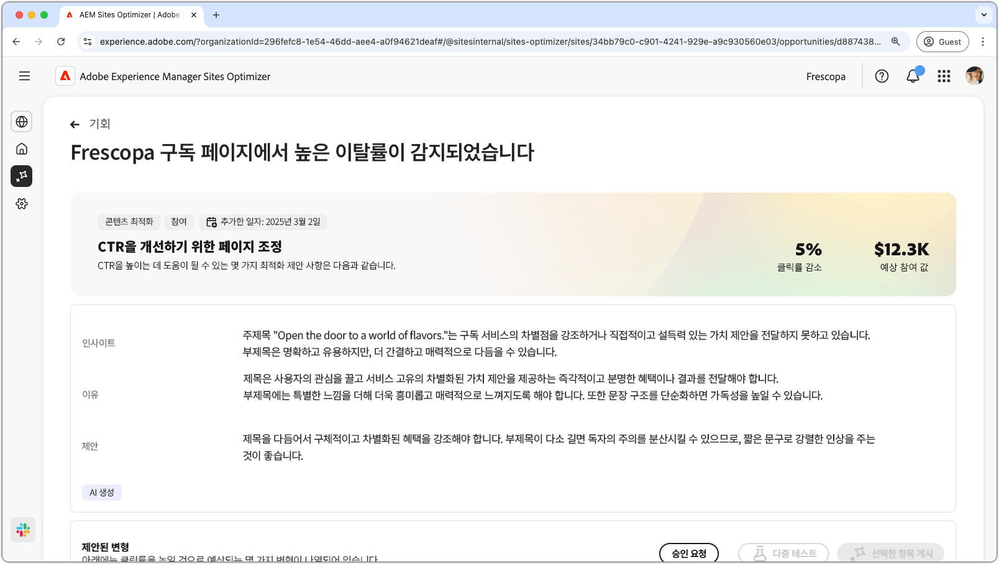
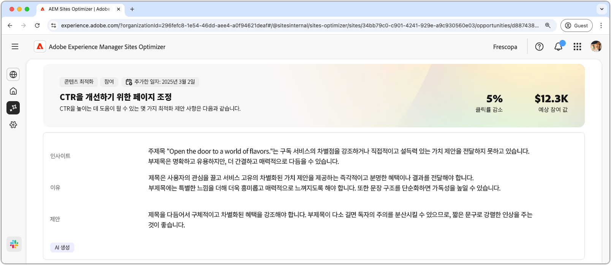
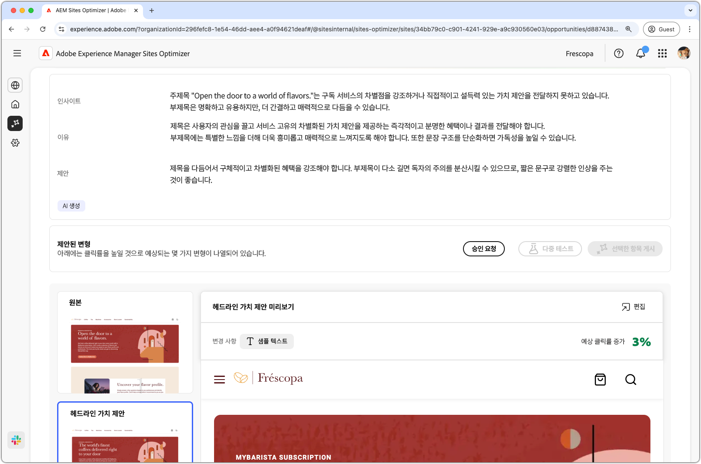
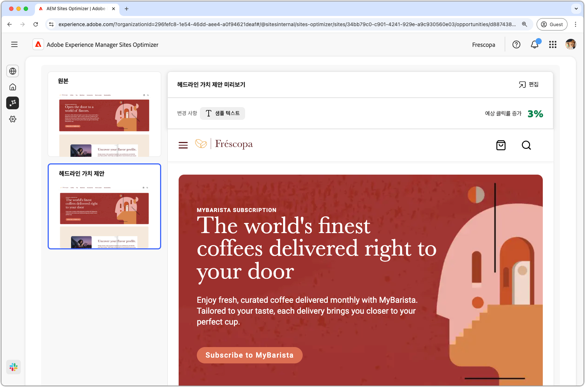
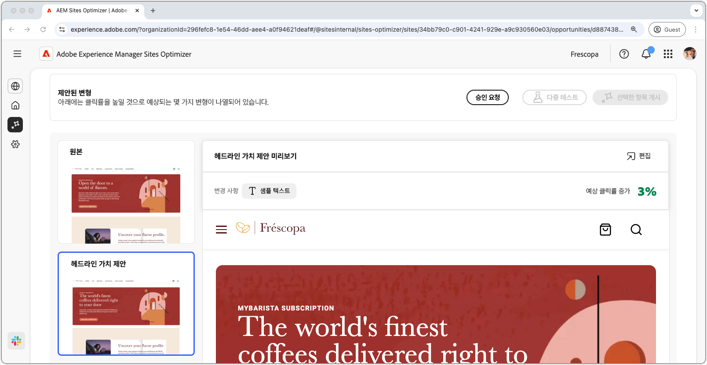

# 높은 바운스 비율 기회

{align="center"}

높은 바운스 비율 기회는 웹 사이트에서 바운스 비율이 높은 양식을 식별합니다. 이 기회 양식은 성과가 좋지 않은지 이해하는 데 도움이 되며 참여율을 개선하는 방법에 대한 제안을 제공합니다. 양식의 조회수를 최적화하면 양식 제출 건수를 늘리고 웹 사이트의 전반적인 성능을 개선할 수 있습니다.

## 자동 식별

{align="center"}

조회수가 낮은 양식이 있는 각 웹 페이지는 자체 **높은 바운스 비율** 기회로 나열됩니다. 기회에 대한 간략한 요약과 AI 생성의 이론적 근거가 기회 페이지 상단에 표시됩니다.

## 자동 제안

{align="center"}

자동 제안은 양식의 조회수를 높이도록 설계된 AI 생성 웹 페이지 변형을 제공합니다. 각 변형은 양식 참여도를 개선할 수 있는 잠재력을 기반으로 **예상 전환율 증가**&#x200B;를 표시하여 가장 효과적인 제안의 우선순위를 지정하는 데 도움이 됩니다.

>[!BEGINTABS]

>[!TAB 제어 변형]

{align="center"}

제어 변형은 현재 웹 사이트에 있는 원본 양식입니다. 이 변형은 제안된 변형의 성능을 비교하는 기준선으로 사용됩니다.

>[!TAB 제안된 변형]

{align="center"}

제안된 변형은 양식의 바운스 비율을 낮추도록 설계된 AI 생성 웹 페이지 변형입니다. 각 변형은 양식 참여도를 개선할 수 있는 잠재력을 기반으로 **예상 클릭률 증가**&#x200B;를 표시하여 가장 효과적인 제안의 우선순위를 지정하는 데 도움이 됩니다.

각 변형을 클릭하면 화면 오른쪽에서 미리 볼 수 있습니다. 미리보기 상단에서 다음과 같은 액션과 정보를 사용할 수 있습니다.

* **변경** - **제어** 변형에서 이 변형에 적용된 변경 사항에 대한 간단한 요약입니다.
* **예상 클릭률 증가** - 이 변형이 구현될 경우 예상되는 클릭률이 증가입니다.
* **편집** - AEM 작성의 변형을 편집하려면 클릭합니다.

>[!ENDTABS]

## 자동 최적화

[!BADGE Ultimate]{type=Positive tooltip="Ultimate"}

{align="center"}

Sites Optimizer Ultimate에는 낮은 조회수 기회를 통해 발견된 문제에 대한 자동 최적화를 배포하는 기능이 추가됩니다.

>[!BEGINTABS]

>[!TAB 여러 항목 테스트]

>[!TAB 선택한 항목 게시]

{{auto-optimize-deploy-optimization-slack}}

>[!TAB 승인 요청]

{{auto-optimize-request-approval}}

>[!ENDTABS]
