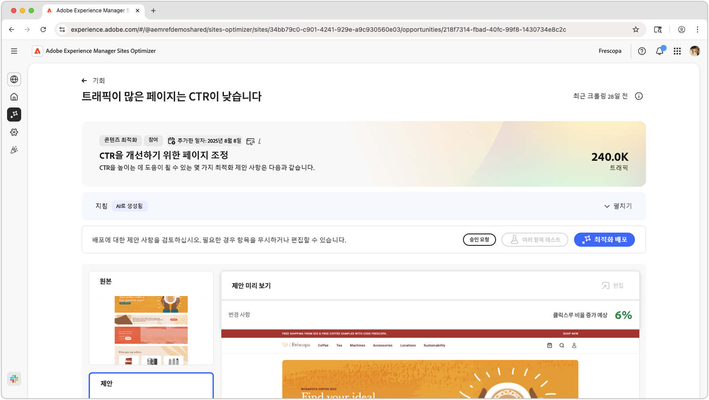
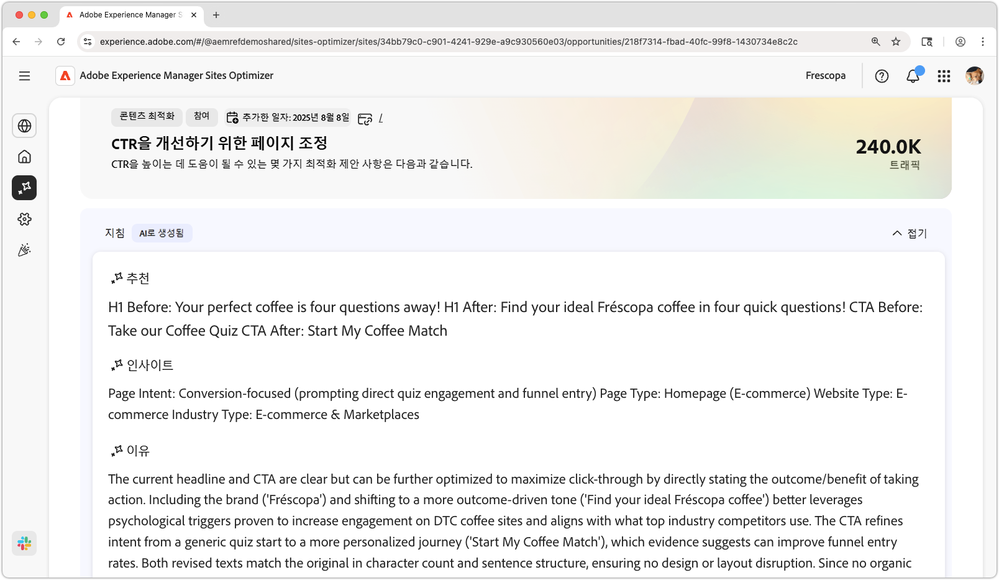
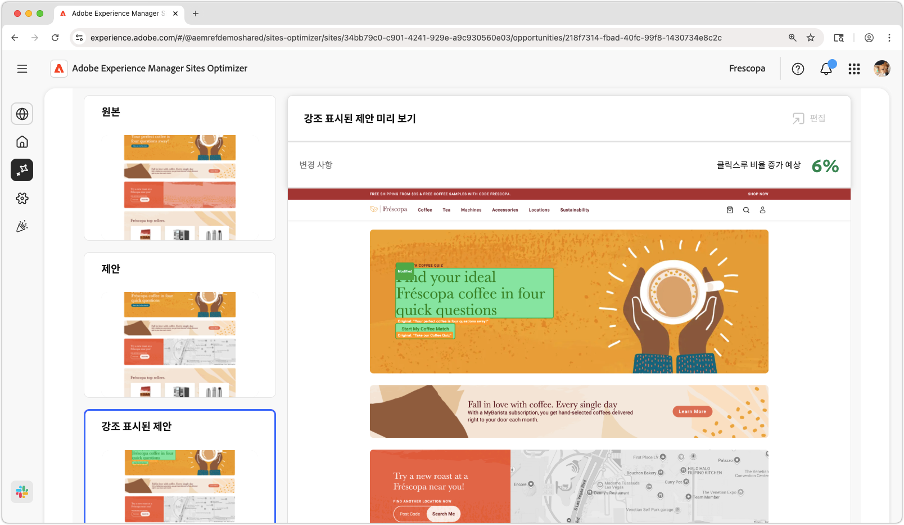
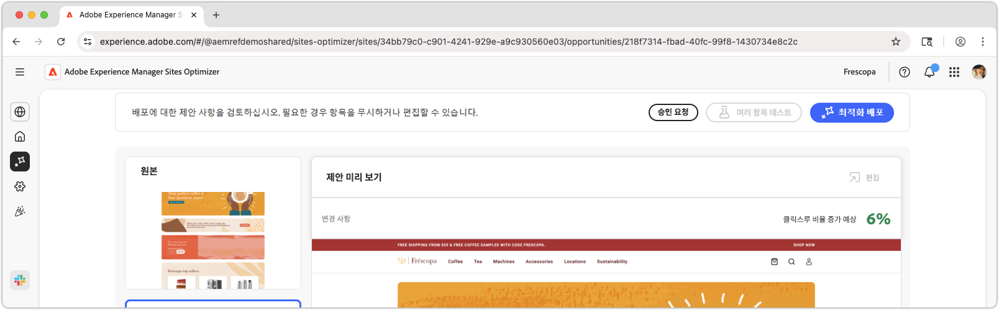

# 높은 트래픽 페이지의 CTR이 낮은 기회

{align="center"}

높은 트래픽 페이지의 CTR이 낮은 기회는 웹 사이트에서 상당한 양의 트래픽을 받지만 클릭스루 비율(CTR)이 낮은 페이지를 식별합니다. 이러한 페이지를 분석하여 사용자 참여를 방해할 수 있는 잠재적 문제를 찾아내고 성능을 개선하기 위한 조치를 취할 수 있습니다. 이 기회는 웹 사이트의 콘텐츠 및 레이아웃을 최적화하여 궁극적으로 더 높은 전환율과 더 나은 사용자 경험을 제공하는 데 필수적입니다.

## 자동 식별

{align="center"}

**높은 트래픽 페이지의 CTR이 낮은 기회**&#x200B;는 웹 사이트에서 CTR이 낮은 높은 트래픽 페이지를 식별하며 다음 사항을 포함합니다.

* **권장 사항** - 페이지의 CTR을 개선하기 위한 조치를 제안합니다.
* **인사이트** - 페이지의 CTR이 낮은 이유에 대한 설명입니다.
* **근거** - 권장 사항에 대한 근거입니다.

## 자동 제안

{align="center"}

자동 제안은 최적화된 웹 경험이 어떻게 표시될 수 있는지에 대한 AI 생성 제안을 제공합니다. 제안에는 **강조 표시**&#x200B;된 보기가 포함되어 제안되는 변경 사항을 쉽게 확인할 수 있습니다.

제안을 선택하여 전체 보기, 예상 CTR 영향 및 페이지에 적용하기 전에 편집하는 기능을 볼 수 있습니다.

## 자동 최적화

[!BADGE Ultimate]{type=Positive tooltip="Ultimate"}

{align="center"}

Sites Optimizer Ultimate에는 제안된 최적화에 대해 자동 최적화를 배포하는 기능이 추가됩니다.

>[!BEGINTABS]

>[!TAB 최적화 배포]

{{auto-optimize-deploy-optimization-slack}}

>[!TAB 승인 요청]

{{auto-optimize-request-approval}}

>[!ENDTABS]
