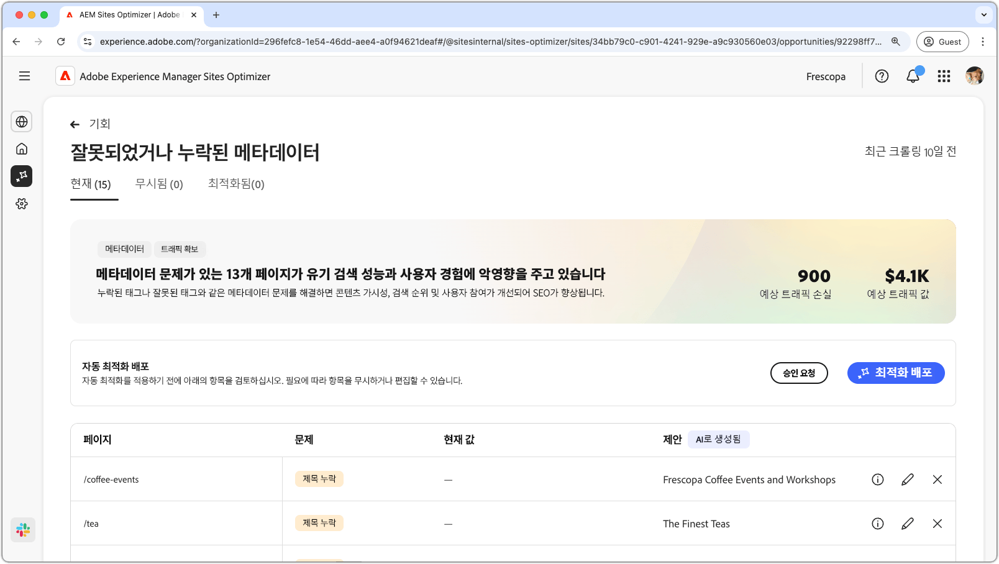
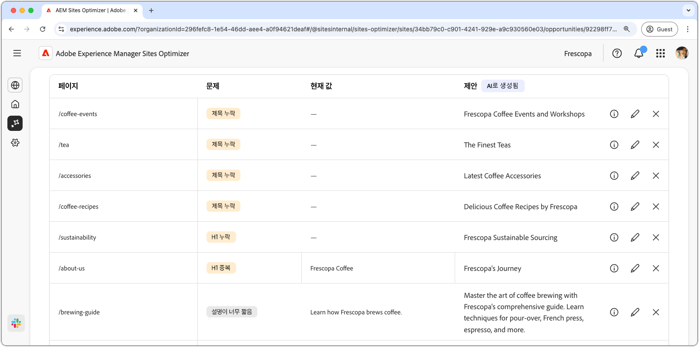
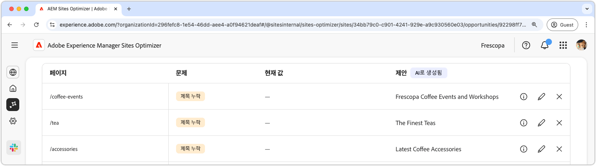
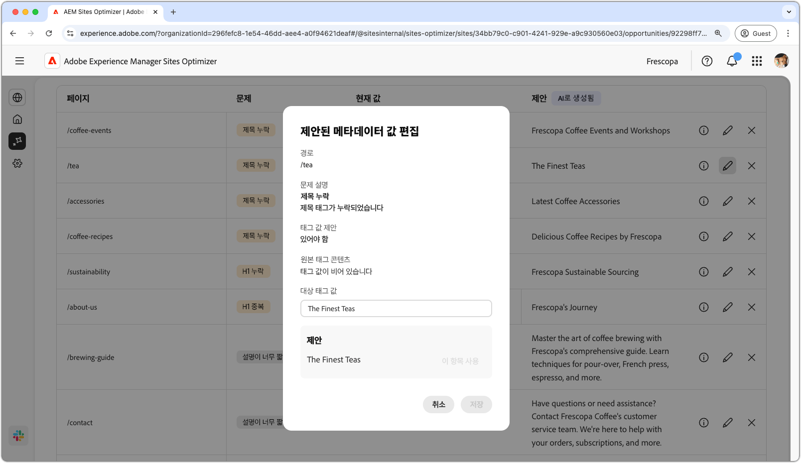
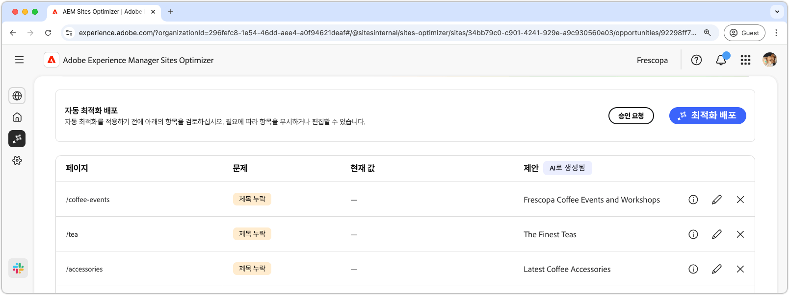

# 잘못되었거나 누락된 메타데이터 기회

{align="center"}

잘못되었거나 누락된 메타데이터 기회는 웹 페이지에서 누락되었거나 잘못된 메타데이터를 식별합니다. 메타데이터 문제를 해결하면 콘텐츠 가시성, 검색 순위 및 사용자 참여가 개선되어 SEO가 향상됩니다. 이러한 문제는 태그가 누락되었거나 잘못되었거나, 설명이 너무 길거나 짧은 경우 등의 요인으로 인해 발생할 수 있습니다.

잘못되었거나 누락된 메타데이터 기회는 페이지 상단에 요약을 표시하며, 여기에는 문제의 개요와 사이트 및 비즈니스에 미치는 영향이 포함됩니다.

* **예상 트래픽 손실** - 잘못된 메타데이터로 인한 예상 트래픽 손실입니다.
* **예상 트래픽 가치** - 손실된 트래픽의 예상 가치입니다.

## 자동 식별

{align="center"}

잘못되었거나 누락된 메타데이터 기회는 페이지의 모든 잘못된 메타데이터를 나열하며, 여기에는 다음이 포함됩니다.

* **페이지** - 잘못되었거나 누락된 메타데이터가 포함된 페이지입니다.
* **문제** - 메타데이터 태그에 영향을 미치는 문제의 유형을 나타냅니다. 제목 누락부터 H1 중복에 이르기까지 다양합니다.
* **값** - 변경해야 할 현재 메타데이터 태그 값입니다.
* **제안** - 적합한 태그 업데이트를 위한 AI 생성 제안입니다. 자세한 내용은 아래 섹션을 참조하십시오.

## 자동 제안

{align="center"}

잘못되었거나 누락된 메타데이터 기회는 메타데이터 태그를 변경하거나 업데이트하는 방법에 대한 AI 생성 제안도 제공합니다. 이러한 제안은 잘못된 메타데이터를 구성하는 초기 태그와 제안된 업데이트의 내용을 기반으로 합니다.

>[!BEGINTABS]

>[!TAB AI 이론적 근거]

**정보 아이콘**&#x200B;을 선택하면 제안된 업데이트에 대한 AI 이론적 근거가 제공됩니다.

>[!TAB  제안된 메타데이터 값 편집]

{align="center"}

AI 생성 제안에 동의하지 않는 경우 **편집 아이콘**&#x200B;을 선택하여 제안된 메타데이터 값을 편집할 수 있습니다. 이렇게 하면 메타데이터에 가장 적합하다고 생각되는 값을 수동으로 입력할 수 있습니다. 편집 창에는 다음이 포함되어 있습니다.

* **경로** - 메타데이터가 포함된 (또는 없는) 페이지로의 경로입니다.
* **문제 설명** - 메타데이터 태그에 영향을 미치는 문제 유형과 간단한 설명을 나타냅니다.
* **태그 값 제안** - 메타데이터 태그를 변경하거나 업데이트하는 방법에 대한 AI 생성 제안입니다. 예를 들어 태그 업데이트에는 몇 글자가 포함되어야 하는지 등입니다.
* **원래 태그 콘텐츠** - 원래 태그 값입니다.
* **대상 태그 값** - 이 필드를 편집하고 원하는 태그 값을 직접 추가합니다. **저장**&#x200B;을 선택하면 이 값이 제안된 업데이트에 적용됩니다.
* **제안** - 값을 변경하는 방법에 대한 AI 생성 제안입니다.
* **저장** - **대상 태그 값** 필드에 있는 값을 저장하고 적용합니다.

>[!TAB 항목 무시]

대상 손상된 또는 잘못된 메타데이터가 포함된 항목을 무시하도록 선택할 수 있습니다. **무시 아이콘**&#x200B;을 선택하면 기회 목록에서 항목이 제거됩니다. 무시된 항목은 기회 페이지 상단의 **무시됨** 탭에서 다시 활성화할 수 있습니다.

>[!ENDTABS]

## 자동 최적화

[!BADGE Ultimate]{type=Positive tooltip="Ultimate"}

{align="center"}

Sites Optimizer Ultimate에는 잘못되었거나 누락된 메타데이터 기회를 통해 발견된 문제에 대한 자동 최적화를 배포하는 기능이 추가됩니다. <!--- TBD-need more in-depth and opportunity specific information here. What does the auto-optimization do?-->

>[!BEGINTABS]

>[!TAB 최적화 배포]

{{auto-optimize-deploy-optimization-slack}}

>[!TAB 승인 요청]

{{auto-optimize-request-approval}}

>[!ENDTABS]
