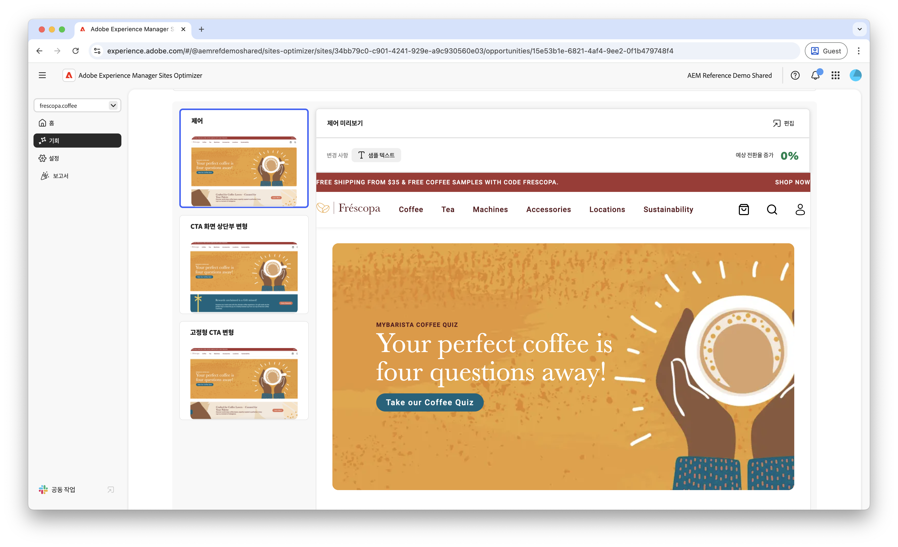

# Forms 탐색 기회 부족

 Forms Optimizer 기능은 조기 액세스 프로그램에서 사용할 수 있습니다. 공식 이메일 ID에서 aem-forms-ea@adobe.com에 작성하여 조기 액세스 프로그램에 참여하고 기능에 대한 액세스를 요청할 수 있습니다. 

{align="center"}

탐색 기회가 낮으면 웹 사이트에서 탐색 비율이 낮은 양식을 식별합니다. 이 영업 기회 유형은 사용자가 검색하거나 액세스하지 않는 양식을 이해하는 데 도움이 되며 검색 기능을 향상시키는 방법에 대한 제안을 제공합니다.

## 자동 식별

{align="center"}

탐색 수준이 낮은 양식의 각 웹 페이지는 고유한 **낮은 탐색** 기회로 나열됩니다. Opportunity 및 이유에 대한 간략한 요약이 Opportunity 페이지 상단에 표시됩니다.

## 자동 제안

자동 제안은 양식에 대한 탐색을 늘리기 위해 설계된 AI 생성 양식 변형을 제공합니다. 각 변형은 양식 검색 기능 및 접근성을 개선하는 잠재력에 따라 **예상 전환율 증가**&#x200B;를 표시하므로 가장 효과적인 제안의 우선 순위를 지정하는 데 도움이 됩니다.

>[!BEGINTABS]

>[!TAB 제어 변형]

{align="center"}

제어 변형은 현재 웹 사이트에 있는 원본 양식입니다. 이러한 변형은 제안된 변형의 성능을 비교하는 기준선으로 사용됩니다.

>[!TAB 제안된 변형]

{align="center"}

제안된 변형은 양식에 대한 탐색을 늘리기 위해 설계된 AI 생성 양식 변형입니다. 각 변형은 양식 검색 기능 및 접근성을 개선하는 잠재력에 따라 **예상 전환율 증가**&#x200B;를 표시하므로 가장 효과적인 제안의 우선 순위를 지정하는 데 도움이 됩니다.

각 변형을 클릭하면 화면 오른쪽에서 미리 볼 수 있습니다. 미리보기 상단에서 다음과 같은 액션과 정보를 사용할 수 있습니다.

* **변경** - **제어** 변형에서 이 변형에 적용된 변경 사항에 대한 간단한 요약입니다.
* **예상 전환율 증가** - 이 변형이 구현된 경우 양식 참여의 예상 증가입니다.
* **편집** - AEM 작성의 변형을 편집하려면 클릭합니다.

>[!ENDTABS]

<!-- 

## Auto-optimize

[!BADGE Ultimate]{type=Positive tooltip="Ultimate"}

{align="center"}

Sites Optimizer Ultimate adds the ability to deploy auto-optimization for the issues found by the low navigation opportunity.

>[!BEGINTABS]

>[!TAB Test multiple]

>[!TAB Publish selected]

{{auto-optimize-deploy-optimization-slack}}

>[!TAB Request approval]

{{auto-optimize-request-approval}}

>[!ENDTABS]

-->
