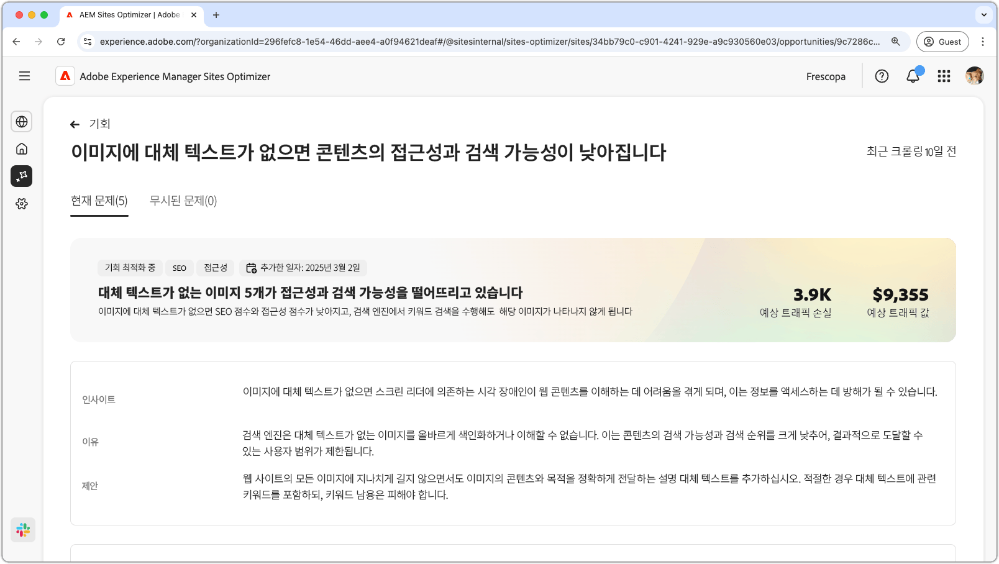
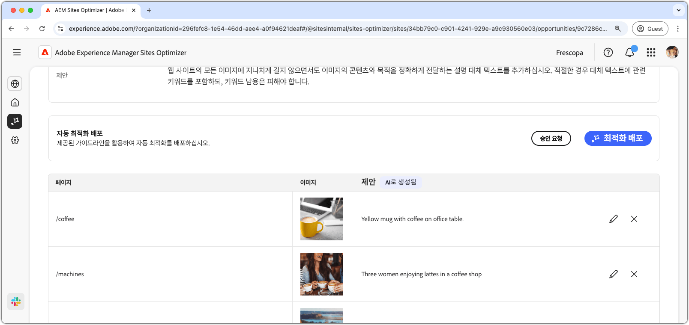
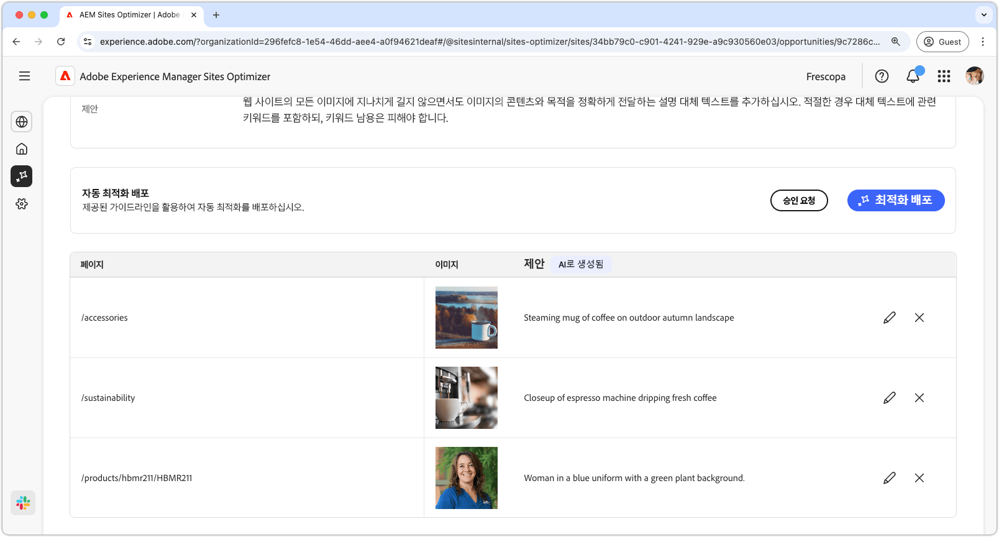
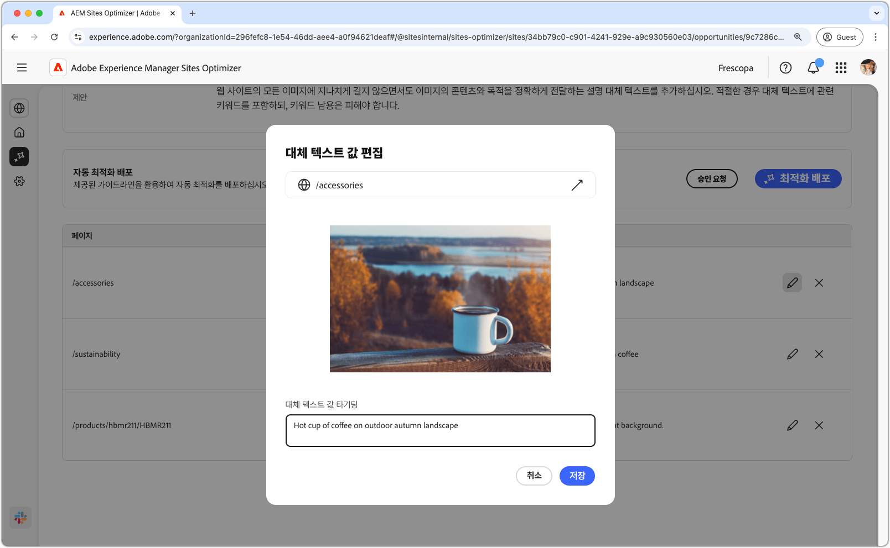
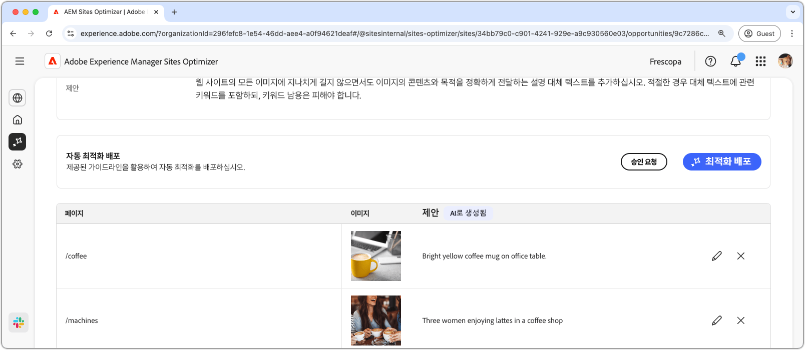

# 대체 텍스트 영업 기회 누락

{align="center"}

대체 텍스트 영업 기회가 누락되면 웹 사이트에 설명적인 대체 텍스트가 없는 이미지가 식별됩니다. 검색 엔진이 대체 텍스트 없이 이미지를 제대로 인덱싱하거나 이해할 수 없어 콘텐츠의 검색 가능성과 잠재적 검색 순위가 크게 감소하여 궁극적으로 대상자 도달 범위를 제한합니다. 또한 이미지에 대한 대체 텍스트가 없으면 화면 판독기에 의존하여 웹 콘텐츠를 이해하는 시각 장애가 있는 사람은 제외되므로 정보 액세스에 효과적으로 장애가 발생합니다.

누락된 대체 텍스트 영업 기회는 페이지 맨 위에 문제와 사이트 및 비즈니스에 미치는 영향의 개요를 포함한 요약을 표시합니다.

* **예상되는 트래픽 손실** - 대체 텍스트가 누락되어 예상되는 트래픽 손실입니다.
* **예상 트래픽 값** - 손실된 트래픽의 예상 값입니다.

기회와 관련된 이론적, 통찰력 및 제언을 표시하는 추가적인 분야도 있다.

## 자동 식별

{align="center"}

대체 텍스트 영업 기회가 없으면 대체 텍스트가 없는 웹 사이트의 모든 이미지가 나열됩니다. 이 섹션에는 다음 카테고리가 포함됩니다.

* **페이지** - 누락된 대체 텍스트가 포함된 페이지의 경로입니다.
* **이미지** - 설명 대체 텍스트가 없는 이미지입니다.
* **제안** - 대체 텍스트에 대한 AI 생성 제안입니다.

## 자동 제안

{align="center"}

자동 제안은 이미지의 대체 텍스트에 대해 AI가 생성한 제안을 제공합니다. AI가 생성한 제안은 각 이미지를 수동으로 분석할 필요 없이 이미지에 대체 텍스트를 빠르게 추가할 수 있도록 설계되었습니다.

>[!BEGINTABS]

>[!TAB 누락된 대체 텍스트 편집]

{align="center"}

AI가 생성한 제안에 동의하지 않으면 **편집 아이콘**&#x200B;을 선택하여 제안된 대체 텍스트를 편집할 수 있습니다. 이렇게 하면 이미지에 가장 잘 맞는다고 생각되는 텍스트를 수동으로 조정할 수 있습니다. 편집 창에는 다음 항목이 포함되어 있습니다.

* **페이지 경로** - 대체 텍스트 문제가 없는 페이지의 경로를 표시하는 읽기 전용 필드입니다. 경로 옆에 있는 화살표를 클릭하여 해당 페이지를 엽니다.
* **이미지** - 대체 텍스트가 필요한 이미지의 읽기 전용 미리 보기입니다.
* **대상 대체 텍스트** - 이미지에 대한 설명 대체 텍스트를 수동으로 입력할 수 있는 편집 가능한 필드입니다. 대체 텍스트가 이미지의 내용과 목적을 간결하게 전달하는지 확인합니다. 관련성이 있는 경우 키워드를 오버로드하지 않고 자연스럽게 포함하십시오.

>[!TAB 항목 무시]

기회 목록의 입력사항을 무시하도록 선택할 수 있습니다. **무시 아이콘**&#x200B;을 선택하면 목록에서 항목이 제거됩니다. 기회 페이지 상단의 **무시됨** 탭에서 무시된 항목을 다시 사용할 수 있습니다.

>[!ENDTABS]

## [!BADGE Ultimate] 자동 최적화{type=Positive tooltip="Ultimate"}

{align="center"}

Sites Optimizer Ultimate은 누락된 대체 텍스트 기회에 의해 발견된 문제에 대해 자동 최적화를 배포하는 기능을 추가합니다. <!--- TBD-need more in-depth and opportunity specific information here. What does the auto-optimization do?-->

>[!BEGINTABS]

>[!TAB 최적화 배포]

{{auto-optimize-deploy-optimization-slack}}

>[!TAB 승인 요청]

{{auto-optimize-request-approval}}

>[!ENDTABS]
