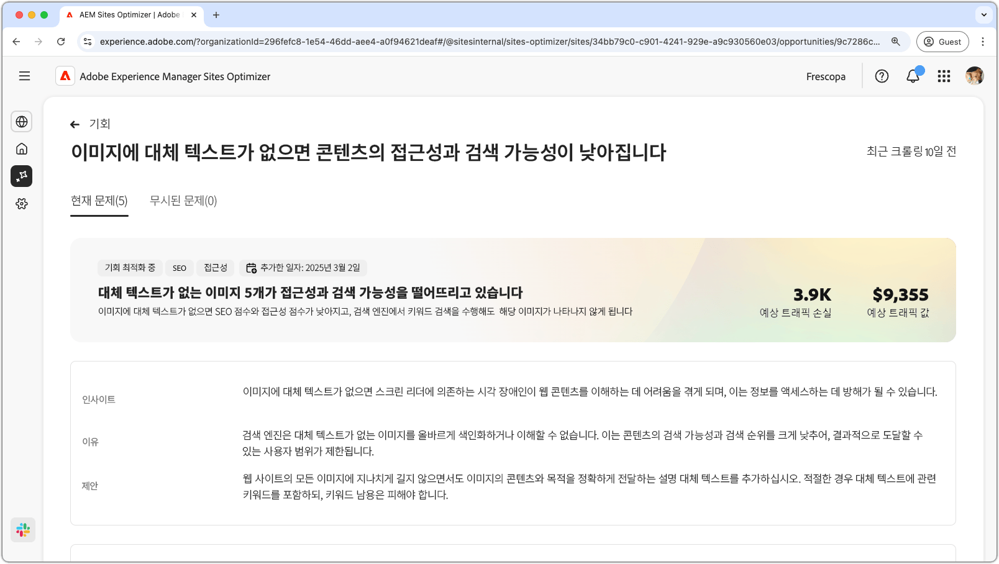
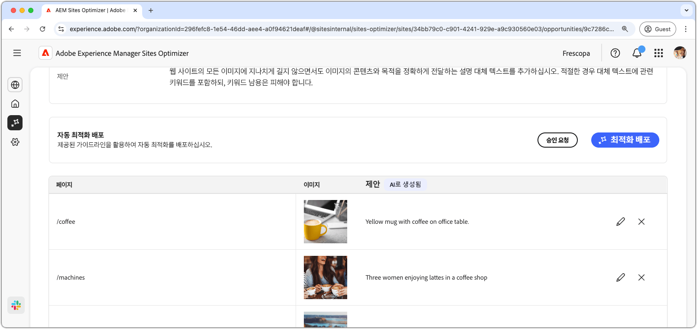
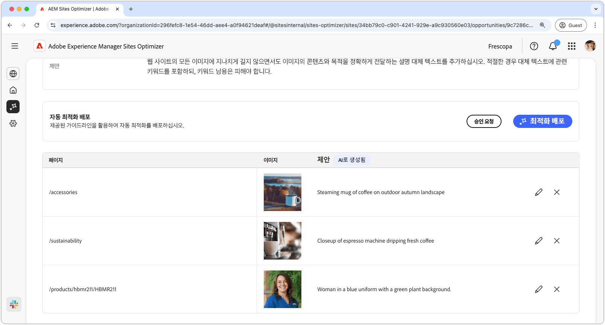
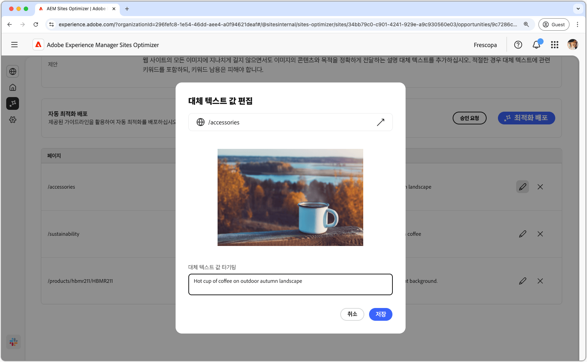

# 누락된 대체 텍스트 기회

<!--{align="center"}-->

>[!VIDEO](https://video.tv.adobe.com/v/3483271/?captions=kor&learn=on&enablevpops)

누락된 대체 텍스트 기회는 웹 사이트에서 설명하는 대체 텍스트가 없는 이미지를 식별합니다. 대체 텍스트가 없으면 화면 판독기에 의존하는 사용자가 시각적 콘텐츠를 해석할 수 없어 접근성 장벽이 생깁니다. 또한 검색 엔진이 이미지를 이해하고 색인화하는 방식을 제한하여 콘텐츠 검색 기능과 검색 성능을 저하시킵니다. AEM Sites Optimizer는 누락된 대체 텍스트 문제를 식별하고 구체적인 AI 권장 사항을 제공하며 클릭 한 번으로 배포하여 해당 문제를 수정할 수 있는 기능을 지원합니다. 이 모든 작업은 단일 중앙 집중식 보기에서 이루어집니다.

## 자동 식별

<!--{align="center"}-->

AEM Sites Optimizer는 사이트 크롤링, 실제 사용자 트래픽 데이터, AI 분석을 결합한 다단계 감사를 사용하여 웹 사이트를 스캔함으로써 대체 텍스트가 필요하지만 정의되어 있지 않은 이미지를 식별합니다. 또한 웹 콘텐츠 접근성 지침(WCAG)에 따라 페이지의 이미지를 평가하여 대체 텍스트가 필요한지 여부를 판단하고 장식용이거나 정보를 제공하지 않는 이미지는 제외합니다. 페이지 내에서 수행하는 역할과 관련성을 기준으로 이미지를 분석하여 접근성과 SEO에 가장 큰 영향을 미치는 수정 사항을 우선적으로 처리합니다.

이 기회는 다음 항목을 포함하여 식별된 문제 목록을 제공합니다.

* **페이지** – 누락된 대체 텍스트가 포함된 페이지의 경로입니다.
* **이미지** – 대체 설명 텍스트가 누락된 이미지입니다.

## 자동 제안

<!--{align="center"}-->

식별된 각 문제에 대해 AEM Sites Optimizer는 이미지를 설명하는 대체 텍스트를 제안합니다. AI 비전 모델을 사용하여 이미지를 분석하고 페이지에 포함된 콘텐츠와 페이지 내에서 수행하는 역할을 반영하는 설명을 생성합니다. 권장 사항은 간결하고 관련성이 높으며 접근성 모범 사례에 맞게 제공됩니다. 각 제안은 적용하기 전에 검토하고 편집할 수 있습니다.

>[!BEGINTABS]

>[!TAB 누락된 대체 텍스트 편집]

<!--{align="center"}-->

AI 생성 제안에 동의하지 않는 경우 **편집 아이콘**&#x200B;을 선택하여 제안된 대체 텍스트를 편집할 수 있습니다. 이 기능을 사용하면 이미지에 가장 적합하다고 생각되는 텍스트를 수동으로 조정할 수 있습니다. 편집 창에는 다음이 포함되어 있습니다.

* **페이지 경로** – 누락된 대체 텍스트 문제가 발생한 페이지의 경로를 표시하는 읽기 전용 필드입니다. 경로 옆에 있는 화살표를 클릭하면 해당 페이지가 열립니다.
* **이미지** – 대체 텍스트가 필요한 이미지의 읽기 전용 미리보기입니다.
* **대상 ALT 텍스트** – 이미지에 대한 대체 설명 텍스트를 수동으로 입력할 수 있는 편집 가능한 필드입니다. 대체 텍스트가 이미지의 내용과 목적을 간결하면서도 명확하게 전달하는지 확인하십시오. 관련이 있을 경우, 키워드는 자연스럽게 포함하되 과도하게 사용하지 않도록 합니다.

>[!TAB 항목 무시]

기회 목록에서 항목을 무시하도록 선택할 수 있습니다. 을 선택하면 목록에서 항목이 제거됩니다. 무시된 항목은 기회 페이지 상단의 **무시됨** 탭에서 다시 활성화할 수 있습니다.

>[!ENDTABS]

## 자동 최적화

<!--[!BADGE Ultimate]{type=Positive tooltip="Ultimate"}-->

제안을 검토하고 승인하면 **최적화 배포**&#x200B;를 클릭할 수 있습니다. 그러면 AEM Sites Optimizer가 구현 내에서 대체 텍스트가 관리되는 방식에 따라 수정 사항을 작성 환경에 적용합니다. 그런 다음, AEM 작성자는 콘텐츠 관리 시스템(CMS)에서 변경 사항을 게시할 수 있습니다.

구성에 따라 페이지 콘텐츠, 에셋 메타데이터 또는 지원 콘텐츠 모델에 업데이트가 직접 적용될 수 있습니다. 최적화 프로세스에는 다음 단계가 포함됩니다.

* **유효성 검사** – 기존 기능에 영향을 주지 않고 업데이트가 안전하게 적용되도록 합니다.
* **배포** – AEM의 콘텐츠 업데이트 또는 콘텐츠 API와의 통합과 같은 기존 프로세스를 통해 업데이트를 적용합니다.
* **권한 확인** – 사용자에게 변경 사항을 적용할 수 있는 적절한 권한이 있는지 확인합니다. 그렇지 않은 경우 다운로드 가능한 업데이트와 같은 대체 출력이 핸드오프를 위해 사용될 수 있습니다.

지원되는 경우 업데이트의 버전이 지정되므로 가시성과 롤백 기능을 제공합니다. 그러면 대체 텍스트 업데이트가 정확하게 적용되고 기존 구현에 맞게 조정되며 거버넌스 및 접근성 표준과 일관되게 제공됩니다.

AEM Sites Optimizer는 다음과 같이 설정에 따라 대체 텍스트 업데이트를 자동으로 적용합니다.

>[!BEGINTABS]

>[!TAB Edge Delivery Services]

소스 문서(예: Google Docs 또는 SharePoint)를 업데이트합니다.

>[!TAB AEM as a Cloud Service]

버전 관리 및 대체 지원이 포함된 콘텐츠 API를 통해 업데이트를 직접 기록합니다.

>[!TAB 디지털 에셋 관리(옵션)]

해당되는 경우 에셋 수준 대체 텍스트를 업데이트합니다.

>[!ENDTABS]
