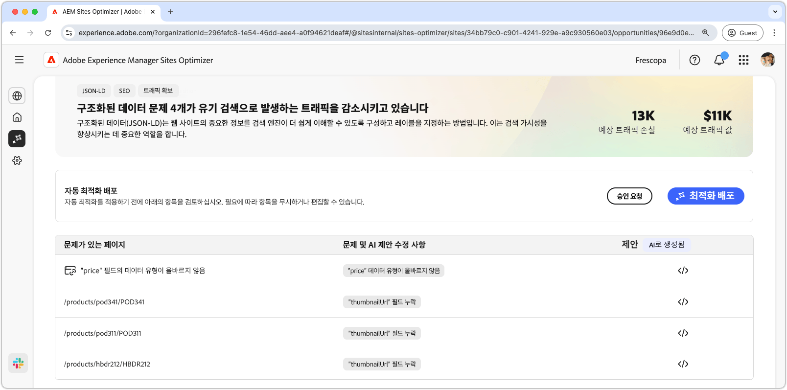

# 누락되거나 잘못된 구조화된 데이터 기회

{align="center"}

누락되거나 잘못된 구조화된 데이터 기회는 Json-LD 표준화된 포맷에서 누락되거나 잘못된 구조화된 데이터를 식별합니다. 구조화된 데이터는 웹 사이트의 중요한 정보를 구성하고, 설명하고, 레이블을 지정하는 방법입니다. 이는 검색 엔진이 페이지의 내용을 해석하는 데 도움이 되며 검색 결과에서 가시성을 향상합니다. 더 나은 검색 결과는 더 많은 사용자가 웹 사이트에 참여하도록 유도해 줍니다.

누락되거나 잘못된 구조화된 데이터 기회는 페이지 상단에 요약을 표시하며, 여기에는 문제의 개요와 사이트 및 비즈니스에 미치는 영향이 포함됩니다.

* **예상 트래픽 손실** – 잘못된 구조화된 데이터로 인한 예상 트래픽 손실입니다.
* **예상 트래픽 가치** – 손실된 트래픽의 예상 가치입니다.

## 자동 식별

{align="center"}

누락되거나 잘못된 구조화된 데이터 기회는 페이지에서 감지된 모든 문제를 나열하며, 여기에는 다음과 같은 카테고리가 포함됩니다.

* **문제가 있는 페이지** – 잘못되었거나 누락된 구조화된 데이터가 포함된 페이지입니다.
* **문제 및 AI가 제안한 수정 사항** – 페이지에 영향을 미치는 구조화된 데이터 문제의 유형을 나타냅니다.
* **제안** - 적합한 구조화된 데이터 업데이트에 대한 AI 생성 제안입니다. 자세한 내용은 아래 섹션을 참조하십시오.

## 자동 제안

{align="center"}

잘못되었거나 누락된 구조화된 데이터 기회는 또한 구조화된 데이터를 변경하거나 업데이트하는 방법에 대한 AI 생성 제안을 제공합니다. 제안 버튼을 클릭하면 다음이 포함된 새 창이 나타납니다.

* **페이지 경로** – 잘못되었거나 누락된 구조화된 데이터가 있는 페이지의 경로가 포함된 필드입니다.
* **문제** – 문제 수와 모든 문제가 나열된 드롭다운 메뉴가 포함된 필드입니다.
* **제안 필드** - 적합한 구조화된 데이터 업데이트에 대한 AI 생성 설명 및 제안입니다. 아래로 스크롤하여 추가적인 제안 및 문제를 확인할 수 있습니다.

## 자동 최적화

[!BADGE Ultimate]{type=Positive tooltip="Ultimate"}

{align="center"}

Sites Optimizer Ultimate에는 잘못되었거나 누락된 구조화된 데이터 기회로 인해 발견된 문제에 대한 자동 최적화를 배포하는 기능이 추가됩니다. <!--- TBD-need more in-depth and opportunity specific information here. What does the auto-optimization do?-->

>[!BEGINTABS]

>[!TAB 최적화 배포]

{{auto-optimize-deploy-optimization-slack}}

>[!TAB 승인 요청]

{{auto-optimize-request-approval}}

>[!ENDTABS]
