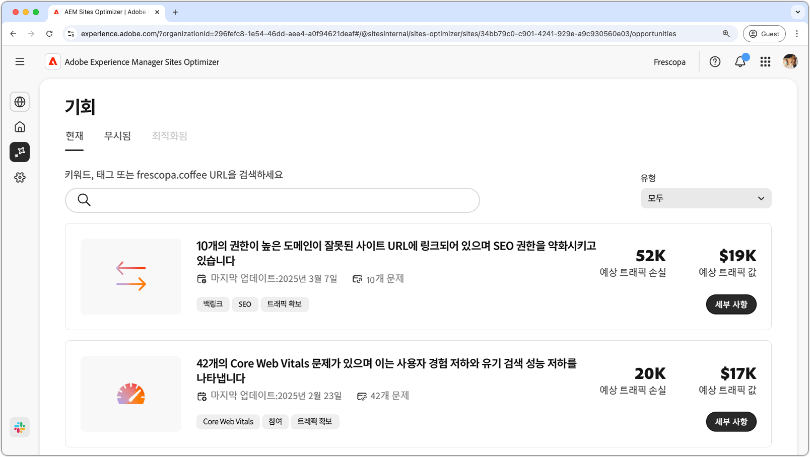

# 기회 설명서

{align="center"}

Sites Optimizer는 Adobe AI 기반의 지속적으로 확장되는 기회들로 구성되어 있으며, 귀하의 웹 사이트를 파악하고 개선 사항을 제안하도록 설계되었습니다. 각 기회는 잠재적인 비즈니스 가치에 대한 인사이트를 제공하고, 주의가 필요한 영역을 강조하며, 최적화를 위한 실행 가능한 권장 사항을 제공합니다. 각 기회를 클릭하여 식별된 문제, 제안된 개선 사항, 그리고 웹 사이트 성과 및 사용자 경험 향상을 위해 이러한 변경 사항을 구현하는 방법에 대한 단계별 구현 안내서를 살펴보십시오.

기회는 [Site Optimizer의 지속적인 탐색](/help/documentation/basics.md#navigation)의 **기회** 메뉴 옵션을 통해 사용할 수 있습니다.

## 기회 상태

경로상단의 탭을 사용하면 상태별로 기회를 구성하고 필터링할 수 있습니다.

>[!BEGINTABS]

>[!TAB 현재]

{align="center"}

현재 보류 중인 기회입니다.

>[!TAB 무시됨]

{align="center"}

무시된 기회입니다. 무시된 기회는 이 보기에서 복원할 수 있습니다.

>[!TAB 최적화됨]

최적화된 기회의 이전 내역입니다.

>[!ENDTABS]

## 기회

[기회 상태](#opportunity-status)를 선택하면 기회 목록을 볼 수 있습니다. 다음과 같은 방법으로 기회 목록을 필터링할 수 있습니다.

* **검색** - **키워드, 태그 또는 URL**&#x200B;별로 기회를 검색합니다.
* **기회 유형** - **유형** 드롭다운을 사용하여 [기회 유형](/help/opportunity-types/overview.md)별로 기회를 필터링합니다.

### 기회 세부 정보

{align="center"}

각 기회에는 문제에 대한 간략한 설명, 사이트에 미칠 수 있는 잠재적 영향 및 전체 세부 정보에 대한 링크가 제공됩니다. 또한 기회가 최적화되었는지 또는 아직 보류 중인지 여부를 나타내는 상태도 확인할 수 있습니다.

* **기회 제목** – 문제에 대한 간략한 설명과 사이트 성과에 미칠 수 있는 잠재적 영향입니다.
* **마지막으로 업데이트됨** – Sites Optimizer에서 기회를 새 데이터로 최종 업데이트한 날짜입니다.
* **문제 수** - 사이트에서 식별된 문제의 인스턴스 수입니다.
* **기회 유형** – 이 기회가 포함된 [기회의 유형](/help/opportunity-types/overview.md)입니다(예: 트래픽 확보, 참여, 전환, 사이트 상태).

각 기회에 대한 요약 정보는 유형에 따라 다르며 수익 영향, 트래픽, 사용자 참여 또는 보안 위협에 대한 세부 정보가 포함될 수 있습니다.

기회의 세부 정보를 보려면 **세부 정보** 버튼을 클릭하십시오.

Sites Optimizer 대시보드에서 기회를 제외하려면 **무시** 버튼을 클릭하십시오.  이 액션을 수행하면 기회가 [**무시됨** 탭으로 이동합니다](#opportunity-status).

## 모든 기회

Sites Optimizer에서 사용 가능한 모든 기회를 탐색합니다.

<!-- CARDS

* ./accessibility-issues.md
  {title=Accessibility issues}
  {image=../../assets/common/card-arrows.png} 
* ./broken-backlinks.md
  {title=Broken backlinks}
  {image=../../assets/common/card-arrows.png}
* ./broken-internal-links.md
  {title=Broken internal links}
  {image=../../assets/common/card-link.png}
* ./cors-configuration.md
  {title=CORS configuration}
  {image=../../assets/common/card-code.png}
* ./core-web-vitals.md
  {title=Core web vitals}
  {image=../../assets/common/card-performance.png}
* ./cross-site-scripting.md
  {title=Cross-site scripting}
  {image=../../assets/common/card-code.png}
* ./high-bounce-rate.md
  {title=High bounce rate}
  {image=../../assets/common/card-arrows.png}    
* ./invalid-or-missing-metadata.md
  {title=Invalid or missing metadata}
  {image=../../assets/common/card-code.png}
* ./low-conversions.md
  {title=Low conversions}
  {image=../../assets/common/card-bag.png}
* ./low-views.md
  {title=Low views}
  {image=../../assets/common/card-bag.png} 
* ./missing-alt-text.md
  {title=Missing alt text}
  {image=../../assets/common/card-arrows.png}
* ./missing-invalid-structured-data.md
  {title=Missing or invalid structured data}
  {image=../../assets/common/card-bag.png}
* ./sitemap-issues.md
  {title=Sitemap issues}
  {image=../../assets/common/card-relationship.png}
* ./website-permissions.md
  {title=Website permissions}
  {image=../../assets/common/card-people.png}
* ./website-vulnerabilities.md
  {title=Website vulnerabilities}
  {image=../../assets/common/card-puzzle.png}
  
--->
<!-- START CARDS HTML - DO NOT MODIFY BY HAND -->

    

        

            

                <figure class="image x-is-16by9">
                    
                </figure>
            

            

                

                    

                        <a href="./accessibility-issues.md" target="_blank" rel="referrer" title="접근성 문제">접근성 문제</a>
                    

                    
접근성 문제 기회와 이를 사용하여 웹 사이트 보안을 강화하는 방법을 알아봅니다.

                

                <a href="./accessibility-issues.md" target="_blank" rel="referrer" class="spectrum-Button spectrum-Button--outline spectrum-Button--primary spectrum-Button--sizeM" style="align-self: flex-start; margin-top: 1rem;">
                    자세히 알아보기
                </a>
            

        

    

    

        

            

                <figure class="image x-is-16by9">
                    
                </figure>
            

            

                

                    

                        <a href="./broken-backlinks.md" target="_blank" rel="referrer" title="끊어진 백링크">끊어진 백링크</a>
                    

                    
끊어진 백링크 기회에 대해 알아보고 이를 사용하여 트래픽 확보를 개선하는 방법을 알아봅니다.

                

                <a href="./broken-backlinks.md" target="_blank" rel="referrer" class="spectrum-Button spectrum-Button--outline spectrum-Button--primary spectrum-Button--sizeM" style="align-self: flex-start; margin-top: 1rem;">
                    자세히 알아보기
                </a>
            

        

    

    

        

            

                <figure class="image x-is-16by9">
                    
                </figure>
            

            

                

                    

                        <a href="./broken-internal-links.md" target="_blank" rel="referrer" title="끊어진 내부 링크">끊어진 내부 링크</a>
                    

                    
끊어진 링크 기회에 대해 알아보고 이를 사용하여 웹 사이트 참여도를 개선하는 방법을 알아봅니다.

                

                <a href="./broken-internal-links.md" target="_blank" rel="referrer" class="spectrum-Button spectrum-Button--outline spectrum-Button--primary spectrum-Button--sizeM" style="align-self: flex-start; margin-top: 1rem;">
                    자세히 알아보기
                </a>
            

        

    

    

        

            

                <figure class="image x-is-16by9">
                    
                </figure>
            

            

                

                    

                        <a href="./cors-configuration.md" target="_blank" rel="referrer" title="CORS 구성">CORS 구성</a>
                    

                    
CORS 구성 기회에 대해 알아보고 사이트 보안 취약점을 식별하여 해결하는 방법을 알아봅니다.

                

                <a href="./cors-configuration.md" target="_blank" rel="referrer" class="spectrum-Button spectrum-Button--outline spectrum-Button--primary spectrum-Button--sizeM" style="align-self: flex-start; margin-top: 1rem;">
                    자세히 알아보기
                </a>
            

        

    

    

        

            

                <figure class="image x-is-16by9">
                    
                </figure>
            

            

                

                    

                        <a href="./core-web-vitals.md" target="_blank" rel="referrer" title="핵심 웹 바이탈">핵심 웹 바이탈</a>
                    

                    
핵심 웹 바이탈 기회에 대해 알아보고 이를 사용하여 트래픽 확보를 개선하는 방법을 알아봅니다.

                

                <a href="./core-web-vitals.md" target="_blank" rel="referrer" class="spectrum-Button spectrum-Button--outline spectrum-Button--primary spectrum-Button--sizeM" style="align-self: flex-start; margin-top: 1rem;">
                    자세히 알아보기
                </a>
            

        

    

    

        

            

                <figure class="image x-is-16by9">
                    
                </figure>
            

            

                

                    

                        <a href="./cross-site-scripting.md" target="_blank" rel="referrer" title="크로스 사이트 스크립팅">크로스 사이트 스크립팅</a>
                    

                    
크로스 사이트 스크립팅 기회에 대해 알아보고 사이트 보안 취약점을 식별하여 해결하는 방법을 알아봅니다.

                

                <a href="./cross-site-scripting.md" target="_blank" rel="referrer" class="spectrum-Button spectrum-Button--outline spectrum-Button--primary spectrum-Button--sizeM" style="align-self: flex-start; margin-top: 1rem;">
                    자세히 알아보기
                </a>
            

        

    

    

        

            

                <figure class="image x-is-16by9">
                    
                </figure>
            

            

                

                    

                        <a href="./high-bounce-rate.md" target="_blank" rel="referrer" title="높은 바운스 비율">높은 바운스 비율</a>
                    

                    
낮은 조회수 기회에 대해 알아보고 이를 사용하여 웹 사이트에서 양식의 참여도를 개선하는 방법을 알아봅니다.

                

                <a href="./high-bounce-rate.md" target="_blank" rel="referrer" class="spectrum-Button spectrum-Button--outline spectrum-Button--primary spectrum-Button--sizeM" style="align-self: flex-start; margin-top: 1rem;">
                    자세히 알아보기
                </a>
            

        

    

    

        

            

                <figure class="image x-is-16by9">
                    
                </figure>
            

            

                

                    

                        <a href="./invalid-or-missing-metadata.md" target="_blank" rel="referrer" title="잘못되었거나 누락된 메타데이터">잘못되었거나 누락된 메타데이터</a>
                    

                    
잘못되었거나 누락된 메타데이터 기회에 대해 알아보고 이를 사용하여 트래픽 확보를 개선하는 방법을 알아봅니다.

                

                <a href="./invalid-or-missing-metadata.md" target="_blank" rel="referrer" class="spectrum-Button spectrum-Button--outline spectrum-Button--primary spectrum-Button--sizeM" style="align-self: flex-start; margin-top: 1rem;">
                    자세히 알아보기
                </a>
            

        

    

        

            

                <figure class="image x-is-16by9">
                    
                </figure>
            

            

                

                    

                        <a href="./low-conversions.md" target="_blank" rel="referrer" title="Forms 낮은 전환율">Forms 낮은 전환율</a>
                    

                    
낮은 전환율 기회에 대해 알아보고 이를 사용하여 웹 사이트에서 양식 참여도를 개선하는 방법을 알아봅니다.

                

                <a href="./low-conversions.md" target="_blank" rel="referrer" class="spectrum-Button spectrum-Button--outline spectrum-Button--primary spectrum-Button--sizeM" style="align-self: flex-start; margin-top: 1rem;">
                    자세히 알아보기
                </a>
            

        

    

    

        

            

                <figure class="image x-is-16by9">
                    
                </figure>
            

            

                

                    

                        <a href="./low-views.md" target="_blank" rel="referrer" title="낮은 조회수">Forms 낮은 조회수</a>
                    

                    
Forms 낮은 조회수 기회에 대해 알아보고 이를 사용하여 웹 사이트에서 양식 참여도를 개선하는 방법을 알아봅니다.

                

                <a href="./low-views.md" target="_blank" rel="referrer" class="spectrum-Button spectrum-Button--outline spectrum-Button--primary spectrum-Button--sizeM" style="align-self: flex-start; margin-top: 1rem;">
                    자세히 알아보기
                </a>
            

        

    

    

        

            

                <figure class="image x-is-16by9">
                    
                </figure>
            

            

                

                    

                        <a href="./low-navigation.md" target="_blank" rel="referrer" title="Forms 낮은 탐색">Forms 낮은 탐색</a>
                    

                    
낮은 탐색 기회 양식에 대해 알아보고 이를 사용하여 웹 사이트에서 참여도를 개선하는 방법을 알아봅니다.

                

                <a href="./low-navigation.md" target="_blank" rel="referrer" class="spectrum-Button spectrum-Button--outline spectrum-Button--primary spectrum-Button--sizeM" style="align-self: flex-start; margin-top: 1rem;">
                    자세히 알아보기
                </a>
            

        

    

    

        

            

                <figure class="image x-is-16by9">
                    
                </figure>
            

            

                

                    

                        <a href="./forms-accessibility-issues.md" target="_blank" rel="referrer" title="Forms 접근성 문제">Forms 접근성 문제</a>
                    

                    
접근성 문제 기회 양식과 이를 사용하여 웹 사이트의 참여를 향상시키는 방법에 대해 알아봅니다.

                

                <a href="./forms-accessibility-issues.md" target="_blank" rel="referrer" class="spectrum-Button spectrum-Button--outline spectrum-Button--primary spectrum-Button--sizeM" style="align-self: flex-start; margin-top: 1rem;">
                    자세히 알아보기
                </a>
            

        

    

    

        

            

                <figure class="image x-is-16by9">
                    
                </figure>
            

            

                

                    

                        <a href="./missing-alt-text.md" target="_blank" rel="referrer" title="누락된 대체 텍스트">누락된 대체 텍스트</a>
                    

                    
누락된 대체 텍스트 기회에 대해 알아보고 이를 사용하여 웹 사이트 참여도를 개선하는 방법을 알아봅니다.

                

                <a href="./missing-alt-text.md" target="_blank" rel="referrer" class="spectrum-Button spectrum-Button--outline spectrum-Button--primary spectrum-Button--sizeM" style="align-self: flex-start; margin-top: 1rem;">
                    자세히 알아보기
                </a>
            

        

    

    

        

            

                <figure class="image x-is-16by9">
                    
                </figure>
            

            

                

                    

                        <a href="./missing-invalid-structured-data.md" target="_blank" rel="referrer" title="누락되거나 잘못된 구조화된 데이터">누락되거나 잘못된 구조화된 데이터</a>
                    

                    
누락되거나 잘못된 구조화된 데이터 기회에 대해 알아보고 이를 사용하여 트래픽 확보를 개선하는 방법을 알아봅니다.

                

                <a href="./missing-invalid-structured-data.md" target="_blank" rel="referrer" class="spectrum-Button spectrum-Button--outline spectrum-Button--primary spectrum-Button--sizeM" style="align-self: flex-start; margin-top: 1rem;">
                    자세히 알아보기
                </a>
            

        

    

    

        

            

                <figure class="image x-is-16by9">
                    
                </figure>
            

            

                

                    

                        <a href="./sitemap-issues.md" target="_blank" rel="referrer" title="사이트맵 문제">사이트맵 문제</a>
                    

                    
사이트맵 문제 기회에 대해 알아보고 이를 사용하여 트래픽 확보를 개선하는 방법을 알아봅니다.

                

                <a href="./sitemap-issues.md" target="_blank" rel="referrer" class="spectrum-Button spectrum-Button--outline spectrum-Button--primary spectrum-Button--sizeM" style="align-self: flex-start; margin-top: 1rem;">
                    자세히 알아보기
                </a>
            

        

    

    

        

            

                <figure class="image x-is-16by9">
                    
                </figure>
            

            

                

                    

                        <a href="./website-permissions.md" target="_blank" rel="referrer" title="웹 사이트 권한">웹 사이트 권한</a>
                    

                    
웹 사이트 권한 기회와 이를 사용하여 웹 사이트 보안을 강화하는 방법을 알아봅니다.

                

                <a href="./website-permissions.md" target="_blank" rel="referrer" class="spectrum-Button spectrum-Button--outline spectrum-Button--primary spectrum-Button--sizeM" style="align-self: flex-start; margin-top: 1rem;">
                    자세히 알아보기
                </a>
            

        

    

    

        

            

                <figure class="image x-is-16by9">
                    
                </figure>
            

            

                

                    

                        <a href="./website-vulnerabilities.md" target="_blank" rel="referrer" title="웹 사이트 취약점">웹 사이트 취약점</a>
                    

                    
웹 사이트 취약점 기회와 이를 사용하여 웹 사이트 보안을 강화하는 방법을 알아봅니다.

                

                <a href="./website-vulnerabilities.md" target="_blank" rel="referrer" class="spectrum-Button spectrum-Button--outline spectrum-Button--primary spectrum-Button--sizeM" style="align-self: flex-start; margin-top: 1rem;">
                    자세히 알아보기
                </a>
            

        

    

<!-- END CARDS HTML - DO NOT MODIFY BY HAND -->

