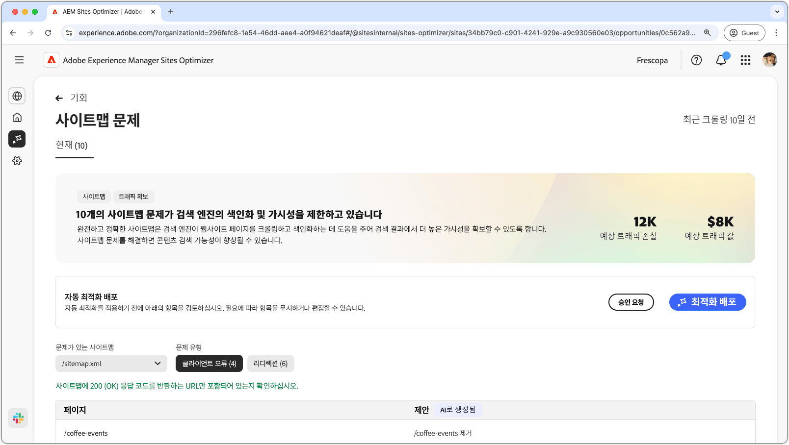
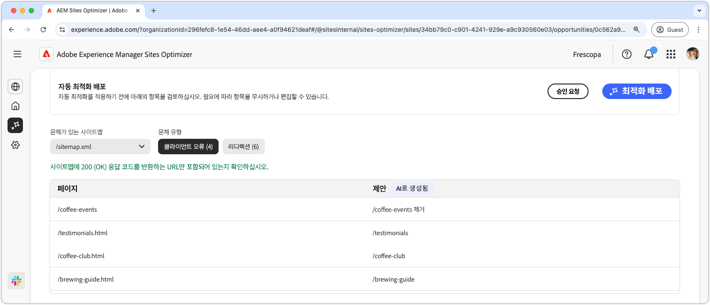
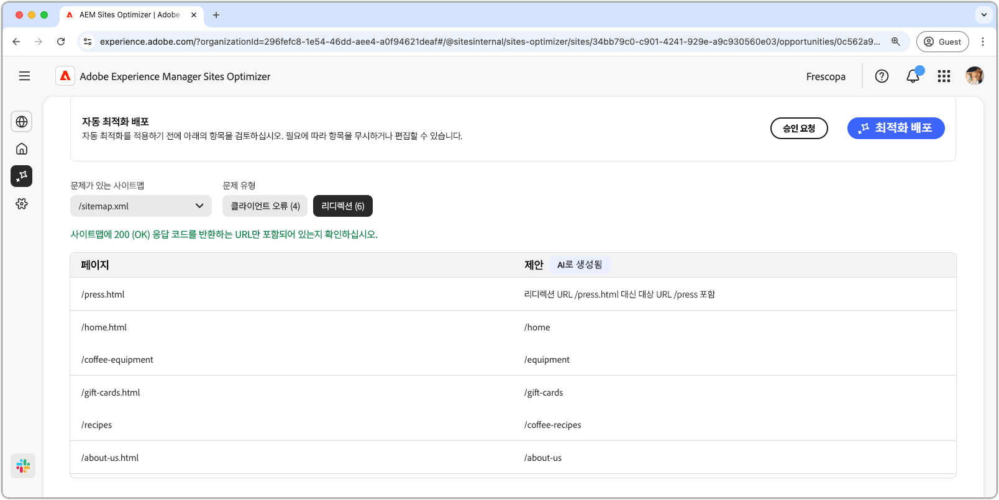
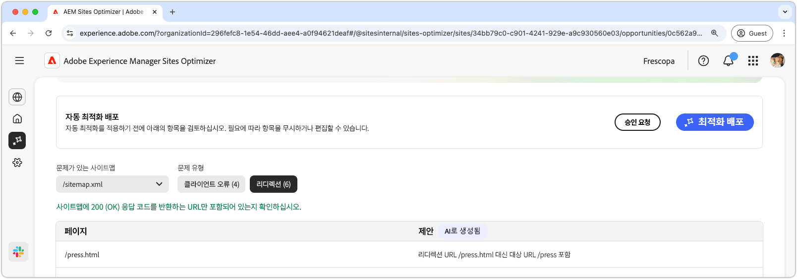

# 사이트맵 문제 기회

{align="center"}

완전하고 정확한 사이트맵은 검색 엔진이 웹 사이트 페이지를 효율적으로 크롤링하고 색인화하는 데 도움이 되어 검색 결과에서 더 나은 가시성을 제공합니다. 사이트맵 기회는 사이트맵의 잠재적인 문제를 식별합니다. 이러한 문제를 수정하면 사이트에서 검색 엔진 인덱싱과 콘텐츠 검색 기능을 크게 향상시킬 수 있습니다.

문제의 개요와 사이트 및 비즈니스에 미치는 영향을 포함한 요약이 페이지 상단에 표시됩니다.

* **예상 트래픽 손실** – 사이트맵 문제로 인한 예상 트래픽 손실입니다.
* **예상 트래픽 가치** – 손실된 트래픽의 예상 가치입니다.

## 자동 식별

사이트맵 문제는 다음 기준을 사용하여 필터링할 수 있습니다.

* **문제가 있는 사이트맵** – 잠재적인 문제를 포함한 분석된 사이트맵 URL입니다.
* **문제 유형** – 사이트맵에서 식별된 문제 유형입니다.
   * **클라이언트 오류** – `200 Success` 응답을 반환하지 않는 항목입니다.
   * **리디렉션** – 잘못되었거나 잘못 구성된 리디렉션입니다.

>[!BEGINTABS]

>[!TAB 클라이언트 오류]

{align="center"}

사이트 맵의 URL이 이러한 오류를 반환하는 경우 검색 엔진은 사이트 맵이 오래되었거나 페이지가 잘못 제거되었다고 가정할 수 있습니다. 클라이언트는 클라이언트(브라우저 또는 크롤러)의 요청이 잘못되었음을 나타냅니다. 일반적인 오류는 다음과 같습니다.

* **404 찾을 수 없음** - 요청한 페이지가 없습니다.
* **403 금지됨** – 서버가 요청된 페이지에 대한 액세스를 거부했습니다.
* **410 없어짐** - 페이지가 의도적으로 제거되었으며 반환되지 않았습니다.
* **401 인증되지 않음** – 인증이 필요하지만 제공되지 않았습니다.

이러한 오류는 SEO에 손상을 줄 수 있으며, 특히 중요한 페이지가 **404 또는 410**&#x200B;을 반환하는 경우 검색 엔진에서 해당 페이지의 색인을 해제할 수 있습니다.

각 문제는 테이블에 표시되며, **페이지** 열은 영향을 받는 사이트맵 항목을 식별합니다.

* **페이지** – 문제가 있는 사이트맵 항목의 URL입니다.

>[!TAB 리디렉션]

{align="center"}

사이트맵에는 리디렉션하는 URL이 아닌 최종 대상 URL만 포함되어야 합니다. 리디렉션은 사용자와 크롤러를 올바른 위치로 안내하기 위한 것이지만 잘못 구성하면 문제가 발생할 수 있습니다.

* **302 발견됨(임시 리디렉션)** – 실수로 **301**&#x200B;대신 사용하면 SEO 문제가 발생할 수 있습니다.
* **307 임시 리디렉션** – 302와 유사하지만 HTTP 메서드를 유지합니다.
* **리디렉션 루프** – 페이지가 자신에게로 리디렉션되거나 무한 루프가 생성되는 경우입니다.
* **손상된 리디렉션** – 리디렉션이 존재하지 않는 페이지나 4xx 페이지로 연결되는 경우입니다.

각 문제는 테이블에 표시되며, **페이지** 열은 영향을 받는 사이트맵 항목을 식별합니다.

* **페이지** – 문제가 있는 사이트맵 항목의 URL입니다.

>[!ENDTABS]

## 자동 제안

[필터 조건을 충족하는](#auto-identify) 각 사이트맵 문제는 다음 열이 포함된 테이블에 나열됩니다.

* **페이지** – 문제가 있는 사이트맵 항목의 URL입니다.
* **제안** – 문제에 대한 권장 수정 사항입니다.

일반적으로 제안에는 사이트맵 항목을 수정하기 위한 업데이트된 사이트 경로가 포함됩니다. 경우에 따라 올바른 리디렉션 대상을 지정하는 등 더 자세한 지침을 제공할 수도 있습니다.

## 자동 최적화

[!BADGE Ultimate]{type=Positive tooltip="Ultimate"}

{align="center"}

Sites Optimizer Ultimate에는 사이트맵의 자동 최적화를 배포하는 기능이 추가됩니다.

>[!BEGINTABS]

>[!TAB 최적화 배포]

{{auto-optimize-deploy-optimization-slack}}

>[!TAB 승인 요청]

{{auto-optimize-request-approval}}

>[!ENDTABS]
