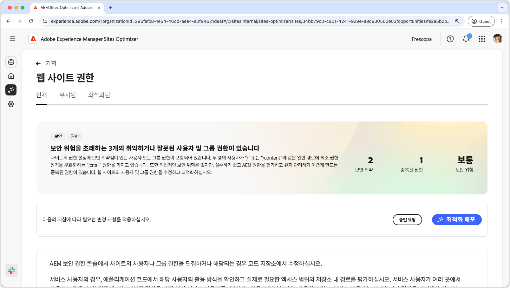
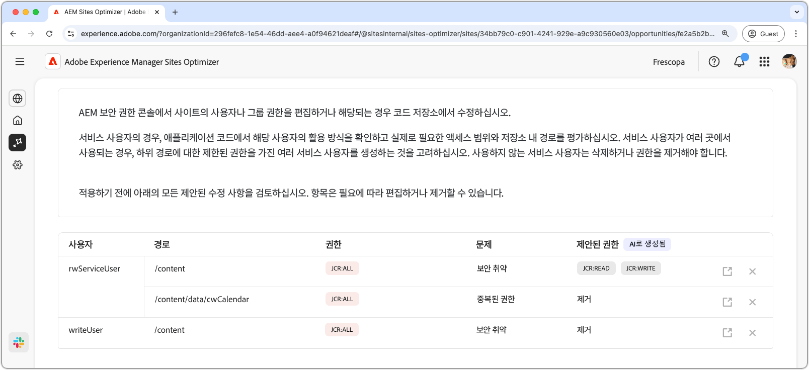
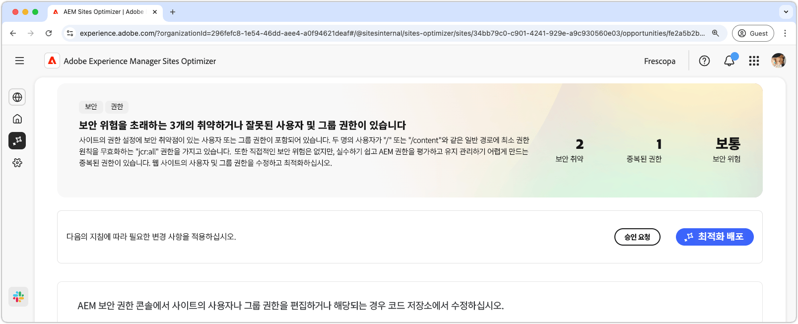

# 웹 사이트 권한 기회

{align="center"}

웹 사이트 권한 기회는 안전하고 관리하기 쉬운 AEM 환경을 유지하는 데 요소인 중요한 웹 사이트 권한을 최적화합니다. 이 기회를 통해 지나치게 광범위한 권한(예: `/` 또는 `/content` 등 일반 경로에 있는 `jcr:all`)을 제거하고 사용자 액세스를 최소 권한 원칙에 맞춰 조정하여 액세스 제어를 개선할 수 있습니다. 권한을 간소화하고 중복을 제거하면 보안 위험을 줄이고, 유지 가능성 개선하고, 향후 잘못된 구성을 방지할 수 있습니다. AEM 보안 권한 콘솔이나 코드 저장소에서 권한을 검토하고 업데이트하여 서비스 사용자에게 꼭 필요한 액세스 권한만 부여되도록 조치를 취하십시오.

## 자동 식별

{align="center"}

**웹 사이트 권한 기회** 기능은 다음을 자동으로 식별하고 나열합니다.

* **사용자** – 의심스러운 권한이 있는 사용자 계정입니다.
* **경로** – 권한에 영향을 받는 AEM의 경로입니다.
* **권한** – 의심스러운 권한입니다.
* **문제** - 권한에 영향을 미치는 문제의 유형을 나타냅니다.

## 자동 제안

{align="center"}

자동 제안 기능은 **제안된 권한** 필드에 AI가 생성한 권장 사항을 제공하여 플래그가 지정된 권한을 안전한 대체 권한으로 바꿀 수 있도록 해 줍니다.

## 자동 최적화

[!BADGE Ultimate]{type=Positive tooltip="Ultimate"}

{align="center"}

Sites Optimizer Ultimate에는 발견된 취약점에 대해 자동 최적화를 배포하는 기능이 추가됩니다.

>[!BEGINTABS]

>[!TAB 최적화 배포]

{{auto-optimize-deploy-optimization-slack}}

>[!TAB 승인 요청]

{{auto-optimize-request-approval}}

>[!ENDTABS]
