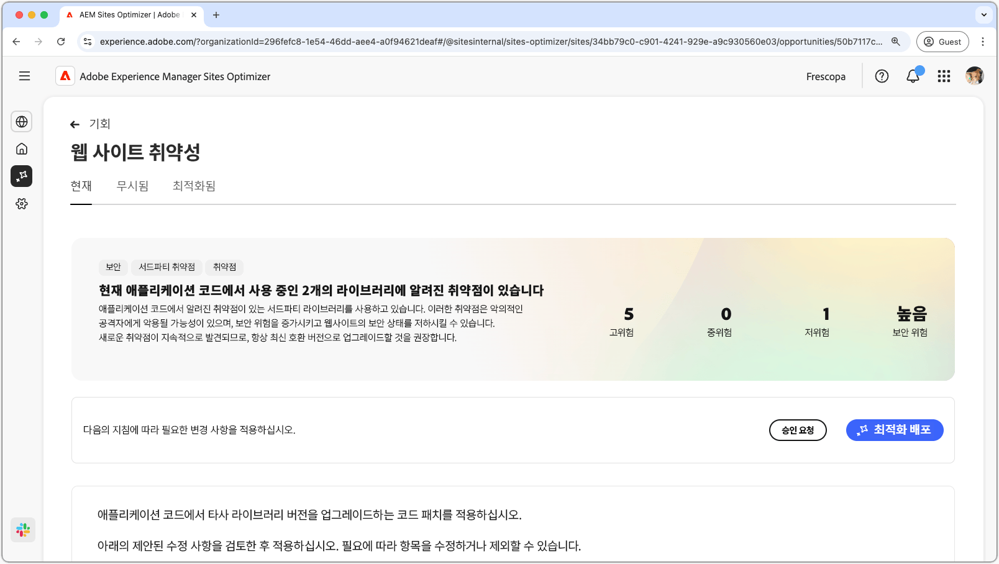
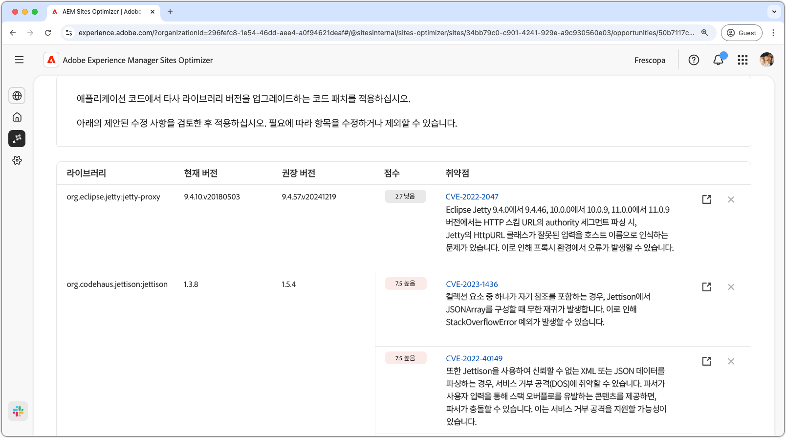
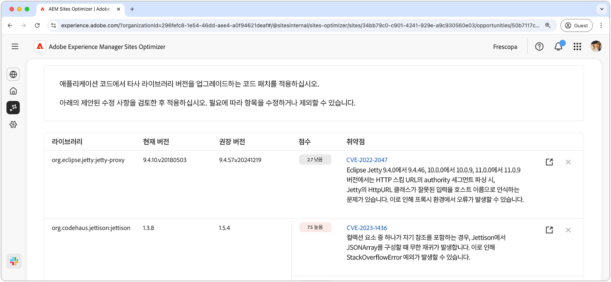
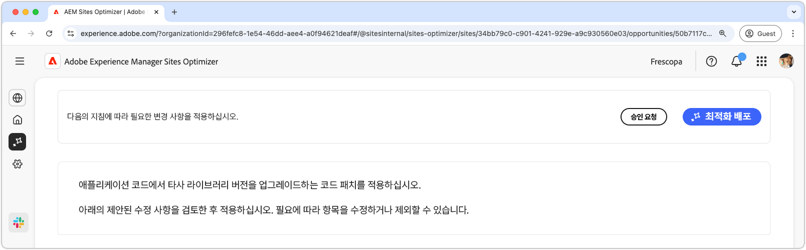

# 웹 사이트 취약성 기회

{align="center"}

웹 사이트 취약성 기회는 애플리케이션 코드에서 사용하는 타사 라이브러리의 보안 취약성을 식별합니다. 이러한 취약성은 악의적인 공격자가 악용하여 위험을 높이고 웹 사이트의 보안 자세를 저하시킬 수 있습니다.

웹 사이트 취약성 기회 에는 다음을 포함한 요약이 페이지 맨 위에 표시됩니다.

* **발견된 문제** - 발견된 취약성의 수를 해당 취약성이 나타내는 보안 위험(낮음, 중간, 높음)으로 범주화합니다.
* **집계된 보안 위험** - 해당 영업 기회에 의해 발견된 취약점을 기반으로 웹 사이트에 대한 전반적인 보안 위험.

## 자동 식별

{align="center"}

**웹 사이트 취약성 기회** 기능은 응용 프로그램 코드에서 사용하는 타사 라이브러리에 있는 취약성을 자동으로 식별하고 나열합니다. 여기에서는 다음 세부 정보를 제공합니다.

* **라이브러리** - 취약성이 포함된 타사 라이브러리입니다. 단일 라이브러리에 여러 취약점이 있을 수 있습니다.
* **현재 버전** - 현재 사용 중인 라이브러리의 버전입니다.
* **권장 버전** - 취약성을 해결하는 권장 버전입니다.
* **점수** - 취약성의 심각도 등급도 페이지 맨 위에 요약되어 있습니다.
* **취약성** - 취약성 식별자, 간략한 설명 및 자세한 내용은 NVD(National Vulnerability Database)에 대한 링크입니다. 식별자나 설명 옆에 있는 링크를 클릭하여 NVD 링크에 액세스합니다.

## 자동 제안

{align="center"}

자동 제안은 업그레이드해야 하는 취약한 라이브러리의 **권장 버전**&#x200B;에 대한 AI 생성 제안을 제공합니다. 각 항목에는 전체 심각도를 나타내는 **점수**&#x200B;가 있어 가장 중요한 취약성의 우선 순위를 지정하는 데 도움이 됩니다.

>[!BEGINTABS]

>[!TAB 취약성 세부 정보]

각 취약성에는 [NVD(National Vulnerability Database)](https://nvd.nist.gov/)의 세부 정보에 대한 링크가 포함되어 있습니다. 취약성 식별자 또는 설명 오른쪽에 있는 링크 항목을 클릭하면 해당 취약성에 대한 NVD 페이지로 이동합니다.

>[!TAB 항목 무시]

취약성 목록의 항목을 무시하도록 선택할 수 있습니다. **무시 아이콘**&#x200B;을 선택하면 목록에서 항목이 제거됩니다. 영업 기회 페이지 상단의 **무시됨** 탭에서 무시된 항목을 다시 사용할 수 있습니다.<!---right now it does not seem to be implemented, but the page description mentions this functionality-->

>[!ENDTABS]

## [!BADGE Ultimate] 자동 최적화{type=Positive tooltip="Ultimate"}

{align="center"}

Sites Optimizer Ultimate은 발견된 취약점에 대해 자동 최적화 배포 기능을 추가합니다.

>[!BEGINTABS]

>[!TAB 최적화 배포]

{{auto-optimize-deploy-optimization-slack}}

>[!TAB 승인 요청]

{{auto-optimize-request-approval}}

>[!ENDTABS]