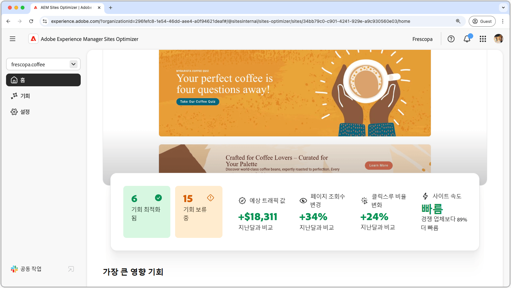
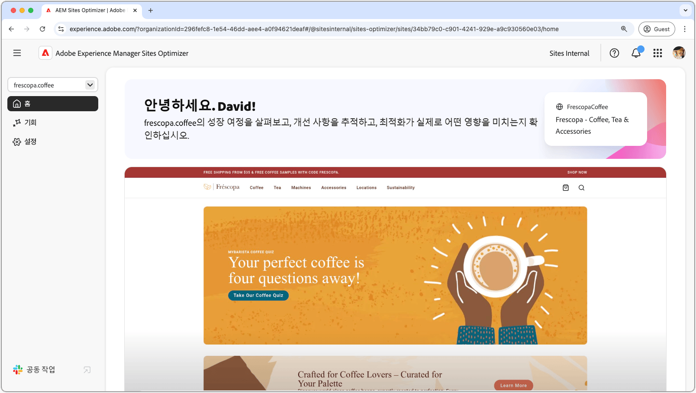
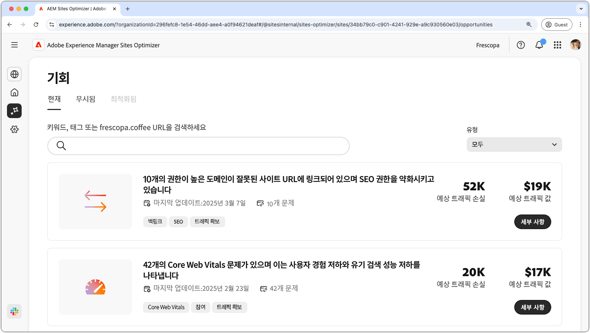
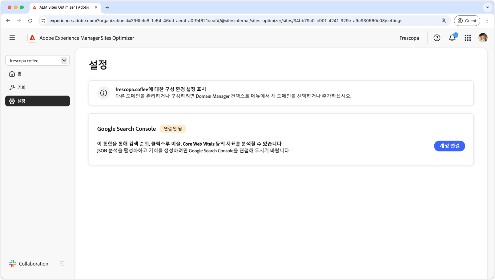

# Sites Optimizer 설명서

{align="center"}

Sites Optimizer 설명서를 시작합니다. 여기에서는 Sites Optimizer를 사용하여 AEM 사이트를 최적화하는 방법에 대한 정보를 확인할 수 있습니다.

## Site Optimizer 기본 사항

AEM Sites Optimizer 설명서를 탐색하여 홈 대시보드, 설정 구성 및 최적화 인사이트를 위한 기회 목록 등 핵심 UI 구성 요소에 대해 알아봅니다.

<!-- CARDS 

* ./basics.md
  {title = Basics}
  {image = ./assets/basics/card.png}
* ./opportunities/overview.md
  {title = Opportunities}
* ./settings.md
  {title = Settings}

-->
<!-- START CARDS HTML - DO NOT MODIFY BY HAND -->

    

        

            

                <figure class="image x-is-16by9">
                    
                </figure>
            

            

                

                    

                        <a href="./basics.md" target="_blank" rel="referrer" title="기본 사항">기본 사항</a>
                    

                    
Sites Optimizer의 기본 사항과 탐색 방법을 알아봅니다.

                

                <a href="./basics.md" target="_blank" rel="referrer" class="spectrum-Button spectrum-Button--outline spectrum-Button--primary spectrum-Button--sizeM" style="align-self: flex-start; margin-top: 1rem;">
                    자세히 알아보기
                </a>
            

        

    

    

        

            

                <figure class="image x-is-16by9">
                    
                </figure>
            

            

                

                    

                        <a href="./opportunities/overview.md" target="_blank" rel="referrer" title="기회">기회</a>
                    

                    
사용 가능한 모든 Site Optimizer 기회와 이를 사용하여 사이트 성과를 개선하는 방법에 대해 알아봅니다.

                

                <a href="./opportunities/overview.md" target="_blank" rel="referrer" class="spectrum-Button spectrum-Button--outline spectrum-Button--primary spectrum-Button--sizeM" style="align-self: flex-start; margin-top: 1rem;">
                    자세히 알아보기
                </a>
            

        

    

    

        

            

                <figure class="image x-is-16by9">
                    
                </figure>
            

            

                

                    

                        <a href="./settings.md" target="_blank" rel="referrer" title="설정">설정</a>
                    

                    
Sites Optimizer 설정을 구성하고 다른 도구와 통합하는 방법을 알아봅니다.

                

                <a href="./settings.md" target="_blank" rel="referrer" class="spectrum-Button spectrum-Button--outline spectrum-Button--primary spectrum-Button--sizeM" style="align-self: flex-start; margin-top: 1rem;">
                    자세히 알아보기
                </a>
            

        

    

<!-- END CARDS HTML - DO NOT MODIFY BY HAND -->

