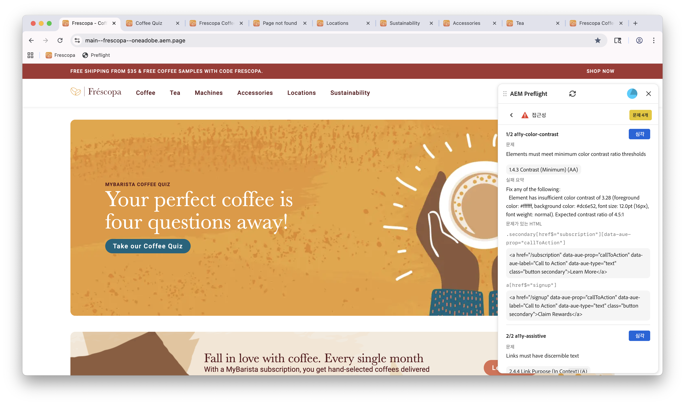

# 프리플라이트 접근성 기회

{align="center"}

Sites Optimizer의 Preflight 접근성 기회는 웹 사이트에서 접근성 문제를 식별하고 해결하여 장애가 있는 사용자를 포함한 모든 개인이 사용할 수 있도록 합니다. 이 기회는 접근성 표준을 준수하는 사이트의 평가를 중점적으로 다루고 개선을 위한 실행 가능한 권장 사항을 제공합니다.
