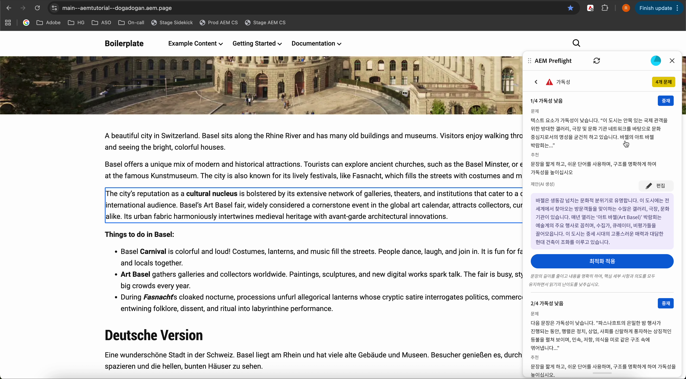

# Preflight의 감사 결과

감사가 완료되면 Preflight는 감사 결과를 기회로 표시합니다. 각 영업 기회는 유형별로 구성되며 페이지를 강화하고 최적화하는 데 도움이 되는 권장 사항이 포함되어 있습니다. 영업 기회 내에서 개별 문제는 검토하거나 수정할 특정 항목을 식별합니다.

AEM Preflight 대화 상자의 맨 위에는 전체 감사 결과를 반영하는 사용자 진행률 표시줄이 있습니다. 이 시각화는 문제 없이 전달된 기회의 백분율과 모든 기회에서 발견된 총 문제 수를 보여줍니다. 사용자 진행률 표시줄을 통해 작성자는 전체 페이지 상태를 한 눈에 파악할 수 있습니다.

{align="center"}

막대는 색상으로 구분됩니다.

* **1/3 미만** 기회에 대해 빨간색 완료
* **1/3에서 2/3까지 주황색 완료**
* **2/3 이상 완료**&#x200B;에 대한 녹색
* 감사가 **계속 실행 중**&#x200B;인 동안 파란색

[사용 가능한 영업 기회 유형의 전체 목록 및 이를 해결하는 방법](./overview.md#preflight-opportunities)을 참조하세요.

## 문제로 이동

감사가 완료되면 미리보기에서 식별된 문제로 빠르게 이동할 수 있습니다.

{align="center"}

### 문제로 이동

1. [프리플라이트] 패널의 [문제] 목록에서 문제를 선택합니다.
1. 미리보기가 자동으로 로 스크롤되어 페이지의 해당 위치를 강조 표시하므로 문제를 수동으로 검색하지 않고도 컨텍스트에서 문제를 검토할 수 있습니다.
