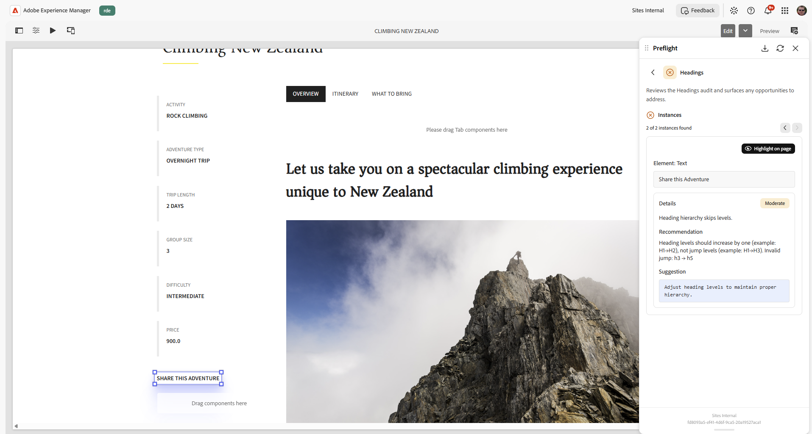

# Preflight 감사 결과

감사가 완료되면 Preflight가 준비 대시보드에 결과를 표시합니다. 대시보드에는 감사 범주별로 그룹화된 전체 준비 측정기와 발견된 기회가 표시됩니다. 각 범주 내에서 개별 감사는 검토하거나 수정할 특정 항목을 식별합니다.

## 도구 모음

준비 대시보드 상단에 있는 도구 모음에서는 현재 실행에 대한 작업을 제공합니다.

* **다시 분석** - 현재 페이지에서 완전히 새로운 감사 실행을 시작합니다. 재분석 은 항상 표시된 결과를 삭제하고 모든 감사를 다시 실행하므로 새 결과를 원할 때(예: 페이지 편집 후) 사용합니다. 다시 분석은 **추가 작업**(**...**)에 있습니다. 메뉴 아래의 제품에서 사용할 수 있습니다.
* **내보내기** - 현재 실행을 **CSV**(스프레드시트 전용) 또는 **PDF**(서식 있는 문서) 파일로 다운로드합니다. 사용 환경에 따라 도구 모음 또는 **추가 작업**&#x200B;에서 **내보내기**&#x200B;를 선택합니다(**...**). 메뉴 아래의 제품에서 사용할 수 있습니다.

내보낼 때 포함할 항목을 선택할 수도 있습니다.

* **메타데이터 테이블 포함** - 호스트, 콘텐츠 경로 및 생성 세부 정보와 같은 실행 세부 정보의 테이블을 추가합니다.
* **합격한 감사 포함** - 발견된 기회뿐만 아니라 기회 없이 합격한 감사를 포함합니다.

>[!NOTE]
>
>PDF 내보내기는 인터페이스 언어에 관계없이 항상 영어로 생성됩니다. CSV 내보내기는 인터페이스 언어를 가능한 한 가깝게 따릅니다.

## 준비 미터

대시보드 맨 위에는 전체 감사 결과를 반영하는 준비 측정기가 있습니다. 모든 감사에서 발견된 총 기회 수와 함께 기회 없이 완료된 감사의 비율을 기반으로 준비 점수를 백분율로 표시합니다. 준비 측정기는 전반적인 페이지 상태를 한 눈에 측정하는 데 도움이 됩니다.

{align="center"}

이전 세션에서 다시 로드한 실행을 보는 경우 헤더에는 실행 시간이 표시됩니다(예: *어제*). 자세한 내용은 [이전 세션 계속](./audits.md#continue-a-previous-session)을 참조하세요.

감사가 여전히 실행 중인 동안 준비 측정기의 아래에 현재 단계를 보여 주는 짧은 상태의 진행률 표시줄이 표시됩니다. 감사가 완료되면, 미터에 최종 준비 비율 및 영업 기회 수가 표시됩니다.

## 카테고리 감사

Preflight는 관련 감사를 **SEO** 및 **접근성**&#x200B;과 같은 범주로 그룹화합니다. 각 범주는 발견된 기회 수를 표시하는 카드로 나타나거나 모든 감사가 기회 없이 통과했음을 나타냅니다.

범주를 확장하여 개별 감사를 봅니다. 각 감사에는 통과 또는 발견 기회 여부, 간단한 설명 및 발견된 기회 카운트가 표시됩니다. 기회를 발견한 감사를 선택하여 세부 정보 페이지를 엽니다.

감사 범주의 전체 목록과 각 감사 목록을 보려면 [Preflight 감사 범주](./overview.md#preflight-audit-categories)을 참조하십시오.

## 기회 세부 정보

세부 사항 페이지에는 선택한 감사에서 발견한 기회가 표시됩니다. 두 곳 이상에서 동일한 문제가 발생하면 각 발생을 인스턴스라고 합니다. 네비게이터(**이전 인스턴스** 및 **다음 인스턴스**)를 사용하여 해당 인스턴스를 단계별로 수행합니다. 예를 들어, 발견된 5개 인스턴스 중 *1개*&#x200B;와 같은 사용자의 위치를 보여줍니다. 준비 대시보드로 돌아가려면 감사 제목 옆의 뒤로 화살표를 선택합니다. 대시보드가 다시 열리고 감사 범주가 확장됩니다.

{align="center"}

각 영업 기회에는 다음이 포함됩니다.

* 영업 기회의 중요성을 나타내는 심각도 또는 영향 배지.
* 문제에 대한 설명, 권장 사항, 접근성을 위한 관련 WCAG 규칙 및 적합성 수준 등 영업 기회에 대한 세부 사항입니다.
* **페이지에서 강조 표시** 단추를 사용하여 페이지에서 영향을 받는 요소를 식별하는 **요소** 섹션입니다. 요소에 읽을 수 있는 텍스트가 있으면 섹션의 제목이 **Element: Text**&#x200B;이고 해당 텍스트를 표시합니다. 그렇지 않으면 제목이 **Element: Selector**&#x200B;이고 요소의 CSS 선택기를 표시합니다. **링크** 및 **정식** 기회의 경우 **현재 URL** 섹션에도 관련 URL이 표시되며 가능한 경우 새 탭에서 열 수 있습니다.
* 권장 수정 사항이 있는 **제안** 섹션. 제안은 AI에 의해 생성되면 AI가 생성한 제안으로 표시되며, 제안하는 수정 사항을 설명하는 짧은 근거를 포함할 수 있다.

## 페이지에서 강조 표시

감사가 완료되면 페이지에서 직접 강조하여 영업 기회를 빠르게 찾고 이해할 수 있습니다.

Preflight는 컨텍스트에서 영향을 받는 요소를 강조 표시하여 패널의 결과를 콘텐츠의 정확한 위치에 연결합니다. 그러면 페이지를 수동으로 검색하지 않고도 기회를 훨씬 더 쉽게 검토하고 해결할 수 있습니다.

1. 감사할 페이지의 컨텍스트에서 [프리플라이트] 패널을 열고 **페이지 분석**&#x200B;을 선택하여 감사를 실행합니다.
1. 준비 대시보드에서 감사를 선택한 다음 검토할 기회를 선택합니다.
1. **페이지에서 강조 표시**&#x200B;를 선택합니다. 미리보기가 관련 영역으로 자동으로 스크롤되고 해당 요소가 강조 표시되므로 컨텍스트에서 기회를 쉽게 식별하고 최적화할 수 있습니다.

강조 표시는 모든 기회에 대해 가능하지 않습니다. 예를 들어 기회가 특정 요소에 연결되어 있지 않거나 요소가 숨겨져 있거나 더 이상 페이지에 없습니다. 이 경우 **페이지에서 강조 표시** 단추가 흐리게 표시되어 그 이유를 확인하십시오.

유니버설 편집기에서 **접근성** 기회에 대해서는 아직 강조 표시가 지원되지 않습니다. **페이지에서 강조 표시** 단추가 흐리게 표시되어 이유를 알 수 있습니다.

AEM Sites 페이지 편집기 및 Adobe Managed Services(AMS)에서 강조 표시를 하려면 **편집 모드**&#x200B;도 필요합니다. **미리 보기 모드**&#x200B;에서 Preflight는 **강조 표시 문제를 사용할 수 없음** 알림을 표시합니다. **편집 모드**(으)로 전환하여 페이지에서 요소를 강조 표시합니다.

## 작업 ID

각 프리플라이트 실행에는 패널 하단에 표시된 고유한 작업 ID가 있습니다. 주로 관리자가 특정 실행 문제를 해결할 때 유용합니다. ID 위로 마우스를 가져간 후 오른쪽에 나타나는 복사 아이콘을 선택합니다. ID가 클립보드에 복사되고 확인 메시지가 나타납니다. 문제를 보고할 때 이 ID를 포함하십시오.

Sidekick 또는 북마클릿 등을 통해 유니버설 편집기 외부의 Preflight를 사용하는 경우 패널 바닥글에 작업 ID 위에 조직 이름도 표시됩니다. 범용 편집기에서 조직이 AEM 헤더에 대신 나타납니다.
