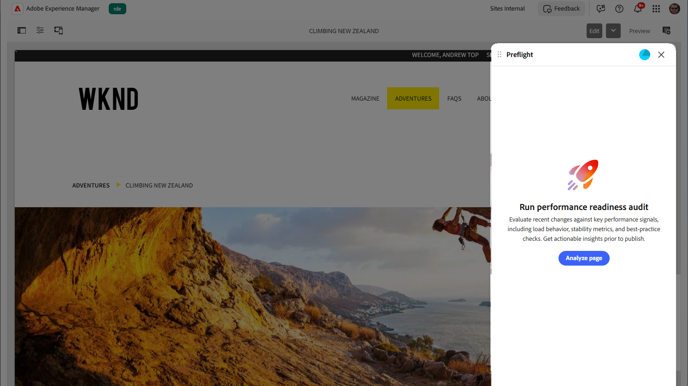

# Preflight 감사

Preflight는 페이지를 감사하여 게시하기 전에 콘텐츠를 향상할 수 있는 기회를 식별합니다. 자동 스캔과 달리 감사를 실행할 시기를 선택하므로 준비가 되면 언제든지 페이지를 분석할 수 있습니다.

{align="center"}

페이지에 대해 Preflight 감사를 실행하는 방법은 다음과 같습니다.

1. [작성 환경](./access-preflight.md)(범용 편집기, 문서 기반 작성 또는 AEM Sites 페이지 편집기)에서 감사할 페이지를 엽니다.
1. [Preflight 패널](./access-preflight.md)을 엽니다. **성능 준비 감사 실행** 랜딩 화면으로 Preflight가 열립니다.
1. **페이지 분석**&#x200B;을 선택합니다. Preflight는 현재 페이지에서 모든 감사를 실행하고 준비 대시보드를 엽니다. 이 대시보드에는 범주별로 그룹화된 준비 점수와 찾은 기회가 표시됩니다.

미리 보기 결과를 이해하고 최적화 기회를 식별하려면 [Preflight의 결과 감사](./audit-results.md)를 참조하십시오.
