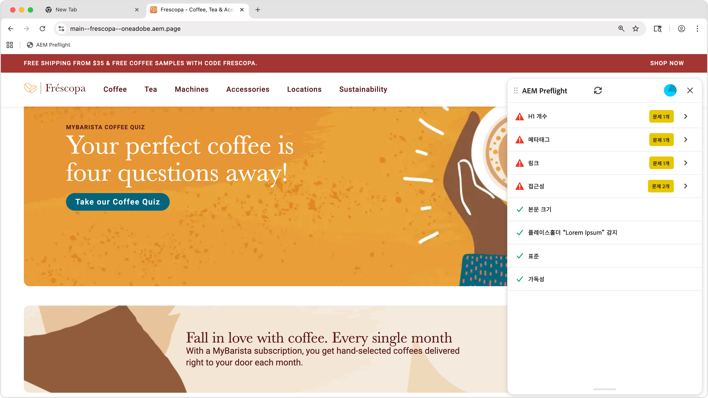

# Preflight 기본 사항

{align="center"}

Preflight를 사용하면 웹 페이지를 게시하기 전에 향상시킬 수 있는 기회를 식별할 수 있습니다. Preflight 확장 프로그램은 콘텐츠에 대한 감사를 실행하여 기회를 식별하고 결과를 패널에 표시하므로 게시하기 전에 이러한 문제를 해결할 수 있습니다.

## Preflight가 표시되는 위치

Preflight는 다른 작성 환경에서 사용할 수 있습니다.

* **범용 편집기** - Preflight 확장이 **쪽 레일**&#x200B;에 표시됩니다. 현재 페이지의 감사를 시작하려면 이 옵션을 선택합니다.
* **문서 기반 작성** - Sidekick 또는 북마클릿을 통해 미리 본 페이지 콘텐츠의 프리플라이트 도구를 실행하여 기회 목록을 확인합니다.
* **AEM Sites 페이지 편집기** - 브라우저에서 Preflight 북마클릿을 사용하여 감사를 시작합니다.

설치 지침은 [Preflight 설정](./setup.md)을 참조하세요.

## 감사 시작

Preflight를 실행하려면:

1. 작성 환경(범용 편집기, 문서 기반 미리보기 또는 AEM Sites 페이지 편집기)에서 감사할 페이지를 엽니다.
2. [프리플라이트] 패널을 엽니다. 측면 레일에서 [프리플라이트 확장]을 선택하거나 Sidekick에서 [프리플라이트] 단추를 클릭합니다.
3. Preflight는 페이지를 분석하고 페이지를 개선하기 위해 찾은 기회를 표시합니다.

## 감사 결과

감사가 완료되면 Preflight가 발견한 기회를 표시합니다. 각 영업 기회는 유형별로 구성되며 문제 해결 방법에 대한 세부 정보가 포함됩니다.

AEM Preflight 대화 상자의 맨 위에는 전체 감사 결과를 반영하는 사용자 진행률 표시줄이 있습니다. 이 시각화는 문제 없이 전달된 기회의 백분율과 모든 기회에서 발견된 총 문제 수를 보여줍니다. 사용자 진행률 표시줄을 통해 작성자는 전체 페이지 상태를 한 눈에 파악할 수 있습니다. 바에는 색상이 지정되어 있습니다. 빨간색은 기회의 1/3 이하를 완료하고, 주황색은 1/3~2/3 를 완료하며, 녹색은 2/3 이상을 완료합니다. 감사에서 진행률 표시줄이 여전히 실행 중일 때 파란색으로 표시됩니다.

## 프리플라이트 기회 정보

Preflight는 접근성, 메타데이터, 링크 및 가독성을 포함하여 콘텐츠의 여러 측면을 평가합니다. 사용 가능한 영업 기회 유형의 전체 목록과 이를 해결하는 방법은 [프리플라이트 영업 기회](./overview.md)를 참조하십시오.