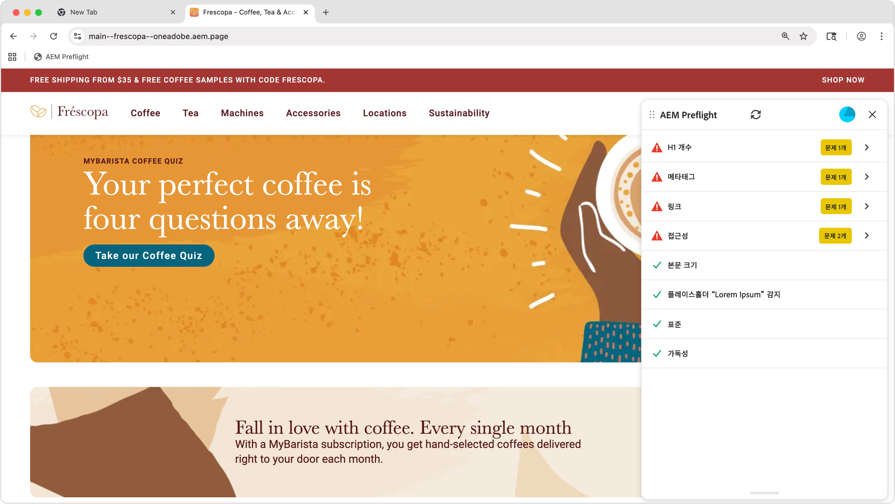

# Preflight 기회

{align="center"}

Sites Optimizer Preflight 기회는 웹 페이지를 게시하기 전에 웹 사이트의 콘텐츠 및 구조의 다양한 측면을 분석하는 일련의 평가로 구성됩니다. 이러한 평가를 통해 잠재적 문제를 식별하고 실행 가능한 권장 사항을 제공하여 사이트의 전반적인 품질과 성능을 향상시키는 데 도움이 됩니다.

## Preflight 설정

[Preflight 설정](./setup.md) 안내서의 단계에 따라 웹 사이트에서 Preflight 확장을 구성하십시오.

## Preflight 기회

<!-- CARDS
* ./accessibility.md
* ./h1-count.md
* ./links.md
* ./meta-data.md
* ./readability.md
-->
<!-- START CARDS HTML - DO NOT MODIFY BY HAND -->

    

        

            

                <figure class="image x-is-16by9">
                    
                </figure>
            

            

                

                    

                        <a href="./accessibility.md" target="_blank" rel="referrer" title="Preflight 접근성 기회">Preflight 접근성 기회</a>
                    

                    
Sites Optimizer의 Preflight 접근성 기회에 대해 알아봅니다.

                

                <a href="./accessibility.md" target="_blank" rel="referrer" class="spectrum-Button spectrum-Button--outline spectrum-Button--primary spectrum-Button--sizeM" style="align-self: flex-start; margin-top: 1rem;">
                    자세히 알아보기
                </a>
            

        

    

    

        

            

                <figure class="image x-is-16by9">
                    
                </figure>
            

            

                

                    

                        <a href="./h1-count.md" target="_blank" rel="referrer" title="프리플라이트 H1 카운트 기회">Preflight H1 계산 기회</a>
                    

                    
Sites Optimizer의 Preflight 접근성 기회에 대해 알아봅니다.

                

                <a href="./h1-count.md" target="_blank" rel="referrer" class="spectrum-Button spectrum-Button--outline spectrum-Button--primary spectrum-Button--sizeM" style="align-self: flex-start; margin-top: 1rem;">
                    자세히 알아보기
                </a>
            

        

    

    

        

            

                <figure class="image x-is-16by9">
                    
                </figure>
            

            

                

                    

                        <a href="./links.md" target="_blank" rel="referrer" title="Preflight 링크 기회">Preflight 링크 기회</a>
                    

                    
Sites Optimizer의 Preflight 링크 기회에 대해 알아봅니다.

                

                <a href="./links.md" target="_blank" rel="referrer" class="spectrum-Button spectrum-Button--outline spectrum-Button--primary spectrum-Button--sizeM" style="align-self: flex-start; margin-top: 1rem;">
                    자세히 알아보기
                </a>
            

        

    

    

        

            

                <figure class="image x-is-16by9">
                    
                </figure>
            

            

                

                    

                        <a href="./meta-data.md" target="_blank" rel="referrer" title="Preflight 메타데이터 기회">Preflight 메타데이터 기회</a>
                    

                    
Sites Optimizer의 Preflight 메타데이터 기회에 대해 알아봅니다.

                

                <a href="./meta-data.md" target="_blank" rel="referrer" class="spectrum-Button spectrum-Button--outline spectrum-Button--primary spectrum-Button--sizeM" style="align-self: flex-start; margin-top: 1rem;">
                    자세히 알아보기
                </a>
            

        

    

    

        

            

                <figure class="image x-is-16by9">
                    
                </figure>
            

            

                

                    

                        <a href="./readability.md" target="_blank" rel="referrer" title="Preflight 가독성 기회">Preflight 읽기 가능 기회</a>
                    

                    
Sites Optimizer의 Preflight 가독성 기회에 대해 알아봅니다.

                

                <a href="./readability.md" target="_blank" rel="referrer" class="spectrum-Button spectrum-Button--outline spectrum-Button--primary spectrum-Button--sizeM" style="align-self: flex-start; margin-top: 1rem;">
                    자세히 알아보기
                </a>
            

        

    

<!-- END CARDS HTML - DO NOT MODIFY BY HAND -->
