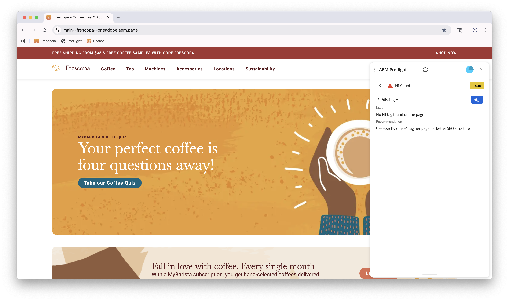

# AEM Sites Optimizer Preflight

{align="center"}

AEM Sites Optimizer의 Preflight를 사용하면 콘텐츠 및 구조를 분석하고 실행 가능한 권장 사항으로 문제를 플래그 지정하여 페이지가 활성화되기 전에 유효성을 검사하고 최적화할 수 있습니다. 이 안내서는 재작업을 줄이면서 페이지의 고품질, 성능 및 게시 준비를 보장하려는 작성자, 마케터 및 개발자를 위해 설계되었습니다.

Preflight의 핵심은 기회이며, 게시 전에 페이지의 주요 측면을 평가하는 일련의 감사를 통해 식별됩니다. 이러한 감사는 잠재적인 문제를 노출하며 전반적인 품질과 성능을 개선하기 위해 명확하고 실행 가능한 권장 사항을 제공합니다.

## Preflight 시작

Preflight를 시작하는 것은 쉽습니다. Preflight를 설정하여 작성 환경에서 열고 페이지에서 감사를 실행하면 나머지는 Preflight가 수행합니다.

1. [Preflight 설정](./setup.md) - AEM 인스턴스에 대한 Preflight를 설정하는 방법에 대해 알아봅니다.
1. [Preflight 액세스](./access-preflight.md) - 작성 환경에서 Preflight가 표시되는 위치를 알아봅니다.
1. [감사 실행](./audits.md) - Preflight 감사를 시작하는 방법 알아보기
1. [감사 결과 및 기회](./audit-results.md) - 감사 결과를 해석하는 방법을 알아봅니다.

## Preflight 기회

<!-- CARDS

* ./opportunities/accessibility.md
* ./opportunities/h1-count.md
* ./opportunities/links.md
* ./opportunities/meta-data.md
* ./opportunities/readability.md
-->
<!-- START CARDS HTML - DO NOT MODIFY BY HAND -->

    

        

            

                <figure class="image x-is-16by9">
                    
                </figure>
            

            

                

                    

                        <a href="./opportunities/accessibility.md" target="_blank" rel="referrer" title="Preflight 접근성 기회">Preflight 접근성 기회</a>
                    

                    
Sites Optimizer의 Preflight 접근성 기회에 대해 알아봅니다.

                

                <a href="./opportunities/accessibility.md" target="_blank" rel="referrer" class="spectrum-Button spectrum-Button--outline spectrum-Button--primary spectrum-Button--sizeM" style="align-self: flex-start; margin-top: 1rem;">
                    자세히 알아보기
                </a>
            

        

    

    

        

            

                <figure class="image x-is-16by9">
                    
                </figure>
            

            

                

                    

                        <a href="./opportunities/h1-count.md" target="_blank" rel="referrer" title="Preflight H1 수 기회">Preflight H1 수 기회</a>
                    

                    
Sites Optimizer의 Preflight 접근성 기회에 대해 알아봅니다.

                

                <a href="./opportunities/h1-count.md" target="_blank" rel="referrer" class="spectrum-Button spectrum-Button--outline spectrum-Button--primary spectrum-Button--sizeM" style="align-self: flex-start; margin-top: 1rem;">
                    자세히 알아보기
                </a>
            

        

    

    

        

            

                <figure class="image x-is-16by9">
                    
                </figure>
            

            

                

                    

                        <a href="./opportunities/links.md" target="_blank" rel="referrer" title="Preflight 링크 기회">Preflight 링크 기회</a>
                    

                    
Sites Optimizer의 Preflight 링크 기회에 대해 알아봅니다.

                

                <a href="./opportunities/links.md" target="_blank" rel="referrer" class="spectrum-Button spectrum-Button--outline spectrum-Button--primary spectrum-Button--sizeM" style="align-self: flex-start; margin-top: 1rem;">
                    자세히 알아보기
                </a>
            

        

    

    

        

            

                <figure class="image x-is-16by9">
                    
                </figure>
            

            

                

                    

                        <a href="./opportunities/meta-data.md" target="_blank" rel="referrer" title="Preflight 메타데이터 기회">Preflight 메타데이터 기회</a>
                    

                    
Sites Optimizer의 Preflight 메타데이터 기회에 대해 알아봅니다.

                

                <a href="./opportunities/meta-data.md" target="_blank" rel="referrer" class="spectrum-Button spectrum-Button--outline spectrum-Button--primary spectrum-Button--sizeM" style="align-self: flex-start; margin-top: 1rem;">
                    자세히 알아보기
                </a>
            

        

    

    

        

            

                <figure class="image x-is-16by9">
                    
                </figure>
            

            

                

                    

                        <a href="./opportunities/readability.md" target="_blank" rel="referrer" title="Preflight 가독성 기회">Preflight 가독성 기회</a>
                    

                    
Sites Optimizer의 Preflight 가독성 기회에 대해 알아봅니다.

                

                <a href="./opportunities/readability.md" target="_blank" rel="referrer" class="spectrum-Button spectrum-Button--outline spectrum-Button--primary spectrum-Button--sizeM" style="align-self: flex-start; margin-top: 1rem;">
                    자세히 알아보기
                </a>
            

        

    

<!-- END CARDS HTML - DO NOT MODIFY BY HAND -->
