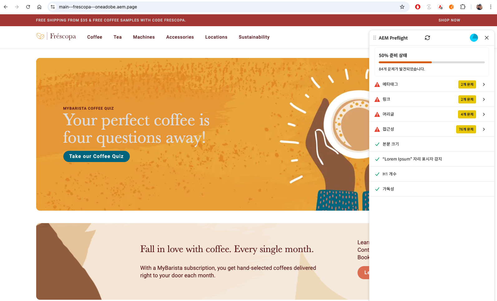
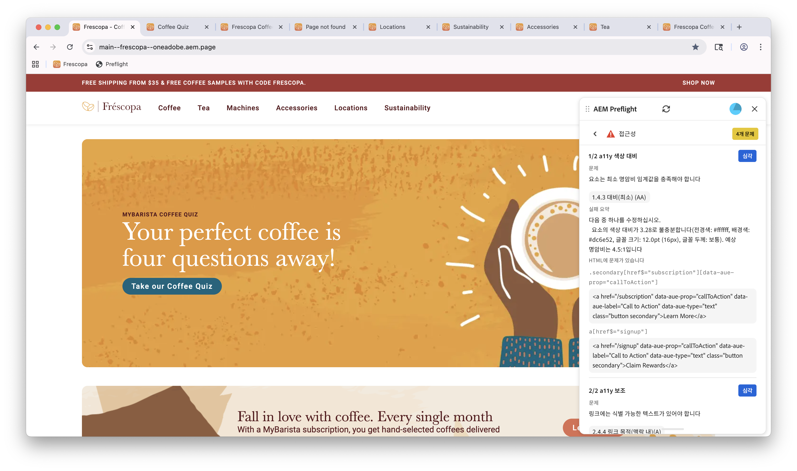

# AEM Sites Optimizer Preflight

{align="center"}

>[!NOTE]
>
>[AEM 2026.7.0(릴리스 27083)](https://experienceleague.adobe.com/en/docs/experience-manager-cloud-service/content/release-notes/maintenance/2026/2026-7-0#release-27083)부터 Preflight가 AEM Sites 페이지 편집기 도구 모음에 내장되어 있습니다. 자세한 내용은 [Preflight 설정](./setup.md)을 참조하세요.

AEM Sites Optimizer의 Preflight를 사용하면 실행 가능한 권장 사항을 통해 콘텐츠 및 구조를 분석하고 기회를 표시하여 페이지를 활성화하기 전에 유효성을 검사하고 최적화할 수 있습니다. 이 기능은 페이지가 고품질이고 성능이 뛰어나며 바로 게시해도 될 만큼 준비된 상태인지 확인하면서 재작업을 줄이려는 작성자, 마케터, 개발자를 위해 설계되었습니다.

작성 환경에서 Preflight를 시작하고 **페이지 분석**&#x200B;을 선택하여 감사를 실행합니다. 감사는 메타데이터 또는 제목 구조와 같은 페이지의 한 측면을 평가하고 Preflight는 관련 감사를 **SEO** 및 **접근성**&#x200B;과 같은 범주로 그룹화합니다. 그런 다음 Preflight는 실행 가능한 권장 사항과 함께 페이지에 대한 준비 점수를 찾고, 개선할 수 있는 특정 사항을 보고합니다.

## Preflight 시작하기

Preflight는 쉽게 시작할 수 있습니다. Preflight를 설정하고 작성 환경에서 열고 페이지에서 감사를 실행하고 나머지는 Preflight에서 수행합니다.

1. [Preflight 설정](./setup.md) – AEM 인스턴스에서 Preflight를 설정하는 방법 알아보기
1. [Preflight 액세스](./access-preflight.md) – 작성 환경에서 Preflight가 표시되는 위치 알아보기
1. [감사 실행](./audits.md) – Preflight 감사를 시작하는 방법 알아보기
1. [감사 결과 및 기회](./audit-results.md) – 감사 결과를 해석하는 방법 알아보기

## 프리플라이트 감사 범주

<!--
CARDS

* ./opportunities/accessibility.md
* ./opportunities/seo.md
-->
<!-- START CARDS HTML - DO NOT MODIFY BY HAND -->

    

        

            

                <figure class="image x-is-16by9">
                    
                </figure>
            

            

                

                    

                        <a href="./opportunities/accessibility.md" target="_blank" rel="referrer" title="Preflight 접근성 감사">Preflight 접근성 감사</a>
                    

                    
Sites Optimizer의 Preflight 접근성 감사에 대해 알아봅니다.

                

                <a href="./opportunities/accessibility.md" target="_blank" rel="referrer" class="spectrum-Button spectrum-Button--outline spectrum-Button--primary spectrum-Button--sizeM" style="align-self: flex-start; margin-top: 1rem;">
                    자세히 알아보기
                </a>
            

        

    

    

        

            

                <figure class="image x-is-16by9">
                    
                </figure>
            

            

                

                    

                        <a href="./opportunities/seo.md" target="_blank" rel="referrer" title="Preflight SEO 감사">SEO 감사 프리플라이트</a>
                    

                    
Sites Optimizer의 Preflight SEO 감사에 대해 알아봅니다.

                

                <a href="./opportunities/seo.md" target="_blank" rel="referrer" class="spectrum-Button spectrum-Button--outline spectrum-Button--primary spectrum-Button--sizeM" style="align-self: flex-start; margin-top: 1rem;">
                    자세히 알아보기
                </a>
            

        

    

<!-- END CARDS HTML - DO NOT MODIFY BY HAND -->
