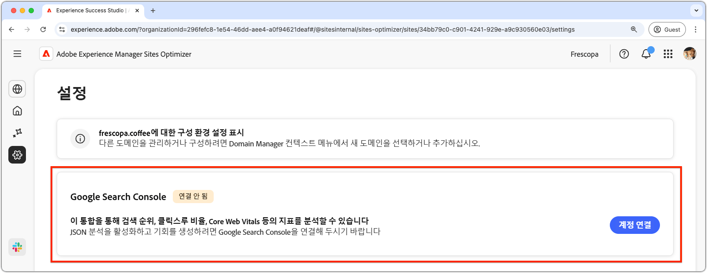

# Sites Optimizer 설정

{align="center"}

사이트 최적화 도구 설정은 Sites Optimizer 환경을 구성하기 위한 중앙 허브입니다.

## Google Search Console

{align="center"}

AEM Sites Optimizer의 Google Search Console 설정 커넥터를 사용하면 검색 순위, 클릭스루 비율, 핵심 웹 바이탈과 같은 주요 SEO 지표를 분석할 수 있습니다. Google Search Console을 연결하면 JSON 분석을 활용하여 최적화 기회를 발견하고 사이트 성과를 개선할 수 있습니다.

이 커넥터를 설정하려면 해당 도메인의 Google Search Console에 대한 관리자 액세스 권한이 있는 자격 증명이 있어야 합니다.
