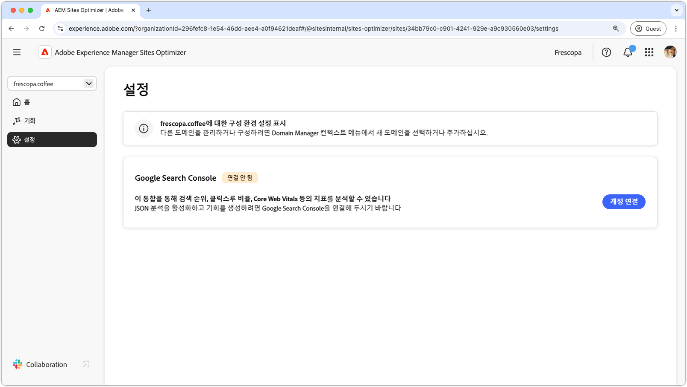
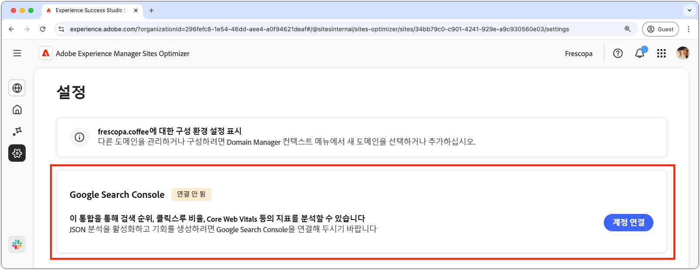
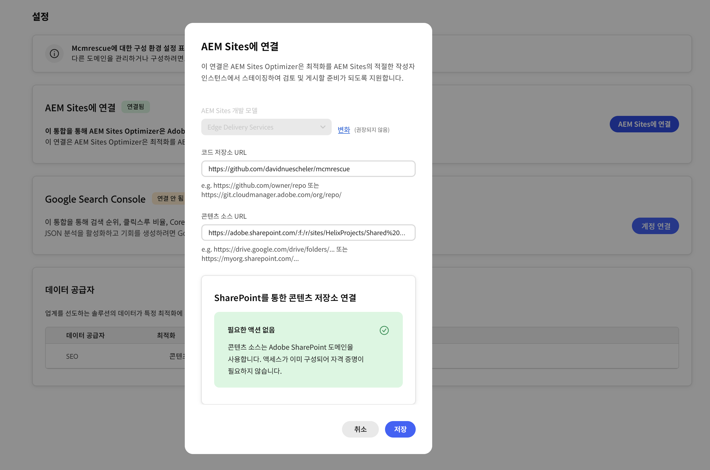
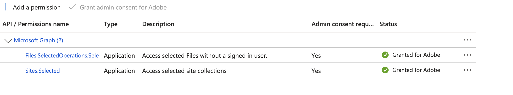
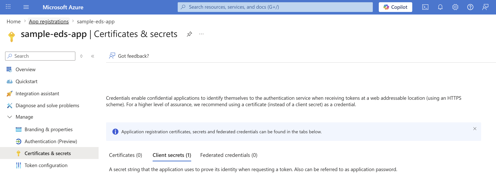
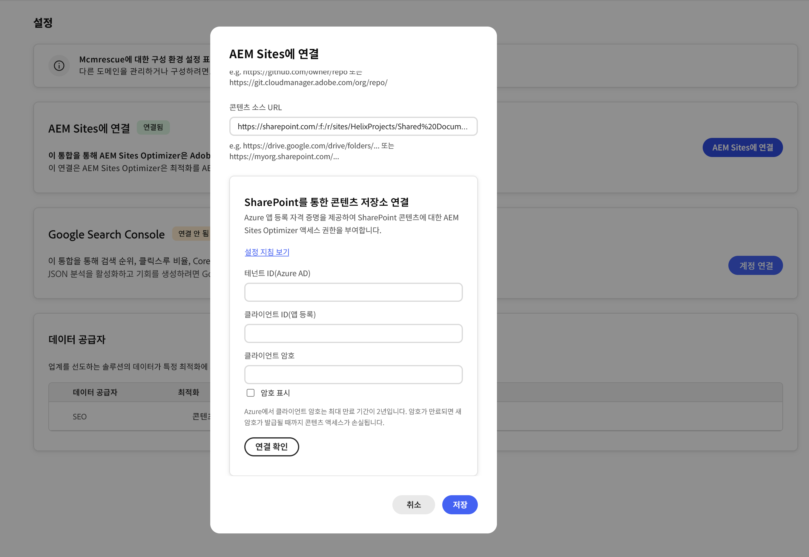
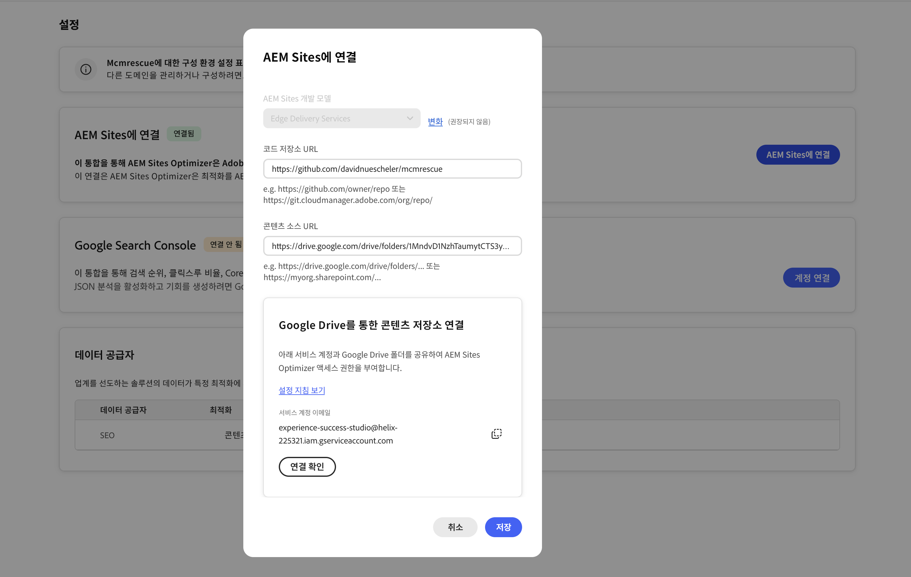

# Sites Optimizer 설정

{align="center"}

Sites Optimizer 설정은 Sites Optimizer 환경을 구성하기 위한 중앙 허브입니다.

## Google Search Console

{align="center"}

AEM Sites Optimizer의 Google Search Console 설정 커넥터를 사용하면 검색 순위, 클릭스루 비율, 핵심 웹 바이탈과 같은 주요 SEO 지표를 분석할 수 있습니다. Google Search Console을 연결하면 JSON 분석을 활용하여 최적화 기회를 발견하고 사이트 성과를 개선할 수 있습니다.

이 커넥터를 설정하려면 해당 도메인의 Google Search Console에 대한 관리자 액세스 권한이 있는 자격 증명이 있어야 합니다.

## AEM Sites에 연결

이 안내서에서는 기존 Edge Delivery Services(EDS) 사이트를 AEM Sites Optimizer에 연결하는 방법을 설명합니다. 시작하기 전에 EDS 사이트가 이미 설정되어 있고 작동 중인지 확인하십시오. 이 연결은 특히 AEM Sites Optimizer이 콘텐츠에 액세스할 수 있는 연결입니다.

연결하려면 다음 두 단계가 필요합니다.

1. 코드 저장소 URL 및 콘텐츠 소스 URL을 제공합니다.
2. 컨텐츠 소스에 대한 AEM Sites Optimizer 액세스 권한을 부여합니다.

### 1단계 — 코드 리포지토리와 컨텐츠 소스 연결

AEM Sites Optimizer에서 **설정 → AEM Sites 연결**(으)로 이동하여 다음을 입력합니다.

- **코드 저장소 URL** - EDS 사이트의 GitHub URL(예:
  `https://github.com/owner/repo`

- **컨텐츠 Source URL** - EDS 사이트를 지원하는 SharePoint 폴더 또는 Google 드라이브 폴더의 URL(예: )
  `https://drive.google.com/drive/folders/...` 또는 `https://myorg.sharepoint.com/...`

이 URL은 EDS 사이트의 `fstab.yaml`에 구성된 것과 일치해야 합니다.

컨텐츠 Source URL을 입력하면 AEM Sites Optimizer에서 컨텐츠 소스 유형을 감지하고 아래에 관련 액세스 지침을 표시합니다.

### 2단계 — 컨텐츠 소스에 대한 액세스 권한 부여

콘텐츠 소스와 일치하는 섹션을 따르십시오.

#### SharePoint — Adobe 도메인

{align="center"}

컨텐츠 Source URL이 Adobe SharePoint 도메인을 사용하는 경우 추가 작업이 필요하지 않습니다. 액세스가 이미 구성되었습니다. 연결을 완료하려면 **저장**&#x200B;을 클릭하세요.

#### SharePoint — 사용자 정의 도메인

컨텐츠 Source URL이 조직의 자체 SharePoint 도메인을 사용하는 경우 Azure 애플리케이션을 등록하고 AEM Sites Optimizer에 해당 자격 증명을 제공해야 합니다.

##### 필요한 사항

- Azure 포털에서 애플리케이션을 등록할 수 있는 권한 또는 귀하를 대신하여 애플리케이션을 등록할 수 있는 담당자입니다.
- API 동의를 부여할 테넌트 관리자 권한 또는 API 동의를 승인할 수 있는 관리자.

##### 2a단계 — Azure에서 애플리케이션 등록

1. **Azure 포털 → Microsoft Entra ID → 앱 등록 → 새 등록**&#x200B;으로 이동합니다.
2. 이름을 지정하십시오(예: `AEM Sites Optimizer`).
3. 다른 모든 기본값을 그대로 두고 **등록**&#x200B;을 클릭합니다.
4. **개요** 페이지에서 아래를 메모하세요.
   - **응용 프로그램(클라이언트) ID**
   - **디렉터리(테넌트) ID**

##### 2b단계 — API 권한 추가

1. **API 권한으로 → Microsoft Graph → 응용 프로그램 권한→ 권한을 추가합니다**.
2. 다음 두 가지를 모두 추가합니다.
   - `Sites.Selected` — 특정 SharePoint 사이트 모음에 대한 액세스 범위가 지정되었습니다.
   - `Files.SelectedOperations.Selected` — 로그인한 사용자가 없는 파일에 액세스합니다.
3. 두 항목에 대해 **관리자 동의 부여**&#x200B;를 클릭합니다.

{align="center"}

>[!NOTE]
>
>관리자 동의를 부여하려면 테넌트 관리자 권한이 필요합니다. 이 단계가 없는 경우 계속 진행하기 전에 IT 또는 Azure 관리자에게 이 단계를 완료하도록 요청하십시오.

##### 2c 단계 — 클라이언트 암호 만들기

{align="center"}

1. **새 클라이언트 암호→ 인증서 및 암호**(으)로 이동합니다.
2. 설명 및 만료를 설정한 다음 **추가**&#x200B;를 클릭합니다.
3. 비밀 값을 즉시 복사합니다. 한 번만 표시됩니다.

##### 2d단계 — 앱에 SharePoint 사이트에 대한 액세스 권한을 부여합니다.

Microsoft 그래프 탐색기, PowerShell 또는 직접 그래프 API 호출을 사용하여 앱 액세스 권한을 부여할 수 있습니다.

[Microsoft 그래프 탐색기](https://developer.microsoft.com/graph/graph-explorer)&#x200B;(으)로 이동하여 Microsoft 계정으로 로그인하고 다음 요청을 실행합니다.

1. 사이트 ID 찾기:

```
GET https://graph.microsoft.com/v1.0/sites/{tenant}.sharepoint.com:/sites/{site-name}
```

1. 응답에서 `id`을(를) 복사한 다음 사이트 수준 액세스 권한을 부여합니다.

```
POST https://graph.microsoft.com/v1.0/sites/{siteId}/permissions
```

본문:

```json
{
  "roles": ["write"],
  "grantedToIdentities": [{
    "application": {
      "id": "{your-client-id}",
      "displayName": "{Your app name}"
    }
  }]
}
```

##### 2e단계 — AEM Sites Optimizer에서 자격 증명 입력

{align="center"}

**AEM Sites에 연결** 대화 상자로 돌아가서 **SharePoint을 통한 콘텐츠 저장소 연결**&#x200B;에 다음을 입력하십시오.

- **테넌트 ID(Azure AD)** — 앱 등록 → 개요
- **클라이언트 ID(앱 등록)** — 앱 등록 → 개요
- **클라이언트 암호** — 2c단계에서 만들어졌습니다.

**연결 확인**&#x200B;을 클릭하여 액세스를 확인한 다음 **저장**&#x200B;을 클릭합니다.

#### Google 드라이브

{align="center"}

1. Google 드라이브에서 EDS 사이트를 지원하는 폴더를 마우스 오른쪽 단추로 클릭하고 **공유**&#x200B;를 선택합니다.
2. **사람 및 그룹 추가** 필드에 **AEM Sites에 연결** 대화 상자에 표시된 서비스 계정 전자 메일을 입력하십시오.
   `experience-success-studio@helix-225321.iam.gserviceaccount.com`
3. 권한 수준을 **편집기**(으)로 설정합니다.
4. **사람들에게 알림**&#x200B;을 선택 취소하고 **공유**&#x200B;를 클릭합니다.

공유가 완료되면 대화 상자에서 **연결 확인**&#x200B;을 클릭한 다음 **저장**&#x200B;을 클릭합니다.
