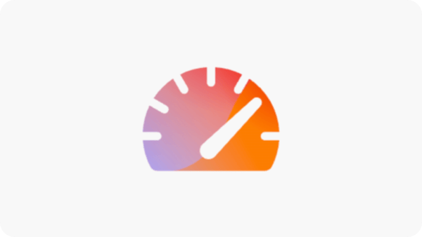
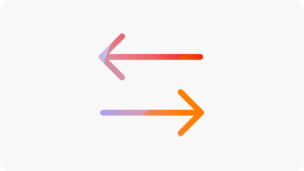

# Sites Optimizer 체험판

기존 Sites Optimizer 고객(Edge Delivery Services, Cloud Services 및 Managed Services)을 위해 이 평가판을 사용하여 AEM Sites을 시작하십시오. 도메인 데이터가 이미 사전 온보딩되었으므로 바로 최적화를 시작할 수 있습니다. 아래 비디오에서는 체험판 과정을 안내하고 시작하는 방법을 보여 줍니다.

>[!VIDEO](https://video.tv.adobe.com/v/3483253/?learn=on&enablevpops)

>[!TIP]
>
> 질문이 있거나 요청이 있는 경우 [siteoptimizer-now@adobe.com](mailto:siteoptimizer-now@adobe.com)에 문의하십시오.

## 지금 평가판을 시작하세요!

다음 단계에 따라 체험판을 시작하십시오.

1. AEM Sites IMS 조직 ID를 사용하여 [www.sitesoptimizer.live](http://www.sitesoptimizer.live/)에 로그인합니다.
2. 페이지 보기 수, 로드 시간 및 참여 비율과 같은 주요 지표와 함께 영향별로 우선 순위가 지정된 최고의 최적화 기회를 봅니다.
3. 사용 가능한 세 가지 영업 기회 유형([끊어진 백링크](./opportunities/broken-backlinks.md), [Core Web Vitals](./opportunities/core-web-vitals.md) 및 [대체 텍스트 누락](./opportunities/missing-alt-text.md))을 살펴보십시오.
4. 각 영업 기회에 대해 식별된 문제를 최대 3개까지 검토하십시오. AI에서 생성한 제안을 사용하고 준비가 되면 최적화를 AEM 환경에 직접 배포할 수 있습니다.
5. 언제든지 전체 라이선스로 업그레이드하여 더 많은 기회를 확보할 수 있습니다.

## 체험판에서 사용할 수 있는 사항

다음은 평가판에 포함되어 있습니다.

* 세 가지 영업 기회 유형: [끊어진 백링크](./opportunities/broken-backlinks.md), [Core Web Vitals](./opportunities/core-web-vitals.md) 및 [대체 텍스트 누락](./opportunities/missing-alt-text.md).
* 매월 영업 기회당 최대 3개의 문제
* 문제당 전체 워크플로우: 자동 식별, 자동 제안 및 자동 최적화.
   * **자동 식별** - 여러 데이터 소스를 사용하여 사이트 전체의 문제를 감지합니다.
   * **자동 제안** — 각 문제에 대해 AI가 생성한 규범적 권장 사항을 제공합니다.
   * **자동 최적화** - 승인 후 수정 사항을 작성 환경에 직접 배포합니다. 업데이트는 기존 워크플로를 따르므로 팀이 AEM을 통해 검토하고 게시할 수 있습니다.

## 자주 묻는 질문

AEM Sites Optimizer 평가판에 대한 FAQ에 대한 답변은 다음을 참조하십시오.

+++AEM Sites Optimizer란?

[AEM Sites Optimizer](/help/home.md)은(는) 웹 사이트에서 문제를 식별하고 규범적인 권장 사항을 제공하고 트래픽 획득, 참여 및 전환을 늘리기 위해 문제를 해결하는 데 도움이 되는 AI 우선 애플리케이션입니다.

+++
+++누가 이 재판에 참여할 수 있습니까?

기존 AEM Sites 고객(Edge Delivery Services, Cloud Services 및 Managed Services).

+++
+++평가판에 액세스하려면 어떻게 합니까?

[www.sitesoptimizer.live](http://www.sitesoptimizer.live/)&#x200B;(으)로 이동한 다음 AEM Sites IMS 조직 ID를 사용하여 로그인합니다.

+++
+++그 재판은 비용이 좀 드나요?

아니요. 이 체험판은 기존 AEM Sites 고객이 무료로 사용할 수 있습니다.

+++
+++유통기한이 있나요?

아니요. 재판은 시간을 기반으로 하지 않습니다. 사용 가능한 영업 기회 유형 및 문제의 수를 통해 사용에 따라 제한됩니다.
+++
+++모든 문제가 해결되면 어떻게 됩니까?

Sites Optimizer은 성능에 영향을 주는 문제를 지속적으로 식별합니다. 무료 체험판에서는 월간만 문제가 추가됩니다. 지속적인 감사 및 최적화를 위한 업그레이드.

+++
+++더 많은 기회에 액세스하려면 어떻게 해야 합니까?

업그레이드를 사용하거나 제품 경험을 통해 사용할 수 있는 판매 CTA에 문의하거나 [siteoptimizer-now@adobe.com](mailto:siteoptimizer-now@adobe.com)로 전자 메일을 보내십시오.

+++

<!--
CARDS
* ./opportunities/core-web-vitals.md
  {title=Core web vitals}
  {image=../assets/common/card-performance.png}
* ./opportunities/missing-alt-text.md
  {title=Missing alt text}
  {image=../assets/common/card-arrows.png}
* ./opportunities/broken-backlinks.md
  {title=Broken backlinks}
  {image=../assets/common/card-arrows.png}
-->

<!-- START CARDS HTML - DO NOT MODIFY BY HAND -->

    

        

            

                <figure class="image x-is-16by9">
                    
                </figure>
            

            

                

                    

                        <a href="./opportunities/core-web-vitals.md" target="_blank" rel="referrer" title="핵심 웹 바이탈">핵심 웹 바이탈</a>
                    

                    
핵심 웹 바이탈 기회에 대해 알아보고 이를 사용하여 트래픽 확보를 개선하는 방법을 알아봅니다.

                

                <a href="./opportunities/core-web-vitals.md" target="_blank" rel="referrer" class="spectrum-Button spectrum-Button--outline spectrum-Button--primary spectrum-Button--sizeM" style="align-self: flex-start; margin-top: 1rem;">
                    자세히 알아보기
                </a>
            

        

    

    

        

            

                <figure class="image x-is-16by9">
                    
                </figure>
            

            

                

                    

                        <a href="./opportunities/missing-alt-text.md" target="_blank" rel="referrer" title="누락된 대체 텍스트">누락된 대체 텍스트</a>
                    

                    
누락된 대체 텍스트 기회에 대해 알아보고 이를 사용하여 웹 사이트 참여를 개선하는 방법을 알아봅니다.

                

                <a href="./opportunities/missing-alt-text.md" target="_blank" rel="referrer" class="spectrum-Button spectrum-Button--outline spectrum-Button--primary spectrum-Button--sizeM" style="align-self: flex-start; margin-top: 1rem;">
                    자세히 알아보기
                </a>
            

        

    

    

        

            

                <figure class="image x-is-16by9">
                    
                </figure>
            

            

                

                    

                        <a href="./opportunities/broken-backlinks.md" target="_blank" rel="referrer" title="끊어진 백링크">끊어진 백링크</a>
                    

                    
끊어진 백링크 기회에 대해 알아보고 이를 사용하여 트래픽 확보를 개선하는 방법을 알아봅니다.

                

                <a href="./opportunities/broken-backlinks.md" target="_blank" rel="referrer" class="spectrum-Button spectrum-Button--outline spectrum-Button--primary spectrum-Button--sizeM" style="align-self: flex-start; margin-top: 1rem;">
                    자세히 알아보기
                </a>
            

        

    

<!-- END CARDS HTML - DO NOT MODIFY BY HAND -->
