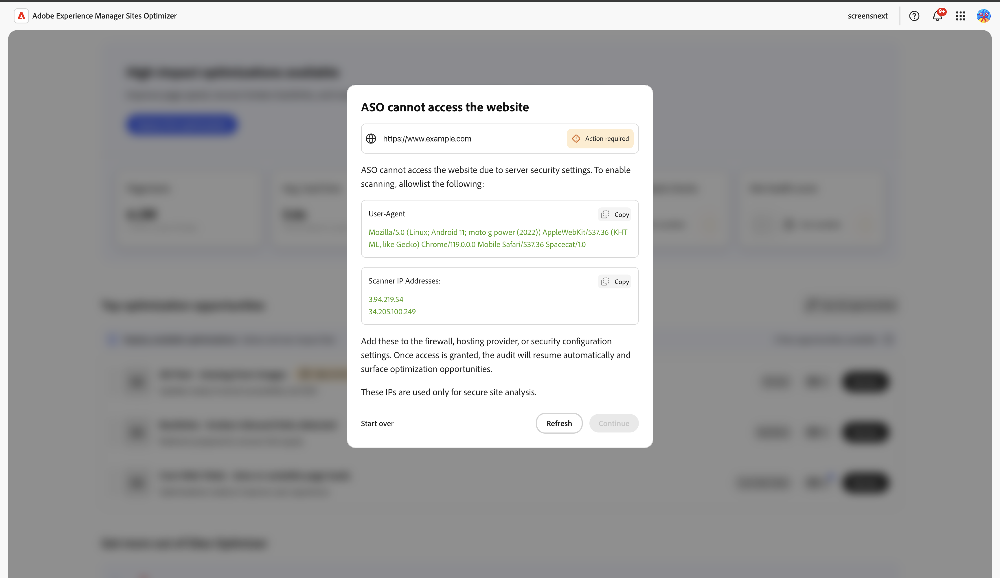
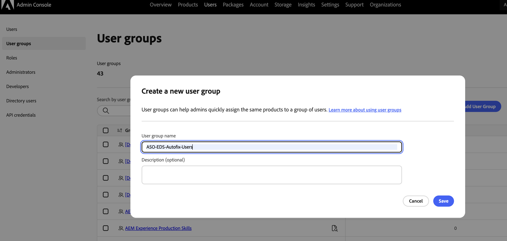
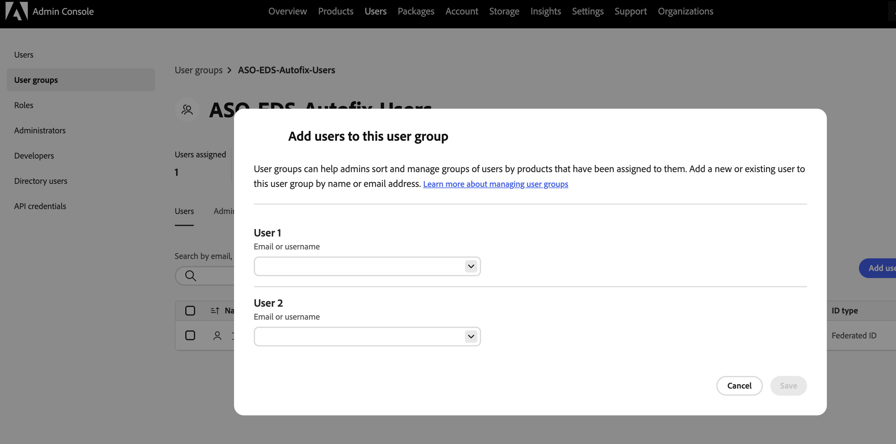

# Sites Optimizer 체험판

기존 **Sites Optimizer 고객(Edge Delivery Services, Cloud Services 및 Managed Services)에 대해 이 평가판을 사용하여 AEM Sites을 시작하십시오**. 도메인 데이터가 이미 사전 온보딩되었으므로 바로 최적화를 시작할 수 있습니다. 아래 비디오는 체험판 환경을 안내하고 시작하는 방법을 보여 줍니다.

>[!IMPORTANT]
>
>시작하기 전에 사이트가 다음 요구 사항을 충족하는지 확인하십시오.
>
>* AEM Sites(Edge Delivery Services, Cloud Service 또는 Managed Services)을 기반으로 구축됩니다.
>* 개발, QA, 스테이징, 작성자 또는 미리보기 환경이 아닌 프로덕션 사이트입니다.
>* 공개적으로 액세스할 수 있으며 로그인 뒤에는 액세스할 수 없습니다.
>* AEM Sites 프론트엔드 게재를 사용합니다. Headless 게재는 현재 지원되지 않습니다.

>[!VIDEO](https://video.tv.adobe.com/v/3483294/?captions=kor&learn=on&enablevpops)

>[!TIP]
>
> 질문이나 요청이 있는 경우 [siteoptimizer-now@adobe.com](mailto:siteoptimizer-now@adobe.com)에 문의하십시오.

## 지금 체험판을 시작해 보십시오!

다음 단계에 따라 체험판을 시작합니다.

1. AEM Sites IMS 조직 ID를 사용하여 [www.sitesoptimizer.live](http://www.sitesoptimizer.live/)에 로그인합니다.
2. 페이지 조회수, 로드 시간, 참여율과 같은 주요 지표와 함께 영향별로 우선순위가 지정된 최상위 최적화 기회를 확인합니다.
3. 사용 가능한 세 가지 영업 기회 유형([끊어진 백링크](./opportunities/broken-backlinks.md), [Core Web Vitals](./opportunities/core-web-vitals.md), [누락된 대체 텍스트](./opportunities/missing-alt-text.md))을 살펴봅니다.
4. 각 기회에 대해 식별된 문제를 최대 3개까지 검토합니다. AI 생성 제안을 사용하고 준비가 되면 최적화를 AEM 환경에 직접 배포합니다.
5. 언제든지 전체 라이선스로 업그레이드하여 더 많은 기회를 확보합니다.

## 체험판에서 사용할 수 있는 사항

체험판에 포함된 사항은 다음과 같습니다.

* 세 가지 기회 유형: [끊어진 백링크](./opportunities/broken-backlinks.md), [Core Web Vitals](./opportunities/core-web-vitals.md), [누락된 대체 텍스트](./opportunities/missing-alt-text.md)
* 매월 기회당 최대 3개의 문제 식별
* 문제당 전체 워크플로: 자동 식별, 자동 제안, 자동 최적화
  * **자동 식별** — 여러 데이터 소스를 사용하여 사이트 전체의 문제를 감지합니다.
  * **자동 제안** — 각 문제에 대해 규범적인 AI 생성 권장 사항을 제공합니다.
  * **자동 최적화** — 승인 후 수정 사항을 작성 환경에 직접 배포합니다. 업데이트는 기존 워크플로를 따르므로 팀이 AEM을 통해 검토하고 게시할 수 있습니다.

## Sites Optimizer의 사이트 액세스 허용

Sites Optimizer은 사이트를 스캔하여 최적화 기회를 식별합니다. 사이트가 방화벽, CDN(콘텐츠 전송 네트워크) 또는 인식되지 않은 클라이언트를 차단하는 기타 보안 구성 뒤에 있는 경우 스캐너가 페이지에 연결할 수 없습니다. 이 경우 온보딩에 Sites Optimizer이 웹 사이트에 액세스할 수 없다는 **작업 필요** 메시지가 표시되며 액세스를 허용할 때까지 검색이 일시 중지됩니다.

{align="center"}

스캐너가 방화벽, 호스팅 공급자 또는 보안 구성을 통해 다음 두 가지 사항을 모두 검색할 수 있도록 합니다. AEM Cloud Service 사이트의 경우 스캐너에 대한 허용 규칙을 Cloud Manager의 [CDN 트래픽 필터 규칙](https://experienceleague.adobe.com/ko/docs/experience-manager-cloud-service/content/security/traffic-filter-rules-including-waf)에 추가하십시오. 이 규칙은 사용자 에이전트와 IP 주소 모두에서 일치할 수 있습니다. [Cloud Manager IP 허용 목록](https://experienceleague.adobe.com/ko/docs/experience-manager-cloud-service/content/implementing/using-cloud-manager/ip-allow-lists/introduction)을 사용하여 액세스를 제한하는 경우 스캐너의 IP 주소도 적용된 허용 목록에 추가하십시오.

* **사용자 에이전트** - 스캐너가 토큰 `Spacecat/1.0`을(를) 포함하는 사용자 에이전트로 식별됩니다. 이 토큰은 이상적으로는 &quot;포함&quot; 일치하므로 전체 사용자 에이전트 문자열이 변경되더라도 계속 작동합니다.
* **스캐너 IP 주소** — 스캐너의 아웃바운드 IP 주소를 검색합니다.

온보딩 화면에는 정확한 사용자 에이전트와 IP 주소 및 허용 목록에 추가하다가 각각 **복사** 버튼을 사용하여 표시되므로 현재 값을 구성에 직접 복사할 수 있습니다.

스캐너에서 새로 고친 후 **새로 고침**&#x200B;을 선택하십시오. 액세스 권한이 부여되면 검색이 자동으로 다시 시작되어 최적화 기회가 사라집니다.

>[!NOTE]
>
>이러한 IP 주소는 사이트를 분석하는 데만 사용됩니다. 허용 목록에 추가 시 다른 액세스 권한은 부여되지 않습니다.

## Edge Delivery 평가판 사이트에 자동 수정 사용

체험판 고객이 Google 드라이브 또는 SharePoint에서 작성된 Edge Delivery Services(EDS) 사이트에서 자동 수정 제안을 위해 **작성자에게 배포** 작업을 활성화하는 방법을 알아봅니다.

>[!NOTE]
>
>이 요구 사항은 사이트가 Google 드라이브 또는 SharePoint에서 작성된 체험판 조직에만 적용됩니다. 유료 고객, 횡단보도나 어두운 골목에서 작성된 사이트는 영향을 받지 않습니다.

평가판 고객은 **ASO-EDS-Autofix-Users** IMS 그룹의 일부여야 합니다. 그룹이 없는 경우 조직의 관리자가 그룹을 만들고 사용자를 추가할 수 있습니다.

1. [Adobe Admin Console](https://adminconsole.adobe.com/)에 로그인합니다.
1. **사용자** > **사용자 그룹**&#x200B;을 선택합니다.
1. **사용자 그룹 추가**&#x200B;를 선택합니다.
1. **사용자 그룹 이름**&#x200B;에 대해 정확히 입력하십시오.

   ```
   ASO-EDS-Autofix-Users
   ```

   >[!IMPORTANT]
   >
   > 그룹 이름은 대소문자를 포함하여 정확히 일치해야 합니다. 대/소문자를 구분하기 때문에 다른 맞춤법이나 대/소문자(예: `ASO-EDS-Autofix-users`)가 작동하지 않습니다. 그룹을 만든 후에는 이름을 바꾸지 마십시오.

1. **저장**&#x200B;을 선택합니다.

   {align="center"}

1. 새 그룹을 열고 **사용자 추가**&#x200B;를 선택합니다.
1. 자동 수정 기능을 배포할 수 있는 각 사용자의 전자 메일 주소 또는 사용자 이름을 입력한 다음 **저장**&#x200B;을 선택합니다.

   {align="center"}

그룹의 구성원인 경우 **작성자에게 배포** 단추를 사용할 수 있습니다. 아직 회원이 아닌 경우, 그룹에 사용자를 추가하도록 관리자에게 문의하라는 도구 설명이 있는 상태에서 **작성자에게 배포**&#x200B;를 사용할 수 없습니다. 관리자가 귀하를 그룹에 추가한 후 로그아웃했다가 Sites Optimizer에 다시 로그인하면 세션에서 새 그룹 멤버십을 선택합니다.

## 자주 묻는 질문

AEM Sites Optimizer 체험판과 관련된 자주 묻는 질문에 대한 답변을 확인하려면 다음 항목을 참조하십시오.

+++AEM Sites Optimizer란 무엇입니까?

[AEM Sites Optimizer](/help/home.md)는 웹 사이트 전체에서 문제를 식별하고 규범적인 권장 사항을 제공하며 식별된 문제를 수정하여 트래픽 확보, 참여도, 전환율을 높일 수 있도록 도와주는 AI 우선 애플리케이션입니다.

+++
+++누가 이 체험판에 참여할 수 있습니까?

기존 AEM Sites 고객(Edge Delivery Services, Cloud Services, Managed Services)이 참여할 수 있습니다.

+++
+++체험판에 액세스하려면 어떻게 해야 합니까?

[www.sitesoptimizer.live](http://www.sitesoptimizer.live/)로 이동한 후 AEM Sites IMS 조직 ID를 사용하여 로그인합니다.

+++
+++체험판을 사용하는 데 비용이 듭니까?

아니요. 기존 AEM Sites 고객이라면 해당 체험판을 무료로 사용할 수 있습니다.

+++
+++만료 일자가 있습니까?

아니요. 이 체험판은 기간 제한이 없습니다. 대신 사용 가능한 기회 유형 및 문제 수에 따른 사용량 제한이 적용됩니다.
+++
+++모든 문제가 수정되면 어떻게 됩니까?

Sites Optimizer는 성능에 영향을 주는 문제를 지속적으로 식별합니다. 무료 체험판에서는 문제가 월 단위로만 추가됩니다. 감사와 최적화를 지속적으로 수행하려면 업그레이드하십시오.

+++
+++더 많은 기회에 접근하려면 어떻게 해야 합니까?

업그레이드를 사용하거나 제품 경험을 통해 이용할 수 있는 판매 CTA에 문의하거나 [siteoptimizer-now@adobe.com](mailto:siteoptimizer-now@adobe.com)으로 이메일을 보내 주십시오.

+++
+++ASO-EDS-Autofix-Users 그룹에 있지만 작성자에게 배포는 여전히 비활성화되어 있습니다. 무엇을 확인해야 합니까?

로그아웃한 후 다시 로그인합니다. 로그인하면 그룹 멤버십이 읽힙니다. 또한 그룹 이름의 철자가 정확하게 `ASO-EDS-Autofix-Users`이고 대문자화된 경우 사이트가 속한 동일한 조직에서 만들어졌는지 확인하십시오.

+++
+++ASO-EDS-Autofix-Users 그룹 요구 사항이 모든 Edge Delivery Services 사이트에 적용됩니까?

아니요. **Google 드라이브** 또는 **SharePoint**&#x200B;에서 작성된 체험판 사이트에만 적용됩니다. **횡단보도** 또는 **어두운 골목**&#x200B;에서 작성된 사이트와 모든 **유료** 사이트는 영향을 받지 않습니다.

+++
+++Sites Optimizer에서 내 사이트에 액세스할 수 없다고 합니다. 어떻게 해야 합니까?

사이트가 스캐너를 차단하는 방화벽, CDN 또는 보안 구성 뒤에 있을 수 있습니다. 스캐너의 사용자 에이전트(`Spacecat/1.0` 토큰)와 보안 구성 또는 Cloud Manager CDN 허용 목록의 AEM Cloud Service 사이트에 대한 IP 주소 허용 목록. **새로 고침**&#x200B;을 선택하십시오. [Sites Optimizer의 사이트 액세스 허용](#allow-sites-optimizer-to-access-your-site)을 참조하십시오.

+++

<!--
CARDS
* ./opportunities/core-web-vitals.md
  {title=Core web vitals}
  {image=../assets/common/card-performance.png}
* ./opportunities/missing-alt-text.md
  {title=Missing alt text}
  {image=../assets/common/card-arrows.png}
* ./opportunities/broken-backlinks.md
  {title=Broken backlinks}
  {image=../assets/common/card-arrows.png}
-->

<!-- START CARDS HTML - DO NOT MODIFY BY HAND -->
<div class="columns">
    <div class="column is-half-tablet is-half-desktop is-one-third-widescreen" aria-label="Core web vitals">
        <div class="card" style="height: 100%; display: flex; flex-direction: column; height: 100%;">
            <div class="card-image">
                <figure class="image x-is-16by9">
                    <a href="./opportunities/core-web-vitals.md" title="Core Web Vitals" target="_blank" rel="referrer">
                        
                    </a>
                </figure>
            </div>
            <div class="card-content is-padded-small" style="display: flex; flex-direction: column; flex-grow: 1; justify-content: space-between;">
                <div class="top-card-content">
                    <p class="headline is-size-6 has-text-weight-bold">
                        <a href="./opportunities/core-web-vitals.md" target="_blank" rel="referrer" title="Core Web Vitals">핵심 웹 바이탈</a>
                    </p>
                    <p class="is-size-6">핵심 웹 바이탈 기회에 대해 알아보고 이를 사용하여 트래픽 확보를 개선하는 방법을 알아봅니다.</p>
                </div>
                <a href="./opportunities/core-web-vitals.md" target="_blank" rel="referrer" class="spectrum-Button spectrum-Button--outline spectrum-Button--primary spectrum-Button--sizeM" style="align-self: flex-start; margin-top: 1rem;">
                    <span class="spectrum-Button-label has-no-wrap has-text-weight-bold">자세히 알아보기</span>
                </a>
            </div>
        </div>
    </div>
    <div class="column is-half-tablet is-half-desktop is-one-third-widescreen" aria-label="Missing alt text">
        <div class="card" style="height: 100%; display: flex; flex-direction: column; height: 100%;">
            <div class="card-image">
                <figure class="image x-is-16by9">
                    <a href="./opportunities/missing-alt-text.md" title="누락된 대체 텍스트" target="_blank" rel="referrer">
                        
                    </a>
                </figure>
            </div>
            <div class="card-content is-padded-small" style="display: flex; flex-direction: column; flex-grow: 1; justify-content: space-between;">
                <div class="top-card-content">
                    <p class="headline is-size-6 has-text-weight-bold">
                        <a href="./opportunities/missing-alt-text.md" target="_blank" rel="referrer" title="누락된 대체 텍스트">누락된 대체 텍스트</a>
                    </p>
                    <p class="is-size-6">누락된 대체 텍스트 기회에 대해 알아보고 이를 사용하여 웹 사이트 참여를 개선하는 방법을 알아봅니다.</p>
                </div>
                <a href="./opportunities/missing-alt-text.md" target="_blank" rel="referrer" class="spectrum-Button spectrum-Button--outline spectrum-Button--primary spectrum-Button--sizeM" style="align-self: flex-start; margin-top: 1rem;">
                    <span class="spectrum-Button-label has-no-wrap has-text-weight-bold">자세히 알아보기</span>
                </a>
            </div>
        </div>
    </div>
    <div class="column is-half-tablet is-half-desktop is-one-third-widescreen" aria-label="Broken backlinks">
        <div class="card" style="height: 100%; display: flex; flex-direction: column; height: 100%;">
            <div class="card-image">
                <figure class="image x-is-16by9">
                    <a href="./opportunities/broken-backlinks.md" title="끊어진 백링크" target="_blank" rel="referrer">
                        
                    </a>
                </figure>
            </div>
            <div class="card-content is-padded-small" style="display: flex; flex-direction: column; flex-grow: 1; justify-content: space-between;">
                <div class="top-card-content">
                    <p class="headline is-size-6 has-text-weight-bold">
                        <a href="./opportunities/broken-backlinks.md" target="_blank" rel="referrer" title="끊어진 백링크">끊어진 백링크</a>
                    </p>
                    <p class="is-size-6">끊어진 백링크 기회에 대해 알아보고 이를 사용하여 트래픽 확보를 개선하는 방법을 알아봅니다.</p>
                </div>
                <a href="./opportunities/broken-backlinks.md" target="_blank" rel="referrer" class="spectrum-Button spectrum-Button--outline spectrum-Button--primary spectrum-Button--sizeM" style="align-self: flex-start; margin-top: 1rem;">
                    <span class="spectrum-Button-label has-no-wrap has-text-weight-bold">자세히 알아보기</span>
                </a>
            </div>
        </div>
    </div>
</div>
<!-- END CARDS HTML - DO NOT MODIFY BY HAND -->
