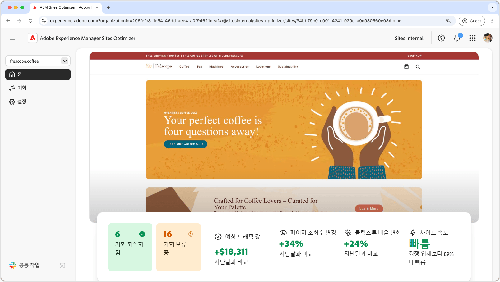

# AEM Sites Optimizer

{align="center"}

Adobe Experience Manager(AEM) Sites Optimizer은 AEM에 구축된 웹 사이트의 성능을 분석 및 개선하는 클라우드 기반 서비스입니다. 페이지 로드, 구성 요소 사용 및 콘텐츠 전달을 향상시킬 수 있는 영역을 식별하여 웹 사이트의 성능을 높이고 유지 관리 및 업데이트 비용을 줄이는 데 도움이 됩니다. Sites Optimizer을 사용하면 유연하고 안정적인 온라인 경험을 확보할 수 있으며, 이는 참여 및 전환을 유지하는 데 중요합니다.

## Sites Optimizer 시작

<!-- CARDS 

* ./opportunity-types/overview.md
   {title=Opportunity types}
   {description = Learn about the available Site Optimizer opportunities and how to use them to improve your site's performance.}
* ./documentation/overview.md
  * {title=Documentation}
  * {description=Explore the Sites Optimizer documentation to learn about all its capabilities.}

-->
<!-- START CARDS HTML - DO NOT MODIFY BY HAND -->

    

        

            

                <figure class="image x-is-16by9">
                    
                </figure>
            

            

                

                    

                        <a href="./opportunity-types/overview.md" target="_blank" rel="referrer" title="영업 기회 유형">영업 기회 유형</a>
                    

                    
사용 가능한 Site Optimizer 기회 및 이를 사용하여 사이트의 성능을 향상시키는 방법에 대해 알아봅니다.

                

                <a href="./opportunity-types/overview.md" target="_blank" rel="referrer" class="spectrum-Button spectrum-Button--outline spectrum-Button--primary spectrum-Button--sizeM" style="align-self: flex-start; margin-top: 1rem;">
                    자세히 알아보기
                </a>
            

        

    

    

        

            

                <figure class="image x-is-16by9">
                    
                </figure>
            

            

                

                    

                        <a href="./documentation/overview.md" target="_blank" rel="referrer" title="설명서">설명서</a>
                    

                    
Sites Optimizer 설명서를 살펴보고 모든 기능에 대해 알아보십시오.

                

                <a href="./documentation/overview.md" target="_blank" rel="referrer" class="spectrum-Button spectrum-Button--outline spectrum-Button--primary spectrum-Button--sizeM" style="align-self: flex-start; margin-top: 1rem;">
                    자세히 알아보기
                </a>
            

        

    

<!-- END CARDS HTML - DO NOT MODIFY BY HAND -->
