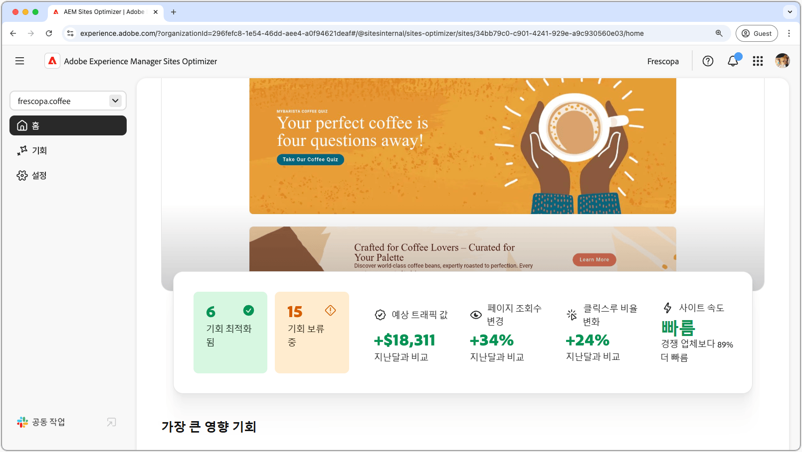
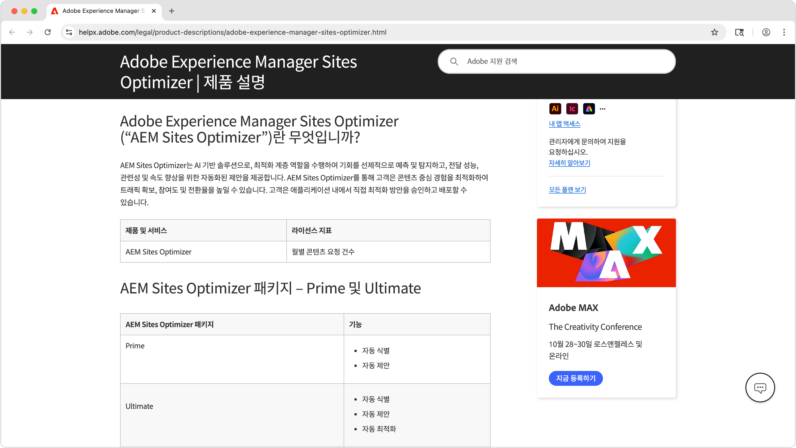
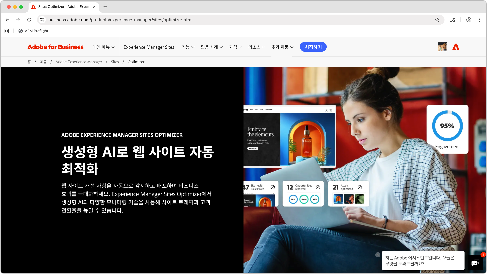

# AEM Sites Optimizer

>[!VIDEO](https://video.tv.adobe.com/v/3455085/?learn=on&enablevpops)

Adobe Experience Manager(AEM) Sites Optimizer는 AEM에 빌드된 웹 사이트의 성능을 분석하고 개선하는 클라우드 기반 서비스입니다. Sites Optimizer는 페이지 로딩, 구성 요소 사용, 콘텐츠 게재 측면에서 개선해야 할 영역을 파악합니다. 이 기능은 유지관리 및 업데이트 비용을 줄이는 동시에 웹 사이트 성능을 향상하는 데 도움이 됩니다. Sites Optimizer를 사용하면 참여와 전환을 유지하는 데 중요한 요소인 원활하고 안정적인 온라인 경험을 보장할 수 있습니다.

## Sites Optimizer 시작하기

<!-- CARDS 

* ./opportunity-types/overview.md
    * {title=Opportunity types}
    * {description = Learn about the available Site Optimizer opportunities and how to use them to improve your site's performance.}
* ./opportunity-types/preflight.md
  * {title=Preflight opportunities}
  * {description = Learn about the Preflight opportunities in Sites Optimizer and how to optimize your web pages before they're even published.}
* ./documentation/overview.md
  * {title=Documentation}
  * {description=Explore the Sites Optimizer documentation to learn about all its capabilities.}

-->
<!-- START CARDS HTML - DO NOT MODIFY BY HAND -->

    

        

            

                <figure class="image x-is-16by9">
                    
                </figure>
            

            

                

                    

                        <a href="./opportunity-types/overview.md" target="_blank" rel="referrer" title="기회 유형">기회 유형</a>
                    

                    
사용 가능한 Site Optimizer 기회와 이를 사용하여 사이트 성과를 개선하는 방법에 대해 알아봅니다.

                

                <a href="./opportunity-types/overview.md" target="_blank" rel="referrer" class="spectrum-Button spectrum-Button--outline spectrum-Button--primary spectrum-Button--sizeM" style="align-self: flex-start; margin-top: 1rem;">
                    자세히 알아보기
                </a>
            

        

    

    

        

            

                <figure class="image x-is-16by9">
                    
                </figure>
            

            

                

                    

                        <a href="./documentation/overview.md" target="_blank" rel="referrer" title="설명서">설명서</a>
                    

                    
Sites Optimizer 설명서를 탐색하여 모든 기능에 대해 알아봅니다.

                

                <a href="./documentation/overview.md" target="_blank" rel="referrer" class="spectrum-Button spectrum-Button--outline spectrum-Button--primary spectrum-Button--sizeM" style="align-self: flex-start; margin-top: 1rem;">
                    자세히 알아보기
                </a>
            

        

    

<!-- END CARDS HTML - DO NOT MODIFY BY HAND -->

## Sites Optimizer에 대해 자세히 알아보기

<!-- CARDS 
* https://helpx.adobe.com/kr/legal/product-descriptions/adobe-experience-manager-sites-optimizer.html
    {title=Packages and licensing}
    {description=Learn about AEM Sites Optimizer packages and licensing.}
    {image=./assets/home/licensing.png}
    {target=_blank}
    {cta=Learn more}
* https://business.adobe.com/products/experience-manager/sites/optimizer.html
    {title=Explore the capabilities of AEM Sites Optimizer}
    {description=Learn what AEM Site Optimizer can do for your company.}
    {image=./assets/home/business-adobe-com.png}
    {target=_blank}
    {cta=Learn more}
-->
<!-- START CARDS HTML - DO NOT MODIFY BY HAND -->

    

        

            

                <figure class="image x-is-16by9">
                    
                </figure>
            

            

                

                    

                        <a href="https://helpx.adobe.com/kr/legal/product-descriptions/adobe-experience-manager-sites-optimizer.html" target="_blank" rel="referrer" title="패키지 및 라이선스">패키지 및 라이선스</a>
                    

                    
AEM Sites Optimizer 패키지 및 라이선스에 대해 알아봅니다.

                

                <a href="https://helpx.adobe.com/kr/legal/product-descriptions/adobe-experience-manager-sites-optimizer.html" target="_blank" rel="referrer" class="spectrum-Button spectrum-Button--outline spectrum-Button--primary spectrum-Button--sizeM" style="align-self: flex-start; margin-top: 1rem;">
                    자세히 알아보기
                </a>
            

        

    

    

        

            

                <figure class="image x-is-16by9">
                    
                </figure>
            

            

                

                    

                        <a href="https://business.adobe.com/products/experience-manager/sites/optimizer.html" target="_blank" rel="referrer" title="AEM Sites Optimizer의 기능 살펴보기">AEM Sites Optimizer의 기능 살펴보기</a>
                    

                    
AEM Site Optimizer가 회사에 어떻게 도움이 되는지 알아봅니다.

                

                <a href="https://business.adobe.com/products/experience-manager/sites/optimizer.html" target="_blank" rel="referrer" class="spectrum-Button spectrum-Button--outline spectrum-Button--primary spectrum-Button--sizeM" style="align-self: flex-start; margin-top: 1rem;">
                    자세히 알아보기
                </a>
            

        

    

<!-- END CARDS HTML - DO NOT MODIFY BY HAND -->
