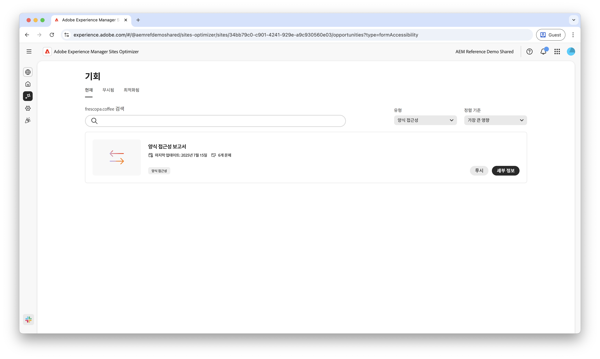

# Forms 액세스 가능성 기회

 Forms 최적화 기능은 조기 액세스 프로그램에서 사용할 수 있습니다. 공식 이메일 ID에서 aem-forms-ea@adobe.com에 작성하여 조기 액세스 프로그램에 참여하고 기능에 대한 액세스를 요청할 수 있습니다. 

{align="center"}

Forms 접근성 기회는 사용자 상호 작용을 향상시키고 전환을 늘리는 데 중요합니다. WCAG(Web Content Accessibility Guidelines)를 준수하도록 양식을 평가하는 것은 시각, 청각, 인지 및 운동 장애가 있는 사용자에게 포괄적인 경험을 제공하는 데 도움이 됩니다. 이는 윤리적 및 법적 요구 사항을 충족시킬 뿐만 아니라 양식 완료율을 향상시키고 대상자를 넓혀 결과적으로 사용자 경험이 향상되고 비즈니스 결과가 강화됩니다.

## 기회

<!-- CARDS
 
* ../documentation/opportunities/low-views.md
  {title=Low views}
  {image=../assets/common/card-bag.png}
* ../documentation/opportunities/low-conversions.md
  {title=Low conversions}
  {image=../assets/common/card-bag.png}

--->
<!-- START CARDS HTML - DO NOT MODIFY BY HAND -->

    

        

            

                <figure class="image x-is-16by9">
                    
                </figure>
            

            

                

                    

                        <a href="../documentation/opportunities/forms-accessibility-issues.md" target="_blank" rel="referrer" title="Forms 접근성 문제">Forms 접근성 문제</a>
                    

                    
양식 액세스 가능성 문제와 이를 사용하여 웹 사이트에서의 양식 참여를 향상시키는 방법에 대해 알아봅니다.

                

                <a href="../documentation/opportunities/forms-accessibility-issues.md" target="_blank" rel="referrer" class="spectrum-Button spectrum-Button--outline spectrum-Button--primary spectrum-Button--sizeM" style="align-self: flex-start; margin-top: 1rem;">
                    자세히 알아보기
                </a>
            

        

    

<!-- END CARDS HTML - DO NOT MODIFY BY HAND -->
