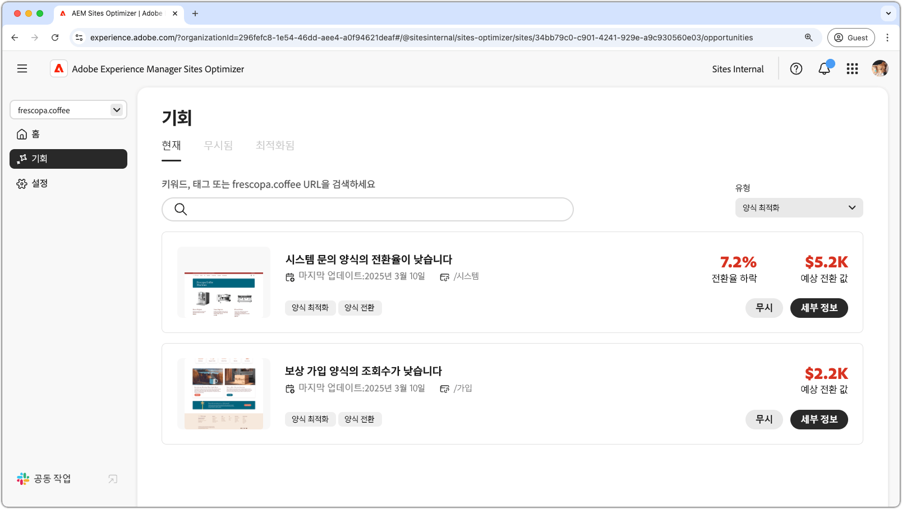

# 양식 최적화 기회

{align="center"}

AEM Sites Optimizer의 양식 최적화는 사용자 상호 작용을 개선하고 전환을 극대화하는 데 필수적입니다. 개선이 필요한 영역(예: 낮은 양식 조회수 및 낮은 양식 바운스 비율)을 식별하면 팀에서 양식 디자인, 배치 및 콘텐츠를 개선하여 참여를 높일 수 있습니다. 최적화된 양식은 원활한 사용자 경험을 보장하며, 방문자가 더 쉽게 액션을 완료하고 비즈니스 성과를 달성할 수 있도록 돕습니다. AEM Sites Optimizer의 인사이트를 사용하여 마케터는 개선 영역을 지속적으로 식별할 수 있으므로 궁극적으로 효율성을 높이고 전체 사이트 성과를 높일 수 있습니다.

## 기회

<!-- CARDS
 
* ../documentation/opportunities/low-views.md
  {title=Low views}
  {image=../assets/common/card-bag.png}
* ../documentation/opportunities/low-conversions.md
  {title=Low conversions}
  {image=../assets/common/card-bag.png}

--->
<!-- START CARDS HTML - DO NOT MODIFY BY HAND -->

    

        

            

                <figure class="image x-is-16by9">
                    
                </figure>
            

            

                

                    

                        <a href="../documentation/opportunities/low-views.md" target="_blank" rel="referrer" title="낮은 조회수">낮은 조회수</a>
                    

                    
낮은 조회수 기회에 대해 알아보고 이를 사용하여 웹 사이트에서 양식 참여를 개선하는 방법을 알아봅니다.

                

                <a href="../documentation/opportunities/low-views.md" target="_blank" rel="referrer" class="spectrum-Button spectrum-Button--outline spectrum-Button--primary spectrum-Button--sizeM" style="align-self: flex-start; margin-top: 1rem;">
                    자세히 알아보기
                </a>
            

        

    

    

        

            

                <figure class="image x-is-16by9">
                    
                </figure>
            

            

                

                    

                        <a href="../documentation/opportunities/low-conversions.md" target="_blank" rel="referrer" title="낮은 전환율">낮은 전환율</a>
                    

                    
낮은 전환율 기회에 대해 알아보고 이를 사용하여 웹 사이트에서 양식 참여를 개선하는 방법을 알아봅니다.

                

                <a href="../documentation/opportunities/low-conversions.md" target="_blank" rel="referrer" class="spectrum-Button spectrum-Button--outline spectrum-Button--primary spectrum-Button--sizeM" style="align-self: flex-start; margin-top: 1rem;">
                    자세히 알아보기
                </a>
            

        

    

<!-- END CARDS HTML - DO NOT MODIFY BY HAND -->
