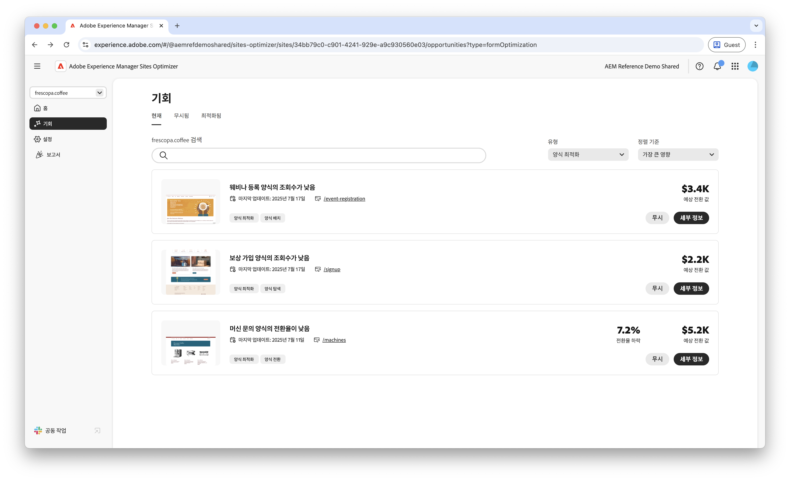

# Forms 최적화 기회

 Forms Optimizer 기능은 조기 액세스 프로그램에서 사용할 수 있습니다. 공식 이메일 ID에서 aem-forms-ea@adobe.com에 작성하여 조기 액세스 프로그램에 참여하고 기능에 대한 액세스를 요청할 수 있습니다. 

>[!VIDEO](https://video.tv.adobe.com/v/3469472/)

<!-- {align="center"} -->

Forms 최적화 기회를 통해 조직은 사용자 상호 작용을 체계적으로 개선하고 양식 전환을 늘릴 수 있습니다. 팀은 낮은 보기 수, 낮은 전환 수 및 낮은 탐색 속도와 같은 문제를 감지함으로써 양식 디자인, 배치 및 컨텐츠에 대한 데이터 기반의 조정을 수행할 수 있습니다. 이러한 최적화를 통해 사용자 경험을 간소화할 수 있으므로 방문자가 양식을 쉽게 작성하고 원하는 결과를 얻을 수 있습니다. Forms Optimizer의 통찰력을 활용하여 성능 격차를 지속적으로 파악 및 해결할 수 있으므로 더욱 효과적인 양식과 비즈니스 결과를 얻을 수 있습니다.

## 기회

<!-- CARDS
 
* ../documentation/opportunities/low-views.md
  {title=Low views}
  {image=../assets/common/card-bag.png}
* ../documentation/opportunities/low-conversions.md
  {title=Low conversions}
  {image=../assets/common/card-bag.png}

--->
<!-- START CARDS HTML - DO NOT MODIFY BY HAND -->

    

        

            

                <figure class="image x-is-16by9">
                    
                </figure>
            

            

                

                    

                        <a href="../documentation/opportunities/low-views.md" target="_blank" rel="referrer" title="낮은 조회수">낮은 조회수</a>
                    

                    
낮은 보기의 기회와 이를 사용하여 웹 사이트에서 양식 참여를 향상시키는 방법에 대해 알아봅니다.

                

                <a href="../documentation/opportunities/low-views.md" target="_blank" rel="referrer" class="spectrum-Button spectrum-Button--outline spectrum-Button--primary spectrum-Button--sizeM" style="align-self: flex-start; margin-top: 1rem;">
                    자세히 알아보기
                </a>
            

        

    

    

        

            

                <figure class="image x-is-16by9">
                    
                </figure>
            

            

                

                    

                        <a href="../documentation/opportunities/low-conversions.md" target="_blank" rel="referrer" title="낮은 전환율">낮은 전환율</a>
                    

                    
낮은 전환 기회와 이를 사용하여 웹 사이트에서 양식 참여를 향상시키는 방법에 대해 알아봅니다.

                

                <a href="../documentation/opportunities/low-conversions.md" target="_blank" rel="referrer" class="spectrum-Button spectrum-Button--outline spectrum-Button--primary spectrum-Button--sizeM" style="align-self: flex-start; margin-top: 1rem;">
                    자세히 알아보기
                </a>
            

        

    

    

        

            

                <figure class="image x-is-16by9">
                    
                </figure>
            

            

                

                    

                        <a href="../documentation/opportunities/low-navigation.md" target="_blank" rel="referrer" title="접근성 문제">탐색 부족</a>
                    

                    
탐색 기회가 적은 것과 이를 사용하여 웹 사이트에서 양식 참여를 향상시키는 방법에 대해 알아봅니다.

                

                <a href="../documentation/opportunities/low-navigation.md" target="_blank" rel="referrer" class="spectrum-Button spectrum-Button--outline spectrum-Button--primary spectrum-Button--sizeM" style="align-self: flex-start; margin-top: 1rem;">
                    자세히 알아보기
                </a>
            

        

    

<!-- END CARDS HTML - DO NOT MODIFY BY HAND -->
