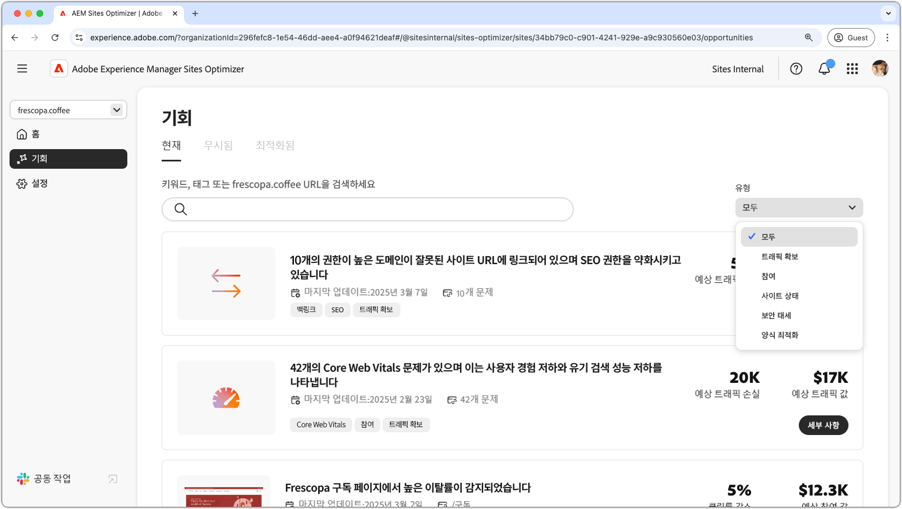
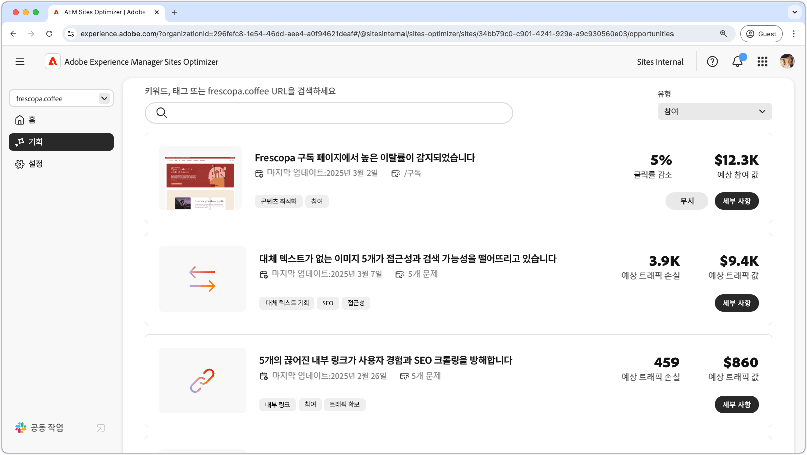
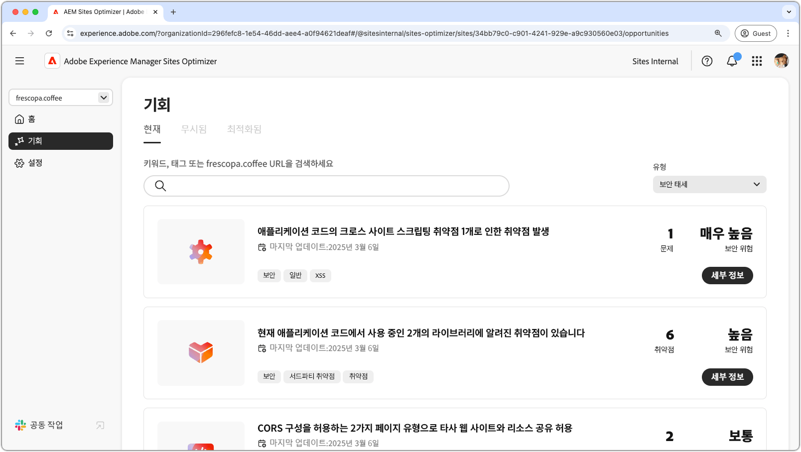
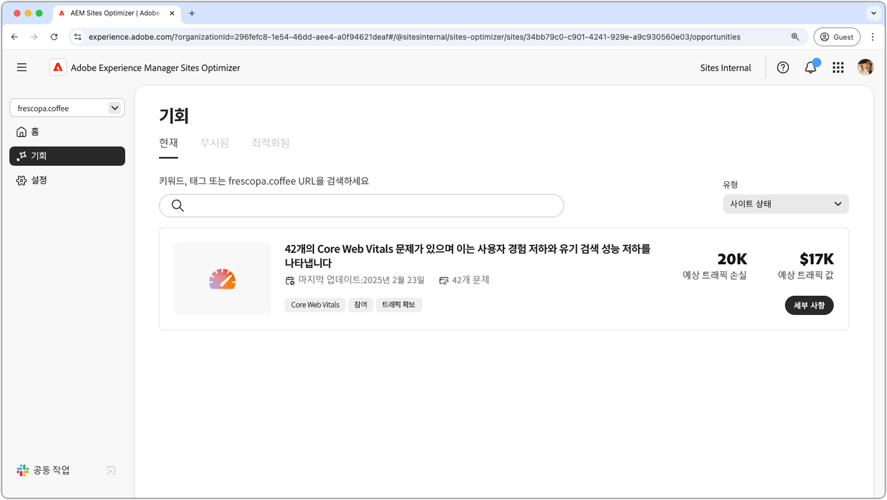
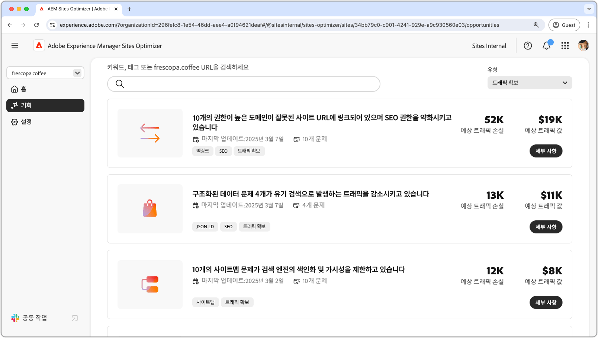

# 기회 유형

{align="center"}

AEM Sites Optimizer는 웹 사이트 성과, 유용성 및 보안을 개선하는 데 도움이 되는 귀중한 인사이트와 권장 사항을 제공합니다. 이러한 인사이트는 참여, 트래픽 확보, 보안 태세 및 사이트 상태의 주요 기회 영역으로 그룹화됩니다. 각 카테고리에서는 방문자 상호 작용 증가, 검색 가능성 개선, 보안 강화 또는 사이트 안정성 유지 등 사이트를 개선할 수 있는 구체적인 방법을 강조합니다.

이들 기회를 활용하면 사용자 경험이 향상되고, 적합한 대상자를 유치할 수 있으며, 사이트의 보안과 신뢰성이 유지됩니다. 참여와 트래픽 확보를 강화하면 상호 작용을 촉진하고 가시성이 높아지며, 강력한 보안 태세와 사이트 상태는 신뢰와 안정성을 보장하는 데 도움이 됩니다. 아래 링크를 탐색하여 카테고리별로 구성된 기회를 확인하고 사이트를 개선할 수 있는 방법을 알아보십시오.

## 기회 유형

<!-- CARDS 

* ./engagement.md
   { title = Engagement }
* ./security-posture.md
   { title = Security posture }
* ./site-health.md
   { title = Site health }
* ./traffic-acquisition.md
   { title = Traffic acquisition }

-->
<!-- START CARDS HTML - DO NOT MODIFY BY HAND -->

    

        

            

                <figure class="image x-is-16by9">
                    
                </figure>
            

            

                

                    

                        <a href="./engagement.md" target="_blank" rel="referrer" title="참여">참여</a>
                    

                    
Sites Optimizer를 사용하여 참여를 개선하는 방법을 알아봅니다.

                

                <a href="./engagement.md" target="_blank" rel="referrer" class="spectrum-Button spectrum-Button--outline spectrum-Button--primary spectrum-Button--sizeM" style="align-self: flex-start; margin-top: 1rem;">
                    자세히 알아보기
                </a>
            

        

    

    

        

            

                <figure class="image x-is-16by9">
                    
                </figure>
            

            

                

                    

                        <a href="./security-posture.md" target="_blank" rel="referrer" title="보안 태세">보안 태세</a>
                    

                    
Sites Optimizer로 사이트의 보안을 개선하는 방법을 알아봅니다.

                

                <a href="./security-posture.md" target="_blank" rel="referrer" class="spectrum-Button spectrum-Button--outline spectrum-Button--primary spectrum-Button--sizeM" style="align-self: flex-start; margin-top: 1rem;">
                    자세히 알아보기
                </a>
            

        

    

    

        

            

                <figure class="image x-is-16by9">
                    
                </figure>
            

            

                

                    

                        <a href="./site-health.md" target="_blank" rel="referrer" title="사이트 상태">사이트 상태</a>
                    

                    
Sites Optimizer로 사이트의 상태를 개선하는 방법을 알아봅니다.

                

                <a href="./site-health.md" target="_blank" rel="referrer" class="spectrum-Button spectrum-Button--outline spectrum-Button--primary spectrum-Button--sizeM" style="align-self: flex-start; margin-top: 1rem;">
                    자세히 알아보기
                </a>
            

        

    

    

        

            

                <figure class="image x-is-16by9">
                    
                </figure>
            

            

                

                    

                        <a href="./traffic-acquisition.md" target="_blank" rel="referrer" title="트래픽 확보">트래픽 확보</a>
                    

                    
Sites Optimizer로 트래픽 확보를 늘리는 방법을 알아봅니다.

                

                <a href="./traffic-acquisition.md" target="_blank" rel="referrer" class="spectrum-Button spectrum-Button--outline spectrum-Button--primary spectrum-Button--sizeM" style="align-self: flex-start; margin-top: 1rem;">
                    자세히 알아보기
                </a>
            

        

    

<!-- END CARDS HTML - DO NOT MODIFY BY HAND -->
