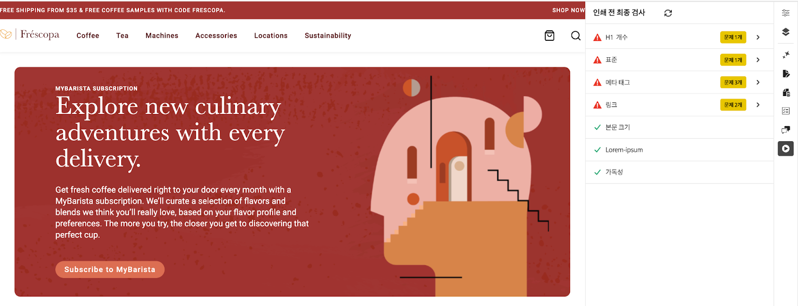

# Preflight 기회

{align="center"}

AEM Sites Optimizer preflight 기회를 사용하면 웹 페이지가 라이브로 전환되기 전에 성능, SEO 및 사용자 경험에 맞게 최적화됩니다. 프리플라이트 검사는 끊어진 링크, 누락된 메타 태그 및 접근성 문제와 같은 잠재적 문제를 식별하여 콘텐츠 작성자 및 마케터가 게시 프로세스 초기에 이러한 문제를 해결할 수 있도록 합니다. 이 사전 예방적 접근 방식은 하위 최적 콘텐츠 게시의 위험을 최소화하고 사이트 품질을 향상시키며 전반적인 디지털 존재감을 향상시킵니다. Preflight 기회를 활용하면 더 원활한 워크플로를 지원하고, 게시 후 수정 사항을 줄이고, 검색 엔진 순위 및 사용자 만족도를 높이는 데 기여할 수 있습니다.

## 기회

<!-- CARDS

* ../documentation/opportunities/invalid-or-missing-metadata.md
  {title=Canonical}
  {image=../assets/common/card-link.png}
* ../documentation/opportunities/broken-internal-links.md
  {title=Broken Internal Links}
  {image=../assets/common/card-link.png}
* ../documentation/opportunities/invalid-or-missing-metadata.md
  {title=Metatags}
  {image=../assets/common/card-code.png}
* ../documentation/opportunities/invalid-or-missing-metadata.md
  {title=H1 count}
  {image=../assets/common/card-code.png}
* ../documentation/opportunities/accessibility-issues.md
  {title=Accessibility}
  {image=../assets/common/card-puzzle.png}

-->
<!-- START CARDS HTML - DO NOT MODIFY BY HAND -->
<div class="columns">
    <div class="column is-half-tablet is-half-desktop is-one-third-widescreen" aria-label="Canonical">
        <div class="card" style="height: 100%; display: flex; flex-direction: column; height: 100%;">
            <div class="card-image">
                <figure class="image x-is-16by9">
                    <a href="../documentation/opportunities/invalid-or-missing-metadata.md" title="표준" target="_blank" rel="referrer">
                        
                    </a>
                </figure>
            </div>
            <div class="card-content is-padded-small" style="display: flex; flex-direction: column; flex-grow: 1; justify-content: space-between;">
                <div class="top-card-content">
                    <p class="headline is-size-6 has-text-weight-bold">
                        <a href="../documentation/opportunities/invalid-or-missing-metadata.md" target="_blank" rel="referrer" title="표준">표준</a>
                    </p>
                    <p class="is-size-6">표준 기회에 대해 알아보고 이를 사용하여 SEO를 개선하고 중복 콘텐츠 문제를 방지하는 방법에 대해 알아봅니다.</p>
                </div>
                <a href="../documentation/opportunities/invalid-or-missing-metadata.md" target="_blank" rel="referrer" class="spectrum-Button spectrum-Button--outline spectrum-Button--primary spectrum-Button--sizeM" style="align-self: flex-start; margin-top: 1rem;">
                    <span class="spectrum-Button-label has-no-wrap has-text-weight-bold">자세히 알아보기</span>
                </a>
            </div>
        </div>
    </div>
    <div class="column is-half-tablet is-half-desktop is-one-third-widescreen" aria-label="Broken Internal Links">
        <div class="card" style="height: 100%; display: flex; flex-direction: column; height: 100%;">
            <div class="card-image">
                <figure class="image x-is-16by9">
                    <a href="../documentation/opportunities/broken-internal-links.md" title="끊어진 내부 링크" target="_blank" rel="referrer">
                        
                    </a>
                </figure>
            </div>
            <div class="card-content is-padded-small" style="display: flex; flex-direction: column; flex-grow: 1; justify-content: space-between;">
                <div class="top-card-content">
                    <p class="headline is-size-6 has-text-weight-bold">
                        <a href="../documentation/opportunities/broken-internal-links.md" target="_blank" rel="referrer" title="끊어진 내부 링크">끊어진 내부 링크</a>
                    </p>
                    <p class="is-size-6">끊어진 내부 링크 기회에 대해 알아보고, 이를 사용하여 웹 사이트의 끊어지거나 문제가 있는 링크를 식별하고 수정하는 방법에 대해 알아봅니다.</p>
                </div>
                <a href="../documentation/opportunities/broken-internal-links.md" target="_blank" rel="referrer" class="spectrum-Button spectrum-Button--outline spectrum-Button--primary spectrum-Button--sizeM" style="align-self: flex-start; margin-top: 1rem;">
                    <span class="spectrum-Button-label has-no-wrap has-text-weight-bold">자세히 알아보기</span>
                </a>
            </div>
        </div>
    </div>
    <div class="column is-half-tablet is-half-desktop is-one-third-widescreen" aria-label="Metatags">
        <div class="card" style="height: 100%; display: flex; flex-direction: column; height: 100%;">
            <div class="card-image">
                <figure class="image x-is-16by9">
                    <a href="../documentation/opportunities/invalid-or-missing-metadata.md" title="메타태그" target="_blank" rel="referrer">
                        
                    </a>
                </figure>
            </div>
            <div class="card-content is-padded-small" style="display: flex; flex-direction: column; flex-grow: 1; justify-content: space-between;">
                <div class="top-card-content">
                    <p class="headline is-size-6 has-text-weight-bold">
                        <a href="../documentation/opportunities/invalid-or-missing-metadata.md" target="_blank" rel="referrer" title="메타태그">메타태그</a>
                    </p>
                    <p class="is-size-6">메타태그 기회에 대해 알아보고, 더 나은 SEO 성능을 위해 메타태그를 사용하여 페이지의 메타데이터를 최적화하는 방법에 대해 알아봅니다.</p>
                </div>
                <a href="../documentation/opportunities/invalid-or-missing-metadata.md" target="_blank" rel="referrer" class="spectrum-Button spectrum-Button--outline spectrum-Button--primary spectrum-Button--sizeM" style="align-self: flex-start; margin-top: 1rem;">
                    <span class="spectrum-Button-label has-no-wrap has-text-weight-bold">자세히 알아보기</span>
                </a>
            </div>
        </div>
    </div>
    <div class="column is-half-tablet is-half-desktop is-one-third-widescreen" aria-label="H1 count">
        <div class="card" style="height: 100%; display: flex; flex-direction: column; height: 100%;">
            <div class="card-image">
                <figure class="image x-is-16by9">
                    <a href="../documentation/opportunities/invalid-or-missing-metadata.md" title="H1 수" target="_blank" rel="referrer">
                        
                    </a>
                </figure>
            </div>
            <div class="card-content is-padded-small" style="display: flex; flex-direction: column; flex-grow: 1; justify-content: space-between;">
                <div class="top-card-content">
                    <p class="headline is-size-6 has-text-weight-bold">
                        <a href="../documentation/opportunities/invalid-or-missing-metadata.md" target="_blank" rel="referrer" title="H1 수">H1 수</a>
                    </p>
                    <p class="is-size-6">H1 수 기회에 대해 알아보고 이를 사용하여 적절한 헤딩 구조 및 SEO 최적화를 보장하는 방법에 대해 알아봅니다.</p>
                </div>
                <a href="../documentation/opportunities/invalid-or-missing-metadata.md" target="_blank" rel="referrer" class="spectrum-Button spectrum-Button--outline spectrum-Button--primary spectrum-Button--sizeM" style="align-self: flex-start; margin-top: 1rem;">
                    <span class="spectrum-Button-label has-no-wrap has-text-weight-bold">자세히 알아보기</span>
                </a>
            </div>
        </div>
    </div>
    <div class="column is-half-tablet is-half-desktop is-one-third-widescreen" aria-label="Accessibility">
        <div class="card" style="height: 100%; display: flex; flex-direction: column; height: 100%;">
            <div class="card-image">
                <figure class="image x-is-16by9">
                    <a href="../documentation/opportunities/accessibility-issues.md" title="접근성" target="_blank" rel="referrer">
                        
                    </a>
                </figure>
            </div>
            <div class="card-content is-padded-small" style="display: flex; flex-direction: column; flex-grow: 1; justify-content: space-between;">
                <div class="top-card-content">
                    <p class="headline is-size-6 has-text-weight-bold">
                        <a href="../documentation/opportunities/accessibility-issues.md" target="_blank" rel="referrer" title="접근성">접근성</a>
                    </p>
                    <p class="is-size-6">접근성 기회에 대해 알아보고, 모든 사용자가 웹 사이트에 액세스할 수 있도록 접근성 기회를 활용하는 방법에 대해 알아봅니다.</p>
                </div>
                <a href="../documentation/opportunities/accessibility-issues.md" target="_blank" rel="referrer" class="spectrum-Button spectrum-Button--outline spectrum-Button--primary spectrum-Button--sizeM" style="align-self: flex-start; margin-top: 1rem;">
                    <span class="spectrum-Button-label has-no-wrap has-text-weight-bold">자세히 알아보기</span>
                </a>
            </div>
        </div>
    </div>

</div>
<!-- END CARDS HTML - DO NOT MODIFY BY HAND -->

## 설정

AEM Sites Optimizer Preflight 기회 식별을 게시하기 전에 페이지에서 Preflight 감사를 실행하려면 유니버설 편집기, 문서 기반 미리보기 또는 AEM Cloud Service에서 Preflight 확장을 설정해야 합니다.

### 사용자 액세스 활성화

Preflight 확장을 사용하려면 사용자가 [Adobe Admin Console](https://adminconsole.adobe.com)에서 다음 AEM Sites Optimizer 제품 프로필 중 하나 이상에 할당되었는지 확인하십시오.

* AEM Sites Optimizer - 자동 제안 사용자
* AEM Sites Optimizer - 사용자 자동 최적화

### Preflight 확장 활성화

>[!BEGINTABS]

>[!TAB 범용 편집기]

범용 편집기에서 Preflight를 설정하려면 다음 단계를 수행하십시오.

1. 다음 위치에서 **Extension Manager**을(를) 엽니다.
   [https://experience.adobe.com/#/@org/aem/extension-manager/universal-editor](https://experience.adobe.com/#/@org/aem/extension-manager/universal-editor)
1. **AEM Sites Optimizer Preflight 확장**&#x200B;을 찾아 활성화하기 위한 요청을 제출합니다.
1. **Adobe AEM 팀**&#x200B;이(가) 조직의 확장을 검토하고 활성화합니다.
1. 확장을 사용하도록 설정한 후 **유니버설 편집기**에서 페이지를 여십시오. 예:
   `https://author-p12345-e123456.adobeaemcloud.com/ui#/@org/aem/universal-editor/canvas/author-p12345-e123456.adobeaemcloud.com/content/en/example/home.html`
1. **Preflight 확장**&#x200B;이 **쪽 레일**&#x200B;에 표시됩니다.
1. 측면 레일에서 **Preflight 확장**&#x200B;을(를) 선택하여 현재 페이지의 **Preflight 감사**&#x200B;를 시작합니다.

>[!TAB 문서 기반 작성]

문서 기반 작성을 위한 프리플라이트 를 설정하려면 다음 단계를 따르십시오.

1. Edge Delivery Services 프로젝트의 GitHub 리포지토리에서 `/tools/sidekick/config.json`에 다음 구성을 추가하십시오.

   ```json
   {
     "plugins": [
       {
         "id": "preflight",
         "titleI18n": {
           "en": "Preflight"
         },
         "environments": ["preview"],
         "event": "preflight"
       }
     ]
   }
   ```

1. 새 파일 `/tools/sidekick/aem-sites-optimizer-preflight.js`을(를) 만들고 다음 콘텐츠를 추가합니다.

   ```javascript
   (function () {
     let isAEMSitesOptimizerPreflightAppLoaded = false;
     function loadAEMSitesOptimizerPreflightApp() {
       const script = document.createElement('script');
       script.src = 'https://experience.adobe.com/solutions/OneAdobe-aem-sites-optimizer-preflight-mfe/static-assets/resources/sidekick/client.js?source=plugin';
       script.onload = function () {
         isAEMSitesOptimizerPreflightAppLoaded = true;
       };
       script.onerror = function () {
         console.error('Error loading AEMSitesOptimizerPreflightApp.');
       };
       document.head.appendChild(script);
     }
   
     function handlePluginButtonClick() {
       if (!isAEMSitesOptimizerPreflightAppLoaded) {
         loadAEMSitesOptimizerPreflightApp();
       }
     }
   
     // Sidekick V1 extension support
     const sidekick = document.querySelector('helix-sidekick');
     if (sidekick) {
       sidekick.addEventListener('custom:preflight', handlePluginButtonClick);
     } else {
       document.addEventListener('sidekick-ready', () => {
         document.querySelector('helix-sidekick')
           .addEventListener('custom:preflight', handlePluginButtonClick);
       }, { once: true });
     }
   
     // Sidekick V2 extension support
     const sidekickV2 = document.querySelector('aem-sidekick');
     if (sidekickV2) {
       sidekickV2.addEventListener('custom:preflight', handlePluginButtonClick);
     } else {
       document.addEventListener('sidekick-ready', () => {
         document.querySelector('aem-sidekick')
           .addEventListener('custom:preflight', handlePluginButtonClick);
       }, { once: true });
     }
   }());
   ```

1. 미리 보기 URL에 대한 Preflight 스크립트를 가져오려면 `loadLazy()`에서 `/scripts/scripts.js` 함수를 업데이트하십시오.

   ```javascript
   if (window.location.href.includes('.aem.page')) {
      import('../tools/sidekick/aem-sites-optimizer-preflight.js');
   }
   ```

1. 감사할 페이지의 미리 보기 URL(`*.aem.page`)을 엽니다.
1. **Sidekick**&#x200B;에서 **Preflight** 단추를 클릭하여 현재 페이지에 대한 감사를 시작합니다.

>[!TAB AEM Sites 페이지 편집기]

AEM Sites 페이지 편집기에서 Preflight를 사용하려면 웹 브라우저에서 북마클릿을 만들 수 있습니다. 다음 단계를 수행합니다.

1. 웹 브라우저에 **책갈피 표시줄** 표시:

   * **Ctrl+Shift+B**(Windows) 또는 **Cmd+Shift+B**(Mac)을 누릅니다.

아! 브라우저에서 새 책갈피를 만듭니다.

* 책갈피 표시줄을 마우스 오른쪽 단추로 클릭하고 **새 페이지** 또는 **책갈피 추가**&#x200B;를 선택합니다.
* **주소(URL)** 필드에 다음 코드를 붙여넣습니다.

```javascript
javascript:(function(){const script=document.createElement('script');script.src='https://experience.adobe.com/solutions/OneAdobe-aem-sites-optimizer-preflight-mfe/static-assets/resources/sidekick/client.js?source=bookmarklet&target-source=aem-cloud-service';document.head.appendChild(script);})();
```

1. 책갈피 이름을 **Preflight**(또는 원하는 이름)로 지정합니다.
1. `*.aem.page`AEM Sites 페이지 편집기&#x200B;**에서 감사할 페이지의 미리 보기 URL(**)을 엽니다.
1. 책갈피 막대에서 **Preflight** 책갈피를 클릭하여 현재 페이지에 대한 감사를 시작합니다.

>[!ENDTABS]

## 모범 사례

Preflight 감사를 실행할 때는 다음 지침을 염두에 두십시오.

* 프로덕션에 게시하기 전에 항상 **준비 또는 미리 보기 페이지**&#x200B;에서 감사를 실행하십시오.
* 끊어진 링크, 누락된 H1 태그 또는 비보안 링크와 같은 **영향력이 큰 문제** 해결을 우선시하십시오.
* 감사를 실행하기 전에 보호된 스테이징 환경에 대해 **인증이 활성화되었는지**&#x200B;확인하십시오.
* SEO 성능을 향상시키려면 **메타 태그 권장 사항**&#x200B;을 검토하고 적용하십시오.
