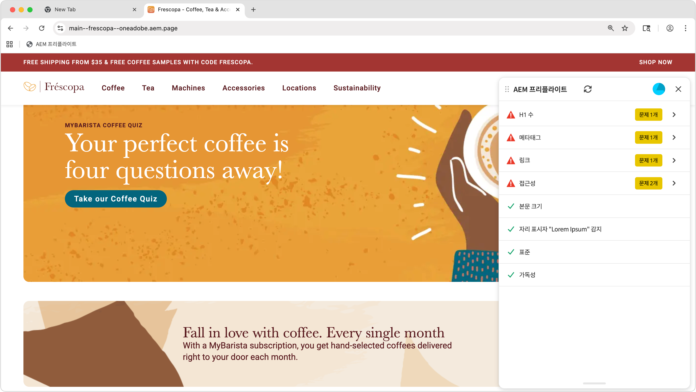

# Preflight 기회

{align="center"}

AEM Sites Optimizer [preflight 기회](../documentation/preflight/overview.md)는 웹 페이지 공개 전에 웹 페이지의 성능, SEO 및 사용자 경험이 최적화되었는지 확인할 수 있도록 도와줍니다. 끊어진 링크, 누락된 메타 태그, 접근성 문제 등 잠재적 문제를 식별함으로써 콘텐츠 작성자와 마케터가 Preflight 검사로 게시 프로세스 초기에 해당 문제를 해결할 수 있습니다. 이 사전 예방적 접근 방식은 하위 최적 콘텐츠 게시의 위험을 최소화하고 사이트 품질을 향상시키며 전반적인 디지털 존재감을 향상시킵니다. Preflight 기회를 사용하면 더 원활한 워크플로를 지원하고, 게시 후 수정 사항을 줄이고, 검색 엔진 순위와 사용자 만족도를 높이는 데 기여합니다.

## 기회

<!-- CARDS

* ../documentation/preflight/accessibility.md
  {title=Accessibility}
  {image=../assets/common/card-puzzle.png}
* ../documentation/preflight/h1-count.md
  {title=H1 count}
  {image=../assets/common/card-link.png}
* ../documentation/preflight/links.md
  {title=Links}
  {image=../assets/common/card-link.png}
* ../documentation/preflight/meta-data.md
  {title=Metadata}
  {image=../assets/common/card-code.png}
* ../documentation/preflight/readability.md
  {title=Readability}
  {image=../assets/common/card-people.png}

-->
<!-- START CARDS HTML - DO NOT MODIFY BY HAND -->

    

        

            

                <figure class="image x-is-16by9">
                    
                </figure>
            

            

                

                    

                        <a href="../documentation/preflight/accessibility.md" target="_blank" rel="referrer" title="접근성">접근성</a>
                    

                    
Sites Optimizer의 Preflight 접근성 기회에 대해 알아봅니다.

                

                <a href="../documentation/preflight/accessibility.md" target="_blank" rel="referrer" class="spectrum-Button spectrum-Button--outline spectrum-Button--primary spectrum-Button--sizeM" style="align-self: flex-start; margin-top: 1rem;">
                    자세히 알아보기
                </a>
            

        

    

    

        

            

                <figure class="image x-is-16by9">
                    
                </figure>
            

            

                

                    

                        <a href="../documentation/preflight/h1-count.md" target="_blank" rel="referrer" title="H1 수">H1 수</a>
                    

                    
Sites Optimizer의 Preflight 접근성 기회에 대해 알아봅니다.

                

                <a href="../documentation/preflight/h1-count.md" target="_blank" rel="referrer" class="spectrum-Button spectrum-Button--outline spectrum-Button--primary spectrum-Button--sizeM" style="align-self: flex-start; margin-top: 1rem;">
                    자세히 알아보기
                </a>
            

        

    

    

        

            

                <figure class="image x-is-16by9">
                    
                </figure>
            

            

                

                    

                        <a href="../documentation/preflight/links.md" target="_blank" rel="referrer" title="링크">링크</a>
                    

                    
Sites Optimizer의 Preflight 링크 기회에 대해 알아봅니다.

                

                <a href="../documentation/preflight/links.md" target="_blank" rel="referrer" class="spectrum-Button spectrum-Button--outline spectrum-Button--primary spectrum-Button--sizeM" style="align-self: flex-start; margin-top: 1rem;">
                    자세히 알아보기
                </a>
            

        

    

    

        

            

                <figure class="image x-is-16by9">
                    
                </figure>
            

            

                

                    

                        <a href="../documentation/preflight/meta-data.md" target="_blank" rel="referrer" title="메타데이터">메타데이터</a>
                    

                    
Sites Optimizer의 Preflight 메타데이터 기회에 대해 알아봅니다.

                

                <a href="../documentation/preflight/meta-data.md" target="_blank" rel="referrer" class="spectrum-Button spectrum-Button--outline spectrum-Button--primary spectrum-Button--sizeM" style="align-self: flex-start; margin-top: 1rem;">
                    자세히 알아보기
                </a>
            

        

    

    

        

            

                <figure class="image x-is-16by9">
                    
                </figure>
            

            

                

                    

                        <a href="../documentation/preflight/readability.md" target="_blank" rel="referrer" title="가독성">가독성</a>
                    

                    
Sites Optimizer의 Preflight 가독성 기회에 대해 알아봅니다.

                

                <a href="../documentation/preflight/readability.md" target="_blank" rel="referrer" class="spectrum-Button spectrum-Button--outline spectrum-Button--primary spectrum-Button--sizeM" style="align-self: flex-start; margin-top: 1rem;">
                    자세히 알아보기
                </a>
            

        

    

<!-- END CARDS HTML - DO NOT MODIFY BY HAND -->
