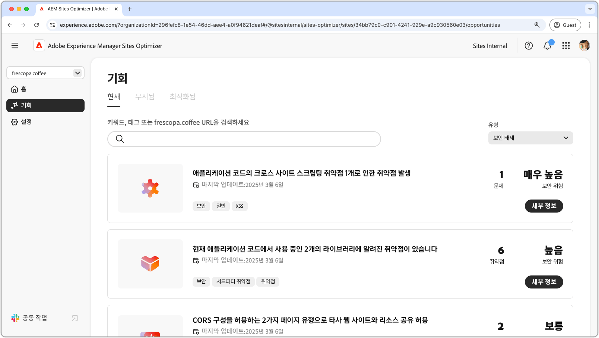

# 보안 태세 기회

{align="center"}

AEM Sites Optimizer에서 강력한 보안 태세를 유지하는 것은 디지털 경험과 사용자 데이터를 보호하는 데 중요합니다. CORS 구성, 크로스 사이트 스크립팅, 웹 사이트 권한 및 웹 사이트 취약점 등과 같은 개선 기회를 식별함으로써 팀은 잠재적인 보안 위험을 사전에 해결하고 모범 사례를 준수할 수 있습니다. 보안 조치를 강화하면 민감한 정보를 보호할 수 있을 뿐만 아니라 사용자 신뢰와 사이트 안정성도 향상됩니다. AEM Sites Optimizer의 통찰력을 사용하면 조직은 보안 상태를 지속적으로 모니터링하고 개선하여 위험을 줄이고 안전한 디지털 환경을 유지할 수 있습니다.

## 기회

<!-- CARDS

* ../documentation/opportunities/cors-configuration.md
  {title=CORS configuration}
  {image=../assets/common/card-code.png}
* ../documentation/opportunities/cross-site-scripting.md
  {title=Cross-site scripting}
  {image=../assets/common/card-gear.png}
* ../documentation/opportunities/website-permissions.md  
  {title=Website permissions}
  {image=../assets/common/card-people.png}
* ../documentation/opportunities//website-vulnerabilities.md
  {title=Website vulnerabilities}
  {image=../assets/common/card-puzzle.png}

-->
<!-- START CARDS HTML - DO NOT MODIFY BY HAND -->

    

        

            

                <figure class="image x-is-16by9">
                    
                </figure>
            

            

                

                    

                        <a href="../documentation/opportunities/cors-configuration.md" target="_blank" rel="referrer" title="CORS 구성">CORS 구성</a>
                    

                    
CORS 구성 기회에 대해 알아보고 사이트 보안 취약점을 식별하여 해결하는 방법을 알아봅니다.

                

                <a href="../documentation/opportunities/cors-configuration.md" target="_blank" rel="referrer" class="spectrum-Button spectrum-Button--outline spectrum-Button--primary spectrum-Button--sizeM" style="align-self: flex-start; margin-top: 1rem;">
                    자세히 알아보기
                </a>
            

        

    

    

        

            

                <figure class="image x-is-16by9">
                    
                </figure>
            

            

                

                    

                        <a href="../documentation/opportunities/cross-site-scripting.md" target="_blank" rel="referrer" title="크로스 사이트 스크립팅">크로스 사이트 스크립팅</a>
                    

                    
크로스 사이트 스크립팅 기회에 대해 알아보고 사이트 보안 취약점을 식별하여 해결하는 방법을 알아봅니다.

                

                <a href="../documentation/opportunities/cross-site-scripting.md" target="_blank" rel="referrer" class="spectrum-Button spectrum-Button--outline spectrum-Button--primary spectrum-Button--sizeM" style="align-self: flex-start; margin-top: 1rem;">
                    자세히 알아보기
                </a>
            

        

    

    

        

            

                <figure class="image x-is-16by9">
                    
                </figure>
            

            

                

                    

                        <a href="../documentation/opportunities/website-permissions.md" target="_blank" rel="referrer" title="웹 사이트 권한">웹 사이트 권한</a>
                    

                    
웹 사이트 권한 기회와 이를 사용하여 웹 사이트 보안을 강화하는 방법을 알아봅니다.

                

                <a href="../documentation/opportunities/website-permissions.md" target="_blank" rel="referrer" class="spectrum-Button spectrum-Button--outline spectrum-Button--primary spectrum-Button--sizeM" style="align-self: flex-start; margin-top: 1rem;">
                    자세히 알아보기
                </a>
            

        

    

    

        

            

                <figure class="image x-is-16by9">
                    
                </figure>
            

            

                

                    

                        <a href="../documentation/opportunities//website-vulnerabilities.md" target="_blank" rel="referrer" title="웹 사이트 취약점">웹 사이트 취약점</a>
                    

                    
웹 사이트 취약점 기회와 이를 사용하여 웹 사이트 보안을 강화하는 방법을 알아봅니다.

                

                <a href="../documentation/opportunities//website-vulnerabilities.md" target="_blank" rel="referrer" class="spectrum-Button spectrum-Button--outline spectrum-Button--primary spectrum-Button--sizeM" style="align-self: flex-start; margin-top: 1rem;">
                    자세히 알아보기
                </a>
            

        

    

<!-- END CARDS HTML - DO NOT MODIFY BY HAND -->

